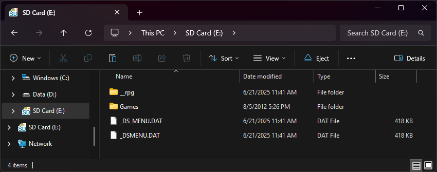

{ align=right width="115"}
# Ace3DS+/X & R4iLS Clones
## r4isdhc.hk 2020+, r4isdhc.com.cn, r4xmp.com, ace3ds.com, XXX in 1, Unlabeled carts with red PCB

---

### Setup Guide:

=== "Ace WoodR4 1.62"

    1. Format the SD card you are using by following the [formatting tutorial.](../tutorials/formatting.md){target="_blank"}
    
    1. Download the [Ace3DS+/R4iLS WoodR4 1.62 kernel.](https://archive.flashcarts.net/Ace3DS+_R4iLS/Ace3DS+_R4iLS_Wood_R4_1.62.zip)
    
    1. Open/extract the zip file, and copy *the contents* into the root of your SD card.
    
    1. If you'd like to be able to use cheats on your games, download a [cheat database.](https://gbatemp.net/threads/deadskullzjrs-nds-i-cheat-databases.488711)
    
    1. You will need the `usrcheat.dat` file from the download link in the post. Copy this file to `__rpg/cheats/` on your SD card. (Create the `cheats` folder if it doesn't exist)
    
    1. Create a `Games` folder in your SD card root, and place your `.nds` game ROMs inside. You can also create additional folders to help with organizing/categorizing your ROMs.
    
    1. The files on your SD card should now look like this:
    
        - { align=left width="600"}

    1. Insert the SD card back into your cart, plug the cart into your DS, and see if it boots into the menu.
    
    !!! warning "Missing Anti-Piracy Patches"
    
        Ace WoodR4 1.62 is known to have issues with anti-piracy checks in a few newer games, notably with clean roms of Pokemon Black & White 2, where EXP gain gets disabled by AP detection.
        
        To fix this issue, tap the Y button in the WoodR4 menu with the game highlighted, open the cheats menu, and enable the `Bypass Anti-Piracy` cheat before starting the game.
    
    !!! tip "Themes"

        Looking to change the default theme? Check out the themes repository at [themes.flashcarts.net](https://themes.flashcarts.net)!

=== "Pico-Launcher"

    !!! info "Kernel Info"

        Pico-Launcher is the game menu for the DS-Pico (an open source DS flashcart by the LNH team) and other supported carts. Combined with Pico-Loader, it can be used as a full kernel, and supports almost all retail DS games. It features a material-inspired user interface, and an extremely fast loader.

    !!! warning "Cheats and Soft-Reset"

        Note that Pico-Launcher/Loader currently does not support using cheats, and soft-reset to the game menu is also unsupported. If these features are important to you, consider using WoodR4 or AceOS.

    1. Format the SD card you are using by following the [formatting tutorial.](../tutorials/formatting.md){target="_blank"}

    1. Download the latest [Pico Package for Ace3DS+/R4iLS.](https://picoarchive.cdn.blobfrii.com/pico_package_ACE3DS.zip?picoloader={{pico_versions.loader}}&picolauncher={{pico_versions.launcher}}&fcnetrev={{pico_versions.fcnetrev}})

    1. Extract the `pico_package_ACE3DS.zip` file with [7-Zip](https://www.7-zip.org/), or your native file manager app. Then, copy *the contents* into the root of your SD card.
    
    1. Create a `Games` folder in your SD card root, and place any `.nds` game ROMs you'd like to play inside.
    
    1. The files on your SD card should now look like this:
    
        - { align=left width="600"}
    
    1. Insert the SD card back into your cart, plug the cart into your DS, and see if it boots into the menu.

=== "AceOS 2.13"

    !!! info "AceOS Kernel Package"
    
        AceOS is a version of the kernel that includes a custom start menu allowing you to boot into various preloaded emulators, apps, and hypervisors; GBARunner2 and 3, GameYob, NesDS, Moonshell2, and others.
    
    To set up AceOS on your cart, follow the instructions found in the [AOS README.](https://github.com/flashcarts/AOS/#setup)

    All carts that are supported by Ace WoodR4 will be able to run AceOS as well.

    !!! tip "Themes"

        Looking to change the default theme? Check out the themes repository at [themes.flashcarts.net](https://themes.flashcarts.net)!
