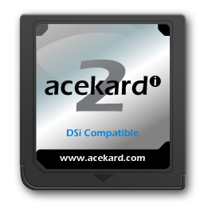

{ align=right width="115"}
# Acekard 2/2.1/2i
## acekard.com

---

### Setup Guide:

=== "AKAIO 1.9.0"

    1. Format the SD card you are using by following the [formatting tutorial.](../tutorials/formatting.md){target="_blank"}
    
    1. Download the [AKAIO 1.9.0 kernel.](https://archive.flashcarts.net/acekard.com/AceKard_2i/AKAIO_1.9.0-20121129.zip)
    
    1. Open/extract the zip file, then copy `__aio` and `akmenu4.nds` into the root of your SD card.
    
    1. If you'd like to be able to use cheats on your games, download a [cheat database.](https://gbatemp.net/threads/deadskullzjrs-nds-i-cheat-databases.488711)
        
    1. You will need the `usrcheat.dat` file from the download link in the post. Copy this file to `__aio/cheats/` on your SD card. (Create the `cheats` folder if it doesn't exist)
    
    1. Create a `Games` folder in your SD card root, and place your `.nds` game ROMs inside. You can also create additional folders to help with organizing/categorizing your ROMs.
    
    1. The files on your SD card should now look like this:
    
        - { align=left width="600"}
    
    1. Insert the SD card back into your cart, plug the cart into your DS, and see if it boots into the menu.
    
    !!! tip "Themes"
    
        Looking to change the default theme? Check out the themes repository at [themes.flashcarts.net](https://themes.flashcarts.net)!
    
=== "Pico-Launcher"

    !!! info "Kernel Info"

        Pico-Launcher is the game menu for the DS-Pico (an open source DS flashcart by the LNH team) and other supported carts. Combined with Pico-Loader, it can be used as a full kernel, and supports almost all retail DS games. It features a material-inspired user interface, and an extremely fast loader.

    !!! warning "Cheats and Soft-Reset"

        Note that Pico-Launcher/Loader currently does not support using cheats, and soft-reset to the game menu is also unsupported. If these features are important to you, consider using AKAIO.

    ### Setup Guide:

    1. Format the SD card you are using by following the [formatting tutorial.](../tutorials/formatting.md){target="_blank"}

    1. Download the latest [Pico Package for Acekard 2.](https://picoarchive.cdn.blobfrii.com/pico_package_AK2.zip)

    1. Extract the `pico_package_AK2.zip` file with [7-Zip](https://www.7-zip.org/), or your native file manager app.

    1. From within the extracted files, copy the following files/folders to your SD card root:

        - `_pico` folder

        - `_picoboot.nds`

        - `akmenu4.nds`
    
    1. Create a `Games` folder in your SD card root, and place any `.nds` game ROMs you'd like to play inside.
    
    1. The files on your SD card should now look like this:
    
        - { align=left width="600"}
    
    1. Insert the SD card back into your cart, plug the cart into your DS, and see if it boots into the menu.