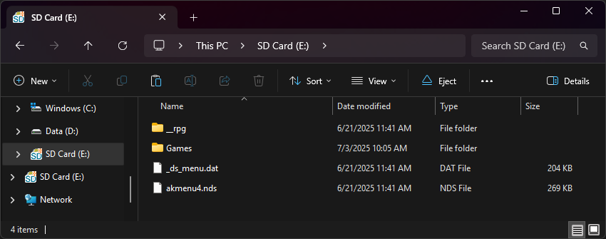

# BL2CK Carts
## Acekard/R4iTT Clones

!!! info "Compatibility Info"

    See [Flashcard-Archive Readme](https://github.com/DS-Homebrew/flashcard-archive) for a list of compatible carts.

!!! danger "Warning"

    Never attempt to use YSMenu on a cart that uses BL2CK! You will **brick** the cart!

### Setup Guide:

=== "Standard"

    1. Format the SD card you are using by following the [formatting tutorial.](../tutorials/formatting.md){target="_blank"}
    
    1. Download the [BL2CK 1.31.0 kernel.](https://archive.flashcarts.net/BL2CK/BL2CK_1.31.0.zip)
    
    1. Open/extract the zip file, and copy *the contents* into the root of your SD card.
    
    1. If you'd like to be able to use cheats on your games, download a [cheat database.](https://gbatemp.net/threads/deadskullzjrs-nds-i-cheat-databases.488711)
    
    1. You will need the `usrcheat.dat` file from the download link in the post. Copy this file to `__rpg/cheats/` on your SD card. (Create the `cheats` folder if it doesn't exist)
    
    1. Create a `Games` folder in your SD card root, and place your `.nds` game ROMs inside. You can also create additional folders to help with organizing/categorizing your ROMs.
    
    1. The files on your SD card should now look like this:
    
        - { align=left width="600"}

    1. Insert the SD card back into your cart, plug the cart into your DS, and see if it boots into the menu.

=== "Amaze3DS"

    1. Format the SD card you are using by following the [formatting tutorial.](../tutorials/formatting.md){target="_blank"}
    
    1. Download the [BL2CK 1.31.0 Amaze3DS kernel.](https://archive.flashcarts.net/BL2CK/BL2CK_1.31.0_Amaze3DS.zip)
    
    1. Open/extract the zip file, and copy *the contents* into the root of your SD card.
    
    1. If you'd like to be able to use cheats on your games, download a [cheat database.](https://gbatemp.net/threads/deadskullzjrs-nds-i-cheat-databases.488711)
    
    1. You will need the `usrcheat.dat` file from the download link in the post. Copy this file to `__rpg/cheats/` on your SD card. (Create the `cheats` folder if it doesn't exist)
    
    1. Create a `Games` folder in your SD card root, and place your `.nds` game ROMs inside. You can also create additional folders to help with organizing/categorizing your ROMs.
    
    1. The files on your SD card should now look like this:
    
        - { align=left width="600"}

    1. Insert the SD card back into your cart, plug the cart into your DS, and see if it boots into the menu.

!!! tip "Themes"

    Looking to change the default theme? Check out the themes repository at [themes.flashcarts.net](https://themes.flashcarts.net)!