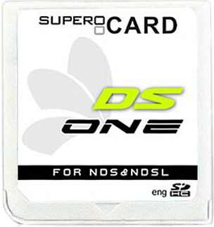
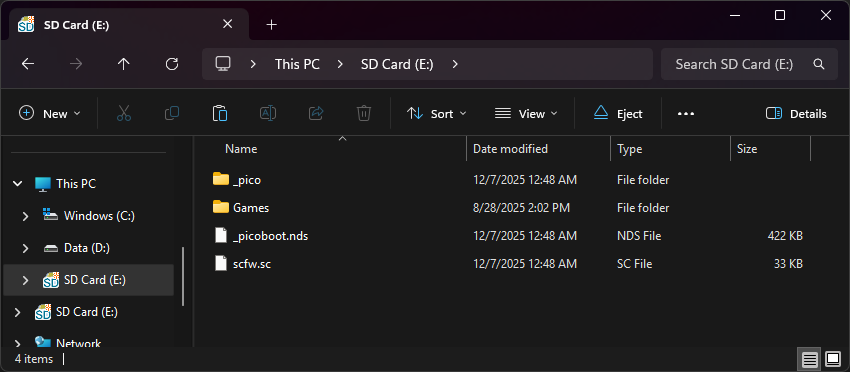

{ align=right width="115"}
# DSOne SDHC
## supercard.sc

!!! info
    
    The DSOne SDHC is one of the SuperCard team's later flashcarts, with some uncommon features like RTS (Real Time Save), and an in-game menu. EvolutionOS, the flashcart's stock kernel, is compatible with nearly all DS games and romhacks, so it is fairly reliable.

    Unfortunately, some DSOne carts have faulty PSRAM, which causes EvolutionOS to not work on those carts due to EOS relying on the PSRAM to function. These carts can use Pico-Launcher or YSMenu instead to retain basic DS game loading functionality, but will not have access to EvolutionOS-exclusive functionality like RTS.

### Setup Guide:

=== "Evolution OS"

    1. Format the SD card you are using by following the [formatting tutorial.](../tutorials/formatting.md){target="_blank"}
    
    1. Download the [Evolution OS SP6 kernel.](https://archive.flashcarts.net/SuperCard/DSONE_SDHC_DSONEi/SuperCard_DSONE_SDHC_EOS_sp6_20121206.zip)
    
    1. Open/extract the zip file, and copy *the contents* into the root of your SD card.
    
    1. If you'd like to be able to use cheats on your games, download a [cheat database.](https://gbatemp.net/threads/deadskullzjrs-nds-i-cheat-databases.488711)
    
    1. You will need the `usrcheat.dat` file from the download link in the post. Copy this file to `_dsone` on your SD card.
    
    1. Create a `Games` folder in your SD card root, and place your `.nds` game ROMs inside. You can also create additional folders to help with organizing/categorizing your ROMs.

    1. The files on your SD card should now look like this:
    
        - { align=left width="600"}

    1. Insert the SD card back into your cart, plug the cart into your DS, and see if it boots into the menu.

    !!! tip
        If you'd like to learn more about the various options and functionality found in EvolutionOS, check out the [DSOne Manual](https://github.com/Sanrax/DSOneManual)!

=== "Pico-Launcher"

    !!! info "Kernel Info"

        Pico-Launcher is the game menu for the DS-Pico (an open source DS flashcart by the LNH team) and other supported carts. Combined with Pico-Loader, it can be used as a full kernel, and supports almost all retail DS games. It features a material-inspired user interface, and an extremely fast loader.

    !!! warning "Cheats, Soft-Reset, and RTS"

         Note that Pico-Launcher/Loader currently does not support using cheats, and soft-reset to the game menu is also unsupported. If these features are important to you, consider using YSMenu or EOS. RTS is only available on EvolutionOS.

    1. Format the SD card you are using by following the [formatting tutorial.](../tutorials/formatting.md){target="_blank"}

    1. Download the latest [Pico Package for DSTT.](https://picoarchive.cdn.blobfrii.com/pico_package_DSTT.zip)

    1. Extract the `pico_package_DSTT.zip` file with [7-Zip](https://www.7-zip.org/), or your native file manager app.

    1. From within the extracted files, copy the following files/folders to your SD card root:

        - `_pico` folder

        - `_picoboot.nds`

        - `scfw.sc`
    
    1. Create a `Games` folder in your SD card root, and place any `.nds` game ROMs you'd like to play inside.
    
    1. The files on your SD card should now look like this:
    
        - { align=left width="600"}
    
    1. Insert the SD card back into your cart, plug the cart into your DS, and see if it boots into the menu.

=== "YSMenu"
    
    1. Format the SD card you are using by following the [formatting tutorial.](../tutorials/formatting.md){target="_blank"}
    
    1. Download the [RetroGameFan YSMenu 7.06 kernel.](https://gbatemp.net/download/retrogamefan-multi-cart-update.35737/download)
    
    1. Extract the YSMenu .7z file you downloaded using [7-Zip](https://www.7-zip.org/), then go into the `DSONEi SDHC YSMenu` folder.
    
    1. From this folder, copy the following files/folders to your SD card root:
    
        - `Games` folder
    
        - `TTMenu` folder
    
        - `SCFW.SC`
    
        - `TTMenu.dat`
    
    1. Place any `.nds` game ROMs you'd like to play into the `Games` folder.

    1. The files on your SD card should now look like this:
    
        - { align=left width="600"}
    
    1. Insert the SD card back into your cart, plug the cart into your DS, and see if it boots into the menu.

    !!! tip "Themes"

        Looking to change the default theme? Check out the YSMenu themes repository at [themes.flashcarts.net](https://themes.flashcarts.net/ysmenu/)!