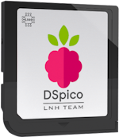
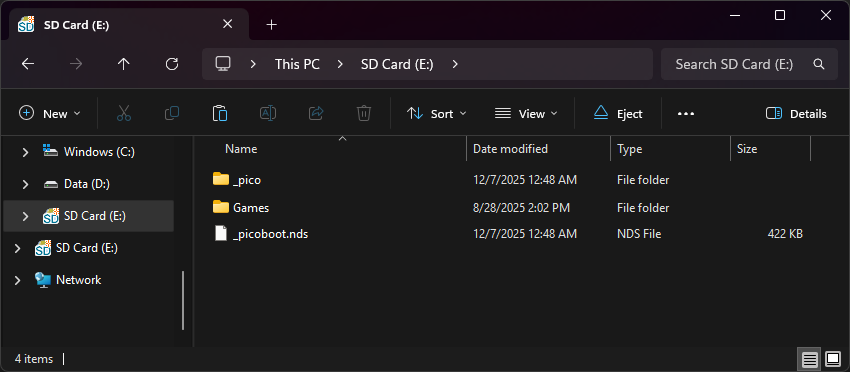

{ align=right width="115"}
# DSpico
## lnh-team.org

---

### Checking For Existing Firmware

Most DSpico flashcarts from AliExpress and other online retailers are usually pre-flashed with a build of the DSpico firmware. Often, they will come with a copy of the WRFUxxed firmware, which works on stock DSi and 3DS devices, as well as DS Lite and NDS. However, this pre-flashed firmware can be out of date, or simply not the firmware you'd prefer to use, as WRFUxxed and Hybrid firmware behave differently. **Therefore, we recommend reflashing your DSpico in the section below to ensure you have the latest build.**

If you do not want to, or are unable to, reflash the firmware (no PC, missing USB cable, etc.), expand the box below to check your DSpico for pre-flashed firmware:

??? info "Checking Existing Firmware"

    1. Insert a **FAT32** formatted MicroSD card into your DSpico. This step is required, the DSpico will not be detected by your console if one is not inserted. You can follow the [formatting tutorial](../tutorials/formatting.md){target="_blank"} to ensure it is formatted correctly.
    
    1. Power off your console, insert the DSpico, then turn it back on.
    
    1. Check for the following:
    
        - **Nintendo DSi/3DS Users:**
        
            - If your console automatically boots to a red screen after flashing `*** WRFU Tester v0.60 ***` on the bottom screen, or gets detected as "Nintendo DS Demonstration" on a Nintendo 3DS, your DSpico has WRFUxxed firmware flashed, which works on all stock DS, DSi, and 3DS consoles.
        
            - If your DSpico shows up as "DSpico LNH Team" on a Nintendo DSi or Nintendo 3DS, it has Hybrid firmware flashed and will only work on the original DS, DS Lite and modded DSi/3DS consoles.
        
        - **Nintendo DS and DS Lite users:**
    
            - Both WRFUxxed and Hybrid FW will show up as "DSpico LNH Team" on these consoles. If you see the cart in the menu, it is flashed with WRFUxxed OR Hybrid FW, but there's no way to check which one.
    
    1. If your DSpico is not recognised by the console in any way, it does not have a firmware flashed. In this case, follow the [flashing firmware section](#flashing-dspico-firmware) below.
    
    1. If you are happy with the existing firmware on your DSPico, you may [skip to the main setup guide.](#setup-guide)

### Flashing DSpico Firmware:

=== "Hybrid Firmware"

    !!! warning "DSpico Hybrid Firmware Limitations"

         The DSpico hybrid firmware only supports the original DS, DS Lite, and modded DSi/3DS consoles. It does not function on stock, unmodified DSi or 3DS systems - firmware with the WRFUxxed exploit enabled is required for these consoles.

    !!! info "Unofficial Build"
    
        This precompiled firmware ("hybrid bootloader") is built by the authors of this page and is not hosted, maintained, or officially endorsed by the LNH Team. The LNH Team only provides the open-source tools and source code, any files containing additional binaries are distributed independently by the community.

    1. Download the [DSpico Hybrid Firmware](https://github.com/coderkei/dspico-hybrid-fw/releases/latest/download/DSpico_hybrid.uf2) UF2 file.

    1. Remove the DSpico from your console, and remove any MicroSD card in the cart.
    
    1. Connect a USB cable to your DSpico and plug it into your computer, then open your file manager.

    1. A drive called `RPI-RP2` will appear. Drag & drop the `DSpico_hybrid.uf2` file into this drive. The drive should then automatically eject and disappear from your computer, indicating the DSpico has processed and installed the firmware. This can sometimes take a few seconds.

    1. Your DSpico is now flashed! Follow the Pico-Launcher setup guide below to prepare the SD card.

=== "WRFUxxed Firmware"

    !!! warning "DSpico WRFUxxed firmware"

         The WRFUxxed firmware supports all DS, DSi & 3DS consoles, on any version. However, it must be built with user-provided components due to the WRFUxxed exploit requiring a copy of WRFU Tester v0.60. This firmware also autoboots on a Nintendo DSi due to WRFU Tester having the autoboot flag set (Does not apply to the 3DS or NDS/DS Lite). You might want to consider using the Hybrid firmware instead if your DSi or 3DS console has CFW installed.

    === "Patch a Precompiled UF2"

        !!! info
            Full builds of WRFUxxed firmware can't be legally distributed due to needing the WRFU Tester v0.60 ROM to be embedded. As such, we don't provide any WRFUxxed firmware UF2 that is ready-to-flash. However, thanks to user @Prozaks, we can instead distribute a WRFUxxed-enabled build that is missing the actual WRFU Tester binary, and let the user inject their own copy of WRFU Tester to create a complete firmware build.

            Just like our precompiled Hybrid FW, we will update the WRFUxxed UF2 whenever a new change to the firmware/bootloader is published by the LNH Team. To update in the future, just redo the patching process.

        1. Obtain a copy of WRFU Tester v0.60 (Build Date 20080821).
            - SHA-1 hash for this file is `2d65fb7a0c62a4f08954b98c95f42b804fccfd26`

        1. Open the [firmware patcher website](https://asaduji.github.io/DSpico-firmware-patcher/){target="_blank"}, and click on "Browse...".

        1. In the file upload window that pops up, select your WRFU Tester v0.60 ROM file and click "Open".

        1. The website will inject your WRFU Tester binary and provide the completed `DSpico_wrfuxxed.uf2` file for download. Save it to your PC.

        1. Remove the DSpico from your console, and remove any MicroSD card in the cart.
        
        1. Connect a USB cable to your DSpico and plug it into your computer, then open your file manager.
    
        1. A drive called `RPI-RP2` will appear. Drag & drop the `DSpico_wrfuxxed.uf2` file into this drive. The drive should then automatically eject and disappear from your computer, indicating the DSpico has processed and installed the firmware. This can sometimes take a few seconds.
        
        1. Your DSpico is now flashed! Follow the Pico-Launcher setup guide below to prepare the SD card.

    === "Compile from Source"
    
        - Follow the [LNH-Team DSpico setup guide](https://github.com/LNH-team/dspico/blob/develop/GUIDE.md) which contains all the steps needed to build the WRFUxxed firmware.
    
        - If you would prefer a video guide, you may follow [this YouTube video](https://www.youtube.com/watch?v=o7IuaewHNTQ) to build the WRFUxxed firmware with Docker, using [this dockerfile.](https://gist.github.com/synthic/f9396062d28144823ee8606eba101b2e). This video guide should result in an up to date firmware due to building it from the latest source.

### Setup Guide:

=== "Pico-Launcher"

    !!! warning "Soft-Reset Not Supported"

        Note that Pico-Launcher/Loader currently does not support soft-resetting to the game menu. If this is important to you, consider using TWiLightMenu++ or AKMenu-Next instead with nds-bootstrap.
        
        Please note that you won't benefit from some of the features offered by the DSpico if you choose to use nds-bootstrap as the loader.

    1. Format the SD card you are using by following the [formatting tutorial.](../tutorials/formatting.md){target="_blank"}

    1. Download the latest [Pico Package for DSpico.](https://picoarchive.cdn.blobfrii.com/pico_package_DSPICO.zip?picoloader={{pico_versions.loader}}&picolauncher={{pico_versions.launcher}}&fcnetrev={{pico_versions.fcnetrev}})
        - <small>Currently updated to Pico-Launcher `{{pico_versions.launcher}}` and Pico-Loader `{{pico_versions.loader}}`</small>

    1. Extract the `pico_package_DSPICO.zip` file with [7-Zip](https://www.7-zip.org/), or your native file manager app. Then, copy *the contents* into the root of your SD card.
    
    1. If you'd like to be able to use cheats on your games, download a [cheat database.](https://gbatemp.net/threads/deadskullzjrs-nds-i-cheat-databases.488711){target="_blank"}
    
    1. You will need the `usrcheat.dat` file from the download link in the post. Copy this file into the `_pico` folder on your SD card.

    1. Create a `Games` folder in your SD card root, and place any `.nds` game ROMs you'd like to play inside.
    
    1. The files on your SD card should now look like this:
    
        - { align=left width="600"}
    
    1. Insert the SD card back into your cart, plug the cart into your DS, and see if it boots into the menu.

=== "AKMenu-Next"

    !!! info "Kernel Info"

        AKMenu-Next is an alternative frontend for pico-loader and nds-bootstrap, which uses the classic WoodR4/AKMenu UI. If you want to enjoy a traditional flashcart UI while loading games via pico-loader, AKMenu-Next is a great choice. All pico-loader features are supported, such as running DSiWare, applying game cheats, and calling emulators with argv to launch a ROM directly.

    1. Format the SD card you are using by following the [formatting tutorial.](../tutorials/formatting.md){target="_blank"}

    1. Download the latest release of [AKMenu-Next DSpico Edition.](https://github.com/coderkei/akmenu-next/releases/latest/download/akmenu-next-pico.zip)

    1. Extract the downloaded `akmenu-next-pico.zip` file with [7-Zip](https://www.7-zip.org/).

    1. From within the akmenu-next files, copy the following files/folders to your SD card root:

        - `_nds` folder
        - `_pico` folder
        - `BOOT.NDS`
        - `_picoboot.nds`

    1. Download the latest release of [Pico-Loader for DSpico](https://github.com/LNH-team/pico-loader/releases/latest/download/Pico_Loader_DSPICO.zip).

    1. Extract the downloaded `Pico_Loader_DSPICO.zip` file with [7-Zip](https://www.7-zip.org/).

    1. Copy the *contents* of the files from the extracted `Pico_Loader_DSPICO.zip` file into the `_pico` folder on your SD card.

    1. This loader can be selected by going to the settings in AKMenu-Next and finding the option labeled `Game Loader` and changing the setting to `Pico Loader`.

    **nds-bootstrap (Optional)**

     Additionally, you may want to install nds-bootstrap if you wish to use soft reset or a game not compatible with Pico-Loader. Please note that you won't benefit from some of the features offered by the DSpico when running games with nds-bootstrap.

    1. Download the latest release of [nds-bootstrap.](https://github.com/DS-Homebrew/nds-bootstrap/releases/latest/download/nds-bootstrap.zip)

    1. Extract the downloaded `nds-bootstrap.zip` file with [7-Zip](https://www.7-zip.org/).

    1. Copy the *contents* of the files from the extracted `nds-bootstrap.zip` file to the `_nds` folder on your SD card.

    1. This loader can be selected by going to the settings in AKMenu-Next and finding the option labeled `Game Loader` and changing the setting to `nds-bootstrap`.

    **Cheats**

    1. If you'd like to be able to use cheats on your games, download a [cheat database.](https://gbatemp.net/threads/deadskullzjrs-nds-i-cheat-databases.488711)
    
    1. You will need the `usrcheat.dat` file from the download link in the post. Copy this file to `_nds/akmenunext/cheats/` on your SD card. (Create the `cheats` folder if it doesn't exist)

### Post-Setup Enhancements

#### Emulators

To emulate retro consoles like GBA, GB/C, NES, and others, you will need to add emulators and configure their file associations for Pico-Launcher to display retro ROMs in the menu.

[Emulators Tutorial :octicons-arrow-right-16:](../tutorials/emulators-pico.md){ .md-button }

#### Game Covers

Pico-Launcher supports showing game covers in cover flow layout mode, and on the top screen in icons mode. You will need to add cover images to your SD card to use this feature.

[PicoCover :octicons-arrow-right-16:](https://scaletta.github.io/PicoCover/){ .md-button }

#### Themes

Looking to customize your DSpico interface? Check out the Pico themes repository:

[Themes Repository :octicons-arrow-right-16:](https://themes.flashcarts.net/pico/){ .md-button }

To create your own custom themes for Pico-Launcher, check out the themes creator:

[Themes Creator :octicons-arrow-right-16:](https://santiagovalencia109.github.io/pl-Theme-Creator/){ .md-button }

#### DSiWare & Encrypted ROMs

Since the DSpico is a DSi-mode cart, it supports running DSiWare and DSi-enhanced games on DSi/3DS consoles. To play DSiWare and encrypted ROMs, extra BIOS and NAND files are required.

[DSiWare Tutorial :octicons-arrow-right-16:](../tutorials/dsiware.md#__tabbed_1_3){ .md-button }

---

**Having issues? Check the troubleshooting box below:**

??? failure "Troubleshooting"

    ***Games lag or randomly freeze on my DSpico, or the DSpico does not load reliably. I have confirmed my MicroSD card is a name-brand and is genuine.***

    - Your DSpico may be on an older firmware before fixes for some microSD card models were added. Please flash the latest firmware by following the [firmware flashing guide.](#flashing-dspico-firmware)
    
    ***I have a Nintendo DSi with HiyaCFW and it stays on the WRFU Tester screen for a long time.***
    
    - When using a DSi with HiyaCFW on a large SD card, the WRFUxxed exploit slows down due to a quirk of the base WRFU Tester ROM. Switch the DSi console SD to a smaller one, or [install Hybrid FW](#flashing-dspico-firmware) to avoid WRFU Tester.
    
    ***The DSpico is not detected by my DS, DSi or 3DS system or hangs at the DS(i) splash screen.***
    
    - Check that a MicroSD card is inserted and that you have flashed the firmware to the DSpico if applicable. If it still does not show up, try using some compressed air to blow out your console's cartridge slot.
    
    !!! note "Phenom Mod DSPico USB-C Users"

        A physical issue with the shell of Phenom Mod carts has been identified. If you have properly configured your flashcart and it still doesn't load, carefully apply pressure on the flashcart with your finger while your console is running. If the flashcart's menu icon pops up, you may need to replace the shell. You may qualify for a replacement shell, free of charge. Please see [here](https://store.phenommod.com/product/dspico-pre-order/) for more info. The replacement form can be found [here](https://docs.google.com/forms/d/e/1FAIpQLSfVeUiYKAfBDZi96PxnnWghlr17539KDZ9jGpLQjH2z6W5_UA/viewform?usp=publish-editor).
    
    ***I get "Error: Failed to mount SD card.", or a blue screen after booting the DSpico with the WRFUxxed firmware.***
    
    - Mounting your microSD card failed. Try reformatting it or try a different micro SD card. Also confirm that it is a genuine. If all else fails, You may need to flash an updated firmware with MicroSD fixes as mentioned above.
    
    ***I get "ERROR: Failed to open Pico Loader file.", or a red screen after booting the DSpico with the WRFUxxed firmware.***
    
    - The `/_pico/picoLoader9.bin` or `/_pico/picoLoader7.bin` files could not be opened. Check that you copied all necessary files to the micro SD card, see the [setup guide](#setup-guide) above.