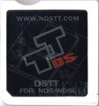
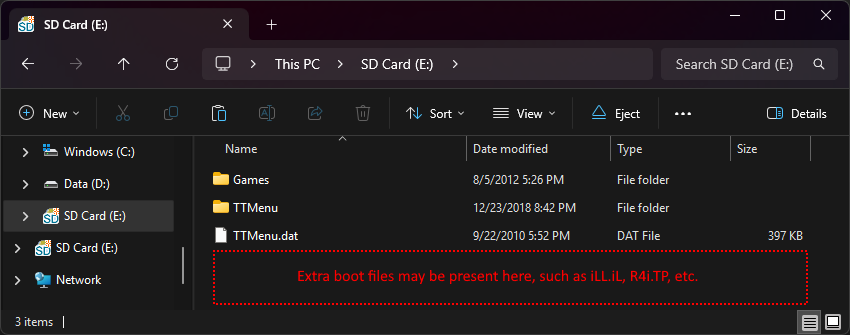
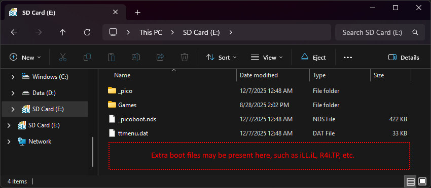

{ align=right width="115"}
# DSTT/i & Clones
## ndstt.com (and many clones)

### Setup Guide:

!!! info "Compatibility Info"

    See [YSMenu Compatibility List's](https://www.flashcarts.net/ysmenu-compat-ext) `DSTTi-Clone YSMenu` section for a full list of compatible carts with YSMenu and DSTTi Pico-Launcher

=== "YSMenu"

    !!! info "Kernel Info"

        YSMenu is a simple, fast, and stable kernel, featuring a menu UI resembling the original R4. It's a great choice for most DSTT-based flashcart users. It can have some issues with running romhacks, but it has near-perfect compatibility with unmodified retail DS roms.

    1. Format the SD card you are using by following the [formatting tutorial.](../tutorials/formatting.md){target="_blank"}
    
    1. Download the [RetroGameFan YSMenu 7.06 kernel.](https://gbatemp.net/download/retrogamefan-multi-cart-update.35737/download)
    
    1. Extract the YSMenu .7z file you downloaded using [7-Zip](https://www.7-zip.org/), then go into the `DSTTi-Clone YSMenu` folder.
    
    1. From this folder, copy the following files/folders to your SD card root:
    
        - `Games` folder
    
        - `TTMenu` folder
    
        - `TTMenu.dat`
    
    1. Some DSTTi clones load from a boot file other than `TTMenu.dat`. Find your flashcart in the [YSMenu compatibility list](https://www.flashcarts.net/ysmenu-compat-ext){target="_blank"} by searching the page (`CTRL`+`F`) for the URL listed on your cart's label.
    
        - If your cart is listed as needing an extra boot file, make copies of the `TTMenu.dat` file on your SD card root, then rename the copy appropriately.
    
        - Note that in all cases, `TTMenu.dat` still needs to be on your SD for soft-reset to function. Do not remove it.
    
    1. Place any `.nds` game ROMs you'd like to play into the `Games` folder.
    
    1. The files on your SD card should now look like this:
    
        - { align=left width="600"}
    
    1. Insert the SD card back into your cart, plug the cart into your DS, and see if it boots into the menu.
    
    !!! tip "Post-Setup Enhancements"

        **Emulators**
        
        To emulate retro consoles on your DS like GBA, GB/C, NES, and others, you will need to download emulators.
        
        [Emulators Tutorial :octicons-arrow-right-16:](../tutorials/emulators.md){ .md-button }
        
        **Themes**
        
        Looking to customize your menu? Check out the YSMenu themes repository:
        
        [Themes Repository :octicons-arrow-right-16:](https://themes.flashcarts.net/ysmenu/){ .md-button }

=== "Pico-Launcher"

    !!! info "Kernel Info"

        Pico-Launcher is the game menu for the DS-Pico (an open source DS flashcart by the LNH team) and other supported carts. Combined with Pico-Loader, it can be used as a full kernel, and supports almost all retail DS games. It features a material-inspired user interface, and an extremely fast loader.

    !!! warning "Soft-Reset Not Supported"

        Note that Pico-Launcher/Loader currently does not support soft-resetting to the game menu. If this is important to you, consider using YSMenu.

    1. Format the SD card you are using by following the [formatting tutorial.](../tutorials/formatting.md){target="_blank"}

    1. Download the latest [Pico Package for DSTT.](https://picoarchive.cdn.blobfrii.com/pico_package_DSTT.zip?picoloader={{pico_versions.loader}}&picolauncher={{pico_versions.launcher}}&fcnetrev={{pico_versions.fcnetrev}})

    1. Extract the `pico_package_DSTT.zip` file with [7-Zip](https://www.7-zip.org/), or your native file manager app.

    1. From within the extracted files, copy the following files/folders to your SD card root:

        - `_pico` folder

        - `_picoboot.nds`

        - `ttmenu.dat`

    1. Some DSTTi clones load from a boot file other than `ttmenu.dat`. Find your flashcart in the [YSMenu compatibility list](https://www.flashcarts.net/ysmenu-compat-ext){target="_blank"} by searching the page (`CTRL`+`F`) for the URL listed on your cart's label.
    
        - If your cart is listed as needing an extra boot file, make copies of the `ttmenu.dat` file on your SD card root, then rename the copy appropriately.
    
    1. If you'd like to be able to use cheats on your games, download a [cheat database.](https://gbatemp.net/threads/deadskullzjrs-nds-i-cheat-databases.488711){target="_blank"}
    
    1. You will need the `usrcheat.dat` file from the download link in the post. Copy this file into the `_pico` folder on your SD card.

    1. Create a `Games` folder in your SD card root, and place any `.nds` game ROMs you'd like to play inside.
    
    1. The files on your SD card should now look like this:
    
        - { align=left width="600"}
    
    1. Insert the SD card back into your cart, plug the cart into your DS, and see if it boots into the menu.

    !!! tip "Post-Setup Enhancements"

        **Emulators**
        
        To emulate retro consoles like GBA, GB/C, NES, and others, you will need to add emulators and configure their file associations for Pico-Launcher to display retro ROMs in the menu.
        
        [Emulators Tutorial :octicons-arrow-right-16:](../tutorials/emulators-pico.md){ .md-button }
        
        **Game Covers**
        
        Pico-Launcher supports showing game covers in cover flow layout mode, and on the top screen in icons mode. You will need to add cover images to your SD card to use this feature.
        
        [PicoCover :octicons-arrow-right-16:](https://scaletta.github.io/PicoCover/){ .md-button }
        
        **Themes**
        
        Looking to customize your DSpico interface? Check out the Pico themes repository:
        
        [Themes Repository :octicons-arrow-right-16:](https://themes.flashcarts.net/pico/){ .md-button }
        
        To create your own custom themes for Pico-Launcher, check out the themes creator:
        
        [Themes Creator :octicons-arrow-right-16:](https://santiagovalencia109.github.io/pl-Theme-Creator/){ .md-button }