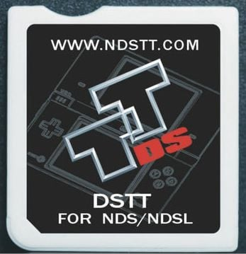

{ align=right width="115"}
# DSTT/i & Clones
## ndstt.com (and many clones)

### Setup Guide:

!!! info "Compatibility Info"

    See [YSMenu Compatibility List's](https://www.flashcarts.net/ysmenu-compat-ext) `DSTTi-Clone YSMenu` section for a full list of compatible carts with YSMenu and DSTTi Pico-Launcher

=== "Pico-Launcher"

    !!! info "Kernel Info"

        Pico-Launcher is the game menu for the DS-Pico (an open source DS flashcart by the LNH team) and other supported carts. Combined with Pico-Loader, it can be used as a full kernel, and supports almost all retail DS games. It features a material-inspired user interface, and an extremely fast loader.

    !!! warning "Cheats and Soft-Reset"

         Note that Pico-Launcher/Loader currently does not support using cheats, and soft-reset to the game menu is also unsupported. If these features are important to you, consider using YSMenu.

    ### Setup Guide:

    1. Format the SD card you are using by following the [formatting tutorial.](../tutorials/formatting.md){target="_blank"}

    1. Download the latest [Pico Package for DSTT.](https://picoarchive.cdn.blobfrii.com/pico_package_DSTT.zip)

    1. Extract the `pico_package_DSTT.zip` file with [7-Zip](https://www.7-zip.org/), or your native file manager app.

    1. From within the extracted files, copy the following files/folders to your SD card root:

        - `_pico` folder

        - `_picoboot.nds`

        - `ttmenu.dat`

    1. Some DSTTi clones load from a boot file other than `ttmenu.dat`. Find your flashcart in the [YSMenu compatibility list](https://www.flashcarts.net/ysmenu-compat-ext){target="_blank"} by searching the page (`CTRL`+`F`) for the URL listed on your cart's label.
    
        - If your cart is listed as needing an extra boot file, make copies of the `ttmenu.dat` file on your SD card root, then rename the copy appropriately.
    
    1. Create a `Games` folder in your SD card root, and place any `.nds` game ROMs you'd like to play inside.
    
    1. The files on your SD card should now look like this:
    
        - { align=left width="600"}
    
    1. Insert the SD card back into your cart, plug the cart into your DS, and see if it boots into the menu.

=== "YSMenu"

    !!! info "Kernel Info"

        YSMenu is a simple, fast, and stable kernel, featuring a menu UI resembling the original R4. It's a great choice for most DSTT-based flashcart users. It can have some issues with running romhacks, but it has near-perfect compatibility with unmodified retail DS roms.

    1. Format the SD card you are using by following the [formatting tutorial.](../tutorials/formatting.md){target="_blank"}
    
    1. Download the [RetroGameFan YSMenu 7.06 kernel.](https://gbatemp.net/download/retrogamefan-multi-cart-update.35737/download)
    
    1. Extract the YSMenu .7z file you downloaded using [7-Zip](https://www.7-zip.org/), then go into the `DSTTi-Clone YSMenu` folder.
    
    1. From this folder, copy the following files/folders to your SD card root:
    
        - `Games` folder
    
        - `TTMenu` folder
    
        - `TTMenu.dat`
    
    1. Some DSTTi clones load from a boot file other than `TTMenu.dat`. Find your flashcart in the [YSMenu compatibility list](https://www.flashcarts.net/ysmenu-compat-ext){target="_blank"} by searching the page (`CTRL`+`F`) for the URL listed on your cart's label.
    
        - If your cart is listed as needing an extra boot file, make copies of the `TTMenu.dat` file on your SD card root, then rename the copy appropriately.
    
        - Note that in all cases, `TTMenu.dat` still needs to be on your SD for soft-reset to function. Do not remove it.
    
    1. Place any `.nds` game ROMs you'd like to play into the `Games` folder.
    
    1. The files on your SD card should now look like this:
    
        - { align=left width="600"}
    
    1. Insert the SD card back into your cart, plug the cart into your DS, and see if it boots into the menu.
    
    !!! tip "Themes"
    
        Looking to change the default theme? Check out the YSMenu themes repository at [themes.flashcarts.net](https://themes.flashcarts.net/ysmenu/)!