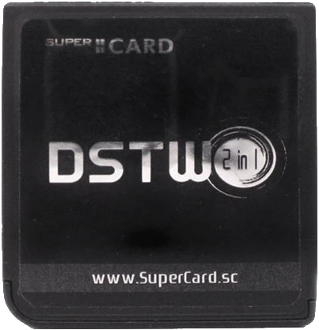
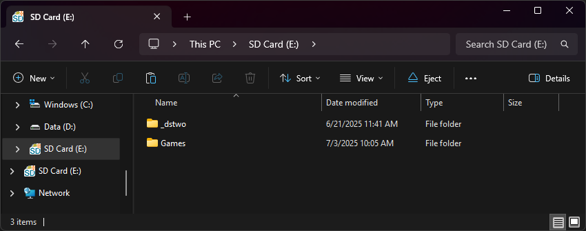

{ align=right width="115"}
# SuperCard DSTWO
## supercard.sc

!!! info "Cart Info"
    
    The DSTWO is the last DS flashcart from the SuperCard team. It boasts uncommon features like RTS (Real Time Save), Real Time Cheats, and an in-game menu. EvolutionOS, the flashcart's stock kernel, is compatible with nearly all DS games and romhacks, so it is fairly reliable.

    It is also well-known for its onboard ARM CPU, being the only DS flashcart to provide an extra CPU to run homebrew applications on. Apps like TempGBA and CATSFC can utilize the DSTWO's onboard processor to emulate GBA and SNES. Other apps like video players can use the CPU for accelerated video playback. Unfortunately, the DSTWO's CPU also comes with heavier battery usage, even when playing retail games that don't utilize the onboard CPU.

### Setup Guide:

1. Format the SD card you are using by following the [formatting tutorial.](../tutorials/formatting.md){target="_blank"}

1. Download the [Evolution OS 1.14 kernel.](https://archive.flashcarts.net/SuperCard/DSTWO/SuperCard_DSTWO_EOS_1.14.zip)

1. Open/extract the zip file, and copy *the contents* into the root of your SD card.

1. If you'd like to be able to use cheats on your games, download a [cheat database.](https://gbatemp.net/threads/deadskullzjrs-nds-i-cheat-databases.488711)

1. You will need the `usrcheat.dat` file from the download link in the post. Copy this file to `_dstwo` on your SD card.

1. Create a `Games` folder in your SD card root, and place your `.nds` game ROMs inside. You can also create additional folders to help with organizing/categorizing your ROMs.

1. The files on your SD card should now look like this:

    - { align=left width="600"}

1. Insert the SD card back into your cart, plug the cart into your DS, and see if it boots into the menu.

!!! tip "DSTWO Plugins"

    If you're looking to download plugins for the DSTWO, check out GameBrew's [repository of DSTWO plugins!](https://www.gamebrew.org/wiki/DSTwo_Plugins)