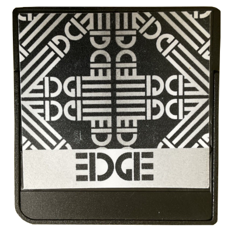
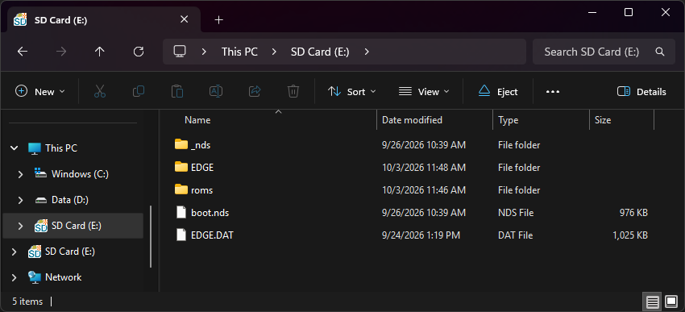

{ align=right width="115"}
# EDGE
## edge-ds.cn

!!! info "Cart Info"

    This cart is a cut-down version of the CycloDS Evolution. The two share similar kernels and hardware, but the EDGE is missing a couple features exclusive to the CycloDS, like RTS. This entire cart family is fairly obscure hardware, so unfortunately, not many loader options currently exist. EDGE OS and nds-bootstrap + AKNext/TWiLight are the only currently usable options.

!!! note "Kernel Info"

    Since using nds-bootstrap is required to load some newer titles that don't load on the stock kernel, the setup guide below will cover adding both EDGE OS and an nds-bootstrap frontend - AKMenu-Next or TWiLight Menu++. Autobooting AKMenu-Next or TWiLight isn't possible, since the EDGE doesn't have autoboot functionality and we don't have a bootstrap binary available for this cart currently.

### Setup Guide:

=== "EDGE OS + AKMenu-Next"

    1. Format the SD card you are using by following the [formatting tutorial.](../tutorials/formatting.md){target="_blank"}
    
    1. Download the [EDGE OS 2.3 kernel.](https://archive.flashcarts.net/EDGE/EDGE_OS_2.3.zip)
    
    1. Open/extract the zip file, and copy *the contents* into the root of your SD card.
    
    1. If you'd like to be able to use cheats on your games, download a [cheat database.](https://gbatemp.net/threads/deadskullzjrs-nds-i-cheat-databases.488711){target="_blank"}
    
    1. Download the `cheats.dat` file from the download link in the post.
    
    1. Create an `EDGE` folder on your SD card root. Copy `cheats.dat` into the `EDGE` folder you created.
    
    1. Next, create a `Games` folder on your SD card root, and place your `.nds` game ROMs inside.
        - You can also create additional folders to help with organizing/categorizing your ROMs.

    1. Next we will add AKMenu-Next for nds-bootstrap support.

    1. Download the latest release of [AKMenu-Next Flashcart Edition.](https://github.com/coderkei/akmenu-next/releases/latest/download/akmenu-next-flashcart.zip)

    1. Extract the downloaded `akmenu-next-flashcart.zip` file with [7-Zip](https://www.7-zip.org/){target="_blank"}.

    1. From within the AKMenu-Next files, copy the following files/folders to your SD card root:

        - `_nds` folder
        - `BOOT.NDS`
    
    1. Download the latest release of [nds-bootstrap.](https://github.com/DS-Homebrew/nds-bootstrap/releases/latest/download/nds-bootstrap.zip)

    1. Extract the `nds-bootstrap.zip`, and copy *the contents* into the `_nds` folder on your SD card.

    1. AKMenu-Next/nds-bootstrap also supports cheats. Open the [cheats database thread](https://gbatemp.net/threads/deadskullzjrs-nds-i-cheat-databases.488711){target="_blank"} again.
    
    1. Download the `usrcheat.dat` file from the download link in the post. Copy this file to `_nds/akmenunext/cheats/` on your SD card.
    
    1. The files on your SD card should now look like this:
    
        - { align=left width="600"}
    
    1. Insert the SD card back into your cart, plug the cart into your DS, and see if it boots into EDGE OS menu.
    
    1. To use AKMenu-Next, launch `BOOT.NDS` in the menu.
    
    !!! tip "Post-Setup Enhancements"
    
        **Emulators**
        
        To emulate retro consoles on your DS like GBA, GB/C, NES, and others, you will need to download emulators.
        
        [Emulators Tutorial :octicons-arrow-right-16:](../tutorials/emulators.md){ .md-button }

        For emulation on AKMenu-Next, the emulators plugin pack is available. See the docs for more info:

        [AKMenu-Next Plugins :octicons-arrow-right-16:](https://coderkei.github.io/akmenu-next-docs/guides/plugins/){ .md-button }
        
        **Game Covers**

        AKMenu-Next can show game covers on the top screen. To use them, select one of the included cover themes: `Blue Skies Game Covers`, `DSpico Game Covers` or `Starlight Covers`. Then add cover images to your SD card. Covers made for Pico-Launcher work too.

        [PicoCover :octicons-arrow-right-16:](https://scaletta.github.io/PicoCover/){ .md-button }

        To create your own custom covers, check out the cover creator. Save each cover in the `_nds/covers_name` folder on your SD card, named after its ROM file without `.nds` (for example, `MyGame.bmp`).

        [Cover Creator :octicons-arrow-right-16:](https://tasken.github.io/banner-maker/#cover-akmenu){ .md-button }

        **Themes**
        
        Looking to customize AKMenu-Next? Check out the AKMenu and AKNext themes repositories:
        
        [AKMenu Themes :octicons-arrow-right-16:](https://themes.flashcarts.net/akmenu/){ .md-button }
        [AKMenu-Next Themes :octicons-arrow-right-16:](https://themes.flashcarts.net/aknext/){ .md-button }

=== "EDGE OS + TWiLightMenu++"

    1. Format the SD card you are using by following the [formatting tutorial.](../tutorials/formatting.md){target="_blank"}
    
    1. Download the [EDGE OS 2.3 kernel.](https://archive.flashcarts.net/EDGE/EDGE_OS_2.3.zip)
    
    1. Open/extract the zip file, and copy *the contents* into the root of your SD card.
    
    1. If you'd like to be able to use cheats on your games, download a [cheat database.](https://gbatemp.net/threads/deadskullzjrs-nds-i-cheat-databases.488711){target="_blank"}
    
    1. Download the `cheats.dat` file from the download link in the post.
    
    1. Create an `EDGE` folder on your SD card root. Copy `cheats.dat` into the `EDGE` folder you created.

    1. Next we will add TWiLight Menu++ for nds-bootstrap support.

    1. Download the latest release of [TWiLight Menu++ Flashcart Edition.](https://github.com/DS-Homebrew/TWiLightMenu/releases/latest/download/TWiLightMenu-Flashcard.7z)

    1. Extract the downloaded `TWiLightMenu-Flashcard.7z` file with [7-Zip](https://www.7-zip.org/){target="_blank"}.

    1. From within the extracted TWiLight Menu++ files, copy the following files/folders to your SD card root:

        - `_nds` folder
        - `roms` folder
        - `BOOT.NDS`
    
    1. The files on your SD card should now look like this:
    
        - { align=left width="600"}
    
    1. Insert the SD card back into your cart, plug the cart into your DS, and see if it boots into EDGE OS menu.
    
    1. To use TWiLight Menu++, launch `BOOT.NDS` in the menu.