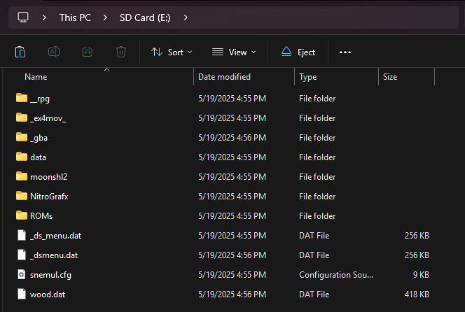

{ align=right width="115"}
# EX4DS
## ex4ds.com

!!! info
    
    The EX4DS is a cart based on R4iLS hardware, marketed as a SuperCard DSTWO competitor. Like the DSTWO, it contains extra hardware for running cart-specific plugins that can be launched from its menu. Currently, these include accelerated movie and music playback, and a GBA emulator. This cart's kernel is also the source of AceOS - the Ace3DS team used the EX4DS' start-up launch menu for the AOS launch menu.

### Setup Guide:

1. Format the SD card you are using by following the [formatting tutorial.](../tutorials/formatting.md){target="_blank"}

1. Download [EX4DS AceOS 2.13.](https://github.com/flashcarts/AOS/releases/latest/download/AOS_EX4DS.zip)

1. Open/extract the zip file, and copy *the contents* into the root of your SD card.

1. If you'd like to be able to use cheats on your games, download a [cheat database.](https://github.com/DeadSkullzJr/NDS-i-Cheat-Databases/releases/latest)

1. You will need the `usrcheat.7z` file. Extract it using [7-Zip](https://www.7-zip.org/), inside you will find a `usrcheat.dat` file. Copy this file to `__rpg/cheats/` on your SD card. (Create the `cheats` folder if it doesn't exist)

1. Navigate to `/roms` and place your `.nds` game ROMs inside the `nds` folder. Place other console roms supported by AceOS emulators in their respective folders.

1. The files on your SD card should now look like this:

    - { align=left width="600"}

1. Insert the SD card back into your cart, plug the cart into your DS, and see if it boots into the menu.

!!! tip
    
    Some emulators shipped with AceOS require you to provide a BIOS binary before they can be used. See the [AOS README](https://github.com/flashcarts/AOS?tab=readme-ov-file#setup) for more info.

!!! warning "Missing Anti-Piracy Patches"

    Since the EX4DS uses Ace WoodR4, it has issues with anti-piracy checks in a few newer games, notably with clean roms of Pokemon Black & White 2, where EXP gain gets disabled by AP detection.
    
    To fix this issue, tap the Y button in the WoodR4 menu with the game highlighted, open the cheats menu, and enable the `Bypass Anti-Piracy` cheat before starting the game.