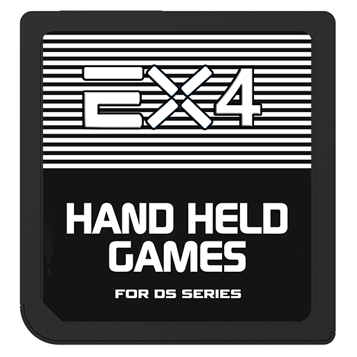
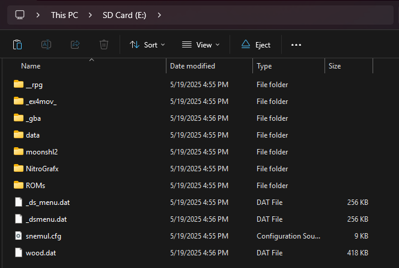
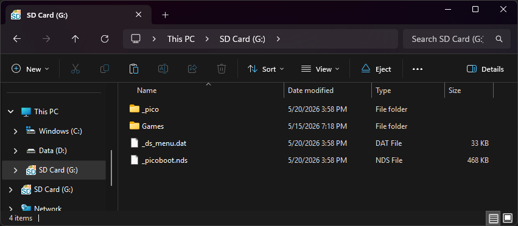

{ align=right width="115"}
# EX4DS
## ex4ds.com

!!! info "Cart Info"
    
    The EX4DS is a cart based on R4iLS hardware, marketed as a SuperCard DSTWO competitor. Like the DSTWO, it contains extra hardware for running cart-specific plugins that can be launched from its menu. Currently, these include accelerated movie and music playback, and a GBA emulator. This cart's kernel is also the source of AceOS - the Ace3DS team used the EX4DS' start-up launch menu for the AOS launch menu.

### Setup Guide:

=== "EX4DS AceOS 2.13"

    1. Format the SD card you are using by following the [formatting tutorial.](../tutorials/formatting.md){target="_blank"}
    
    1. Download [EX4DS AceOS 2.13.](https://github.com/flashcarts/AOS/releases/latest/download/AOS_EX4DS.zip)
    
    1. Open/extract the zip file, and copy *the contents* into the root of your SD card.
    
    1. If you'd like to be able to use cheats on your games, download a [cheat database.](https://gbatemp.net/threads/deadskullzjrs-nds-i-cheat-databases.488711)
        
    1. You will need the `usrcheat.dat` file from the download link in the post. Copy this file to `__rpg/cheats/` on your SD card. (Create the `cheats` folder if it doesn't exist)
    
    1. Navigate to `/roms` and place your `.nds` game ROMs inside the `nds` folder. Place other console roms supported by AceOS emulators in their respective folders.
    
    1. The files on your SD card should now look like this:
    
        - { align=left width="600"}
    
    1. Insert the SD card back into your cart, plug the cart into your DS, and see if it boots into the menu.
    
    !!! warning "Missing Anti-Piracy Patches"
    
        Since the EX4DS uses Ace WoodR4, it has issues with anti-piracy checks in a few newer games, notably with clean roms of Pokemon Black & White 2, where EXP gain gets disabled by AP detection.
        
        To fix this issue, tap the Y button in the WoodR4 menu with the game highlighted, open the cheats menu, and enable the `Bypass Anti-Piracy` cheat before starting the game.
    
        Alternatively, you can AP-patch BW2 with NDS ROM Tool, after which you won't need to use any cheats to bypass AP. You can download it [here.](https://gbatemp.net/download/retrogamefan-nds-rom-tool-v1-0_b1215.35735/)
    
    !!! tip "Post-Setup Enhancements"
    
        **Emulators**
        
        To emulate retro consoles on your DS like GBA, GB/C, NES, and others, you will need to download emulators.
        
        [Emulators Tutorial :octicons-arrow-right-16:](../tutorials/emulators.md){ .md-button }
        
        **Themes**
        
        Looking to customize your menu? Check out the AKMenu themes repository:
        
        [Themes Repository :octicons-arrow-right-16:](https://themes.flashcarts.net/akmenu/){ .md-button }

=== "Pico-Launcher"

    !!! info "Kernel Info"

        Pico-Launcher is the game menu for the DSpico (an open source DS flashcart by the LNH team) and other supported carts. Combined with Pico-Loader, it can be used as a full kernel, and supports almost all retail DS games. It features a material-inspired user interface, and an extremely fast loader.

    !!! warning "Soft-Reset Not Supported"

        Note that Pico-Launcher/Loader currently does not support soft-resetting to the game menu. If this is important to you, consider using AceOS.

    1. Format the SD card you are using by following the [formatting tutorial.](../tutorials/formatting.md){target="_blank"}

    1. Download the latest [Pico Package for EX4DS.](https://picoarchive.cdn.blobfrii.com/pico_package_EX4DS.zip?picoloader={{pico_versions.loader}}&picolauncher={{pico_versions.launcher}}&fcnetrev={{pico_versions.fcnetrev}})
        - <small>Currently updated to Pico-Launcher `{{pico_versions.launcher}}` and Pico-Loader `{{pico_versions.loader}}`</small>

    1. Extract the `pico_package_EX4DS.zip` file with [7-Zip](https://www.7-zip.org/), or your native file manager app. Then, copy *the contents* into the root of your SD card.
    
    1. If you'd like to be able to use cheats on your games, download a [cheat database.](https://gbatemp.net/threads/deadskullzjrs-nds-i-cheat-databases.488711){target="_blank"}
    
    1. You will need the `usrcheat.dat` file from the download link in the post. Copy this file into the `_pico` folder on your SD card.
    
    1. Create a `Games` folder in your SD card root, and place any `.nds` game ROMs you'd like to play inside.
    
    1. The files on your SD card should now look like this:
    
        - { align=left width="600"}
    
    1. Insert the SD card back into your cart, plug the cart into your DS, and see if it boots into the menu.

    !!! tip "Post-Setup Enhancements"

        **Emulators**
        
        To emulate retro consoles like GBA, GB/C, NES, and others, you will need to add emulators and configure their file associations for Pico-Launcher to display retro ROMs in the menu.
        
        [Emulators Tutorial :octicons-arrow-right-16:](../tutorials/emulators-pico.md){ .md-button }
        
        **Game Covers**
        
        Pico-Launcher supports showing game covers in cover flow layout mode, and on the top screen in icons mode. You will need to add cover images to your SD card to use this feature.
        
        [PicoCover :octicons-arrow-right-16:](https://scaletta.github.io/PicoCover/){ .md-button }
        
        **Themes**
        
        Looking to customize your DSpico interface? Check out the Pico themes repository:
        
        [Themes Repository :octicons-arrow-right-16:](https://themes.flashcarts.net/pico/){ .md-button }
        
        To create your own custom themes for Pico-Launcher, check out the themes creator:
        
        [Themes Creator :octicons-arrow-right-16:](https://santiagovalencia109.github.io/pl-Theme-Creator/){ .md-button }