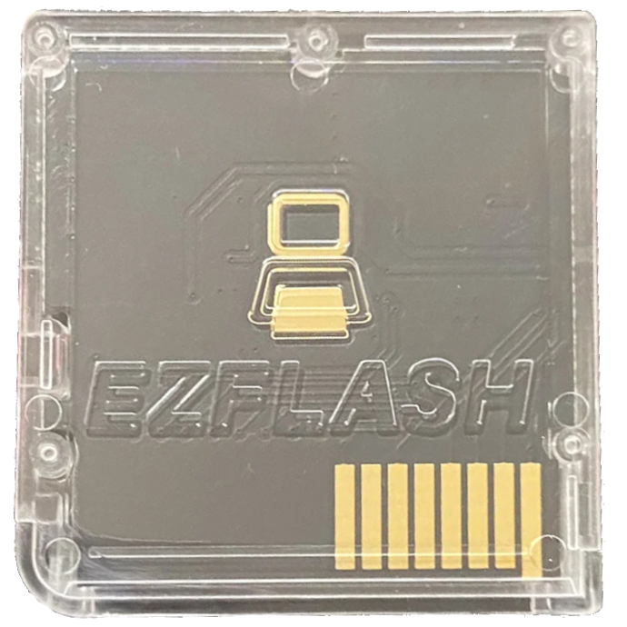

{ align=right width="115"}
# EZ Flash Parallel
## ezflash.cn

!!! warning "Known Issues"

    This cart is known to have a few problems due to its flawed hardware:
    
    1. The SD access on this cart is fairly slow which may cause some games & homebrew to run with slowdown.
    
    2. Sleep mode on this cart is broken. Closing the DS lid causes the screen to turn off, but the game continues to run.

    3. In some cases, this cart needs the paper trick to be read by the console due to inconsistent shell quality.

!!! danger "Warning"

    Do not run the game `Casper's Scare School: Spooky Sports Day` on any Kernel below 1.06, this will **brick** the cart due to an oversight with the save patch system on kernels 1.05 and below.

---

### Setup Guide:

1. Format the SD card you are using by following the [formatting tutorial.](../tutorials/formatting.md){target="_blank"}

1. Download the [EZ-Flash 1.06 Kernel](https://www.ezflash.cn/zip/ezpkernelen20240425.zip)

1. Open/extract the zip file, and copy *the contents* into the root of your SD card.

1. A cheat database is included, but if you want to use a different one, download the DSJ [cheat database.](https://github.com/DeadSkullzJr/NDS-i-Cheat-Databases/releases/latest)

1. You will need the `usrcheat.7z` file. Extract it using [7-Zip](https://www.7-zip.org/), inside you will find a `usrcheat.dat` file. Copy this file to `__ezds/cheats/` on your SD card and overwrite the old one.

1. Create a `Games` folder in your SD card root, and place your `.nds` game ROMs inside. You can also create additional folders to help with organizing/categorizing your ROMs.

1. Insert the SD card back into your cart, plug the cart into your DS, and see if it boots into the menu.

!!! tip "Themes"

    Looking to change the default theme? Check out the themes repository at [themes.flashcarts.net](https://themes.flashcarts.net)!