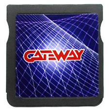

{ align=right width="115"}
# Gateway Blue
## gateway-3ds.com

!!! info
    
    Gateway3DS was a bundle of two flashcarts; one blue DS mode cart, and one red 3DS mode cart. The main goal of this product was to launch 3DS ROMs from the red cart. This was achieved by running a DS mode exploit from the blue cart to load into Gateway emuNAND, where the red cart could then be used.

    Nowadays, Luma3DS has replaced the need for the red cart, but the blue cart can be used as a standard DS flashcart to run NDS roms and homebrew on any DS family system. The setup guides below will cover setting up the blue cart for this use case. As this cart is related to the R4iLS, it uses the same AceWood kernel, but with a different header.

### Setup Guide:

=== "Gateway Blue WoodR4 1.62"

    1. Format the SD card you are using by following [this guide.](https://wiki.hacks.guide/wiki/Formatting_an_SD_card)
    
    1. Download the [Gateway Blue WoodR4 1.62 kernel.](https://archive.flashcarts.net/Gateway_Blue/Gateway_Blue_Wood_R4_1.62.zip)
    
    1. Open/extract the zip file, and copy *the contents* into the root of your SD card.
    
    1. If you'd like to be able to use cheats on your games, download a [cheat database.](https://github.com/DeadSkullzJr/NDS-i-Cheat-Databases/releases/latest)
    
    1. You will need the `usrcheat.7z` file. Extract it using [7-Zip](https://www.7-zip.org/), inside you will find a `usrcheat.dat` file. Copy this file to `__rpg/cheats/` on your SD card. (Create the `cheats` folder if it doesn't exist)
    
    1. Create a `Games` folder in your SD card root, and place your `.nds` game ROMs inside. You can also create additional folders to help with organizing/categorizing your ROMs.
    
    1. Insert the SD card back into your cart, plug the cart into your DS, and see if it boots into the menu.
    
    !!! warning "Missing Anti-Piracy Patches"
    
        Gateway Blue WoodR4 1.62 is known to have issues with anti-piracy checks in a few newer games, notably with clean roms of Pokemon Black & White 2, where EXP gain gets disabled by AP detection.
        
        To fix this issue, tap the Y button in the WoodR4 menu with the game highlighted, open the cheats menu, and enable the `Bypass Anti-Piracy` cheat before starting the game.

=== "AceOS 2.13"

    !!! info "AceOS Kernel Package"
    
        AceOS is a version of the kernel that includes a custom start menu allowing you to boot into various preloaded emulators, apps, and hypervisors; GBARunner2 and 3, GameYob, NesDS, Moonshell2, and others.
    
    1. Format the SD card you are using by following [this guide.](https://wiki.hacks.guide/wiki/Formatting_an_SD_card)
    
    1. Download [Gateway Blue AceOS 2.13.](https://github.com/flashcarts/AOS/releases/latest/download/AOS_Gateway.zip)
    
    1. Open/extract the zip file, and copy *the contents* into the root of your SD card.
    
    1. If you'd like to be able to use cheats on your games, download a [cheat database.](https://github.com/DeadSkullzJr/NDS-i-Cheat-Databases/releases/latest)
    
    1. You will need the `usrcheat.7z` file. Extract it using [7-Zip](https://www.7-zip.org/), inside you will find a `usrcheat.dat` file. Copy this file to `__rpg/cheats/` on your SD card. (Create the `cheats` folder if it doesn't exist)
    
    1. Navigate to `/roms` and place your `.nds` game ROMs inside the `nds` folder. Place other console roms supported by AceOS emulators in their respective folders.
    
    1. Insert the SD card back into your cart, plug the cart into your DS, and see if it boots into the menu.
    
    !!! tip
        
        Some emulators shipped with AceOS require you to provide a BIOS binary before they can be used. See the [AOS README](https://github.com/flashcarts/AOS?tab=readme-ov-file#setup) for more info.
    
    !!! warning "Missing Anti-Piracy Patches"
    
        Gateway Blue WoodR4 1.62 is known to have issues with anti-piracy checks in a few newer games, notably with clean roms of Pokemon Black & White 2, where EXP gain gets disabled by AP detection.
        
        To fix this issue, tap the Y button in the WoodR4 menu with the game highlighted, open the cheats menu, and enable the `Bypass Anti-Piracy` cheat before starting the game.