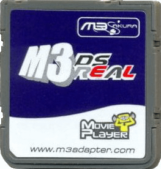

{ align=right width="115"}
# M3 DS Real and M3i Zero (Not GMP-Z003)
## m3adapter.com

!!! info

    The M3 DS Real is the second Slot-1 flashcart from the M3 Adapter team. The M3 team disappeared around 2011, and the Sakura kernel hasn't been updated since then. That means some games released later on in the DS lifecycle don't actually boot in the Sakura/Touchpod kernel, due to missing compatibility patches. To fix this issue, it's recommended to either run Pico-Launcher/YSMenu as replacement kernel, or Sakura with YSMenu as fallback, if you choose to keep Sakura as the primary kernel.

    While this cart does support SDHC SD cards, Sakura/TouchPod has issues with cards that are 64GB or larger. The nds loader will simply refuse to load games, or load the game but crash/freeze soon after. However, YSMenu and Pico-Launcher handle 64GB and larger cards just fine on the M3 DS Real, when configured as primary kernel.

### Setup Guide:

=== "YSMenu"

    1. Format the SD card you are using by following the [formatting tutorial.](../tutorials/formatting.md){target="_blank"}
    
    1. Download the [RetroGameFan YSMenu 7.06 kernel.](https://gbatemp.net/download/retrogamefan-multi-cart-update.35737/download)
    
    1. Extract the YSMenu .7z file you downloaded using [7-Zip](https://www.7-zip.org/), then go into the `M3Real_M3iZero YSMenu` folder.
    
    1. From this folder, copy the following files/folders to your SD card root:
    
        - `Games` folder
    
        - `System` folder
    
        - `TTMenu` folder
    
        - `SRESET.DAT`
    
        - `YSMenu.nds`
    
    1. Place any .nds game ROMs you'd like to play into the `Games` folder.
    
    1. The files on your SD card should now look like this:
    
        - { align=left width="600"}

    1. Insert the SD card back into your cart, plug the cart into your DS, and see if it boots into the menu.

    !!! tip "Themes"

        Looking to change the default theme? Check out the YSMenu themes repository at [themes.flashcarts.net](https://themes.flashcarts.net/ysmenu/)!

=== "Pico-Launcher"

    !!! info "Kernel Info"

        Pico-Launcher is the game menu for the DS-Pico (an open source DS flashcart by the LNH team) and other supported carts. Combined with Pico-Loader, it can be used as a full kernel, and supports almost all retail DS games. It features a material-inspired user interface, and an extremely fast loader.

    !!! warning "Cheats and Soft-Reset"

         Note that Pico-Launcher/Loader currently does not support using cheats, and soft-reset to the game menu is also unsupported. If these features are important to you, consider using YSMenu or Sakura.

    1. Format the SD card you are using by following the [formatting tutorial.](../tutorials/formatting.md){target="_blank"}

    1. Download the latest [Pico Package for M3DS Real.](https://picoarchive.cdn.blobfrii.com/pico_package_M3DS.zip)

    1. Extract the `pico_package_M3DS.zip` file with [7-Zip](https://www.7-zip.org/), or your native file manager app.

    1. From within the extracted files, copy the following files/folders to your SD card root:

        - `_pico` folder

        - `SYSTEM` folder

        - `_picoboot.nds`
    
    1. Create a `Games` folder in your SD card root, and place any `.nds` game ROMs you'd like to play inside.
    
    1. The files on your SD card should now look like this:
    
        - { align=left width="600"}
    
    1. Insert the SD card back into your cart, plug the cart into your DS, and see if it boots into the menu.

=== "Sakura + YSMenu"

    !!! info "Sakura Kernel"
    
        Sakura is the official kernel of the M3 DS Real and M3i Zero. It's based on Moonshell 2, with a custom NDS loader. It also offers a couple unique features like RTS (Real-Time-Save), not found in YSMenu. Because it's based on Moonshell2, it also provides media playback directly in the kernel menu, which can be pretty convenient. This tab will help you setup Sakura with YSMenu, so that you can use Sakura as primary and fallback to YSMenu when necessary, for games that don't load in Sakura.
    
    1. Format the SD card you are using by following the [formatting tutorial.](../tutorials/formatting.md){target="_blank"}
    
    1. Download the [Sakura 1.49a kernel.](https://archive.flashcarts.net/m3adapter.com/m3adapter.com_GMP-Z003_Sakura_1.49a.zip)
    
    1. Extract *the contents* of the Sakura zip to your SD card's root. (It should just be a single `SYSTEM` folder)
    
    1. If you'd like to be able to use cheats on your games, download a [cheat database.](https://gbatemp.net/threads/deadskullzjrs-nds-i-cheat-databases.488711/)

    1. You will need the `cheat_EN.db` file from the download link in the post. Copy the `cheat_EN.db` file into the `SYSTEM` folder on your SD card.
    
    1. Next, we'll be adding YSMenu 7.06 to the setup.
    
    1. Download the [RetroGameFan YSMenu 7.06 kernel.](https://gbatemp.net/download/retrogamefan-multi-cart-update.35737/download)
    
    1. Extract the YSMenu .7z file you downloaded using [7-Zip](https://www.7-zip.org/), then go into the `M3Real_M3iZero YSMenu` folder.
    
    1. From this folder, copy the following files/folders to your SD card root:
    
        - `Games` folder
    
        - `TTMenu` folder
    
        - `SRESET.DAT`
    
        - `YSMenu.nds`
    
    1. Place any .nds game ROMs you'd like to play into the `Games` folder.

    1. The files on your SD card should now look like this:
    
        - { align=left width="600"}
    
    1. Place the SD card back into the cartridge, and boot it up. You'll be asked to select between TouchPod or Sakura, choose whichever you prefer. You can change this later. When you want to use YSMenu, simply launch YSMenu.nds in Sakura/Touchpod.