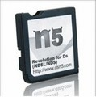

{ align=right width="115"}
# N5
## dsn5.com

!!! info

    This cart is a clone of the original R4SDHC (which is itself a clone of the original R4, with modifications). While it's R4SDHC-related, it doesn't have to chainload YSMenu via its stock kernel. It can directly boot YSMenu as `_DS_MENU.DAT`, provided the cart's `_AX_MENU.DAT` file is present.

!!! warning

    Like the R4SDHC, this cart's SD I/O implementation is wonky since its SDHC I/O code is closely based off of the original R4's I/O, meant for SD class cards rather than SDHC ones. This causes the cart to be unstable with SD cards bigger than 4GB. (It will work with larger cards, but they may cause issues. Consider yourself warned.)

### Setup Guide:

1. Format the SD card you are using by following [this guide.](https://wiki.hacks.guide/wiki/Formatting_an_SD_card)

1. Download the [N5 YSMenu 7.06 package.](https://github.com/Sanrax/YSMenu-Custom-Packages/releases/download/v7.06/dsn5.com-N5-YSMenu-7.06.zip)

1. Next, extract *the contents* of the downloaded kernel zip to your SD card.

1. Place any `.nds` game ROMs you'd like to play into the `Games` folder.

1. Insert the SD back into the cart, plug the cart into the DS, and see if it boots into the menu.