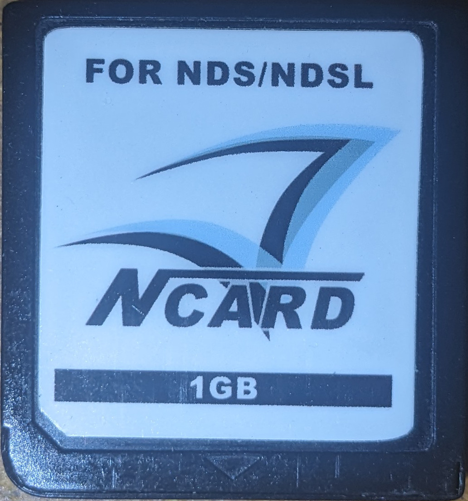

{ align=right width="115"}
# N-Card & Clones
## N-Card, DS Linker, DS Fire Link, Ultra FlashPass EX, NeoFlash MK5, Ultra N-Card, ASNAND & ASIC Carts.

---

!!! info
    Usage of this guide requires you to have a Slot 2 USB reader for your N-Card and a Nintendo DS or DS Lite system.

### Setup Guide:

1. Find and connect a DS/DS Lite with GBA slot2 writer device for your N-card/clone to PC.
1. Ensure your cart had previously been updated to udisk 1.45 and is formatted to be work with udisk 1.45 and the 1.45 matching DLDI driver. If it has not been updated, download the [uDisk v1.45 package](https://archive.flashcarts.net/N-Card/N-Card_FW_2.55_v27.zip) and extract the contents of the package to the root of your N-Card, boot the N-Card and allow it to perform the upgrade.

    !!! tip
        If the filesystem was pre 1.45 XuluMenu will likely hang. But there is a recovery menu. You access it via L+R shoulder buttons on boot which brings up a recovery screen. From there, Press A to boot into built-in uDisk 1.45 while holding start+select to bring up format menu where you can perform a full format. This will **erase all files** on your N-Card so ensure your games & saves have been backed up beforehand!

1. Download the [Xulumenu Package](https://github.com/ApacheThunder/XuluMenu/releases/latest/download/xulumenu.zip) and extract it to a location on your computer.
1. Boot up DS and boot the cart while holding [L] + [R] + [A] + [B] + [DPad Up] at the same time until you see "USB SAFE BLOCK" text on bottom screen.
1. Navigate into the extracted `Xulumenu` files and enter the `USB` folder. Run the included UPDATE_ALL.cmd file to have USB exe flash the new SRL to the cart.
1. After the process is complete, reboot and see your changes live! File browser will come up if boot.nds is not present or if cart is booted with B button held.
1. Note that for Xmenu to operate correctly you must run udisk first. You can use udisk 1.45 as your boot.nds if you wish to auto boot into xmenu. The udisk.srl included in the arm9/binaries source can be used for this purpose. Just copy and rename to boot.nds to have XuluMenu autoboot it or as udisk.nds if you wish to use something else as boot.nds

#### Recovery options
Holding B while booting will skip auto booting boot.nds and show file browser. If fat init fails, built in uDisk will run. However if fat init hangs you can boot while holding L + R shoulder buttons to bring up recovery menu that will let you boot into built in udisk 1.45. Do so while holding START + SELECT to boot udisk into format menu if you need to reformat your cart's file system.