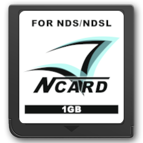

{ align=right width="115"}
# N-Card & Clones
## N-Card, DS Linker, DS Fire Link, Ultra FlashPass EX, NeoFlash MK5, Ultra N-Card, ASNAND & ASIC Carts.

---

!!! note
    Usage of this guide requires you to have a Slot 2 USB reader for your N-Card and a Nintendo DS or DS Lite system or a modded Nintendo DSi/3DS with GodMode9i.

### Setup Guide:

=== "DS/DS Lite with Slot 2 Adapter"

    1. Insert the N-Card into your DS and power it on. Format your N-Card by holding Start + Select while booting the card on your DS. If available, perform a "Full Format". If this option is not available, perform a "Quick Format". Then power off your DS.
    1. Insert your GBA Slot-2 writer device for your N-Card/clone into a DS/DS Lite, then connect the writer via USB to your PC. Power on your DS and choose USB uDisk mode if prompted. Your N-Card should now appear on your computer as a drive.
    1. Download the [N-Card uDisk v1.45 package](https://archive.flashcarts.net/N-Card/N-Card_FW_2.55_v27.zip)
    1. Open/extract the zip file, and copy *the contents* into the root of your N-Card.
    1. Switch off your DS and unplug the Slot 2 adapter.
    1. Allow your N-Card to be updated to uDisk 1.45 if prompted, then power off your DS after it's done.
    1. Insert your GBA Slot-2 writer device for your N-Card/clone into a DS/DS Lite, then connect the writer via USB to your PC. Power on your DS and choose USB uDisk mode if prompted. Your N-Card should now appear on your computer as a drive.
    1. Delete autorun1.nds and then switch off your DS and unplug the Slot 2 adapter.
    1. You can use the Slot 2 Adapter in USB uDisk mode to copy homebrew and games from your computer to the N-Card's internal storage.

=== "GodMode9i"

    1. Download the latest release of [GodMode9i](https://github.com/DS-Homebrew/GodMode9i/releases/latest) from Github or from Universal-Updater if on a Modded 3DS. For Modded DSi consoles, download `GodMode9i.dsi` to your DSi SD card and launch it with Twilightmenu++ or AKMenu-Next.
    1. Insert the N-Card into your DSi/3DS and power it on. Format your N-Card by holding Start + Select while booting the card on your DS. If available, perform a "Full Format". If this option is not available, perform a "Quick Format". Then power off your DSi/3DS.
    1. Download the [N-Card uDisk v1.45 package](https://archive.flashcarts.net/N-Card/N-Card_FW_2.55_v27.zip)
    1. Make a folder called `NCard` on your DSi/3DS SD card, then open/extract the zip file, and copy *the contents* into the the `NCard` folder on your DSi/3DS SD card.
    1. Boot up your DSi/3DS and go into GodMode9i from your chosen menu.
    1. Go into the `NCard` folder and press the L Shoulder button on `xmenu.dat` and `autorun1.nds` to select them.
    1. Press the Y button to add them to the clipboard.
    1. Press B twice to go back to the main menu, and go to the `[fat:]` option.
    1. Press the Y button and choose "Copy Files".
    1. Reboot your DSi/3DS and boot up the N-Card. Allow your N-Card to be updated to uDisk 1.45 if prompted, then power off your DSi/3DS after it's done.
    1. Boot up your DSi/3DS and go into GodMode9i from your chosen menu.
    1. Go to the `[fat:]` option and move the cursor to `autorun1.nds`. Press the X button to delete autorun1.nds and then switch off your DSi/3DS.
    1. GodMode9i can be used to copy homebrew and games from your DSi/3DS SD card to the N-Card's internal storage.