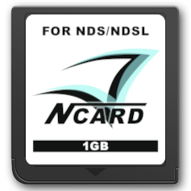

{ align=right width="115"}
# N-Card & Clones
## N-Card, DS Linker, DS Fire Link, Ultra FlashPass EX, NeoFlash MK5, Ultra N-Card, ASNAND & ASIC Carts.

---

!!! note
    Usage of this guide requires you to have a Slot 2 USB reader for your N-Card and a Nintendo DS or DS Lite system.

### Setup Guide:

1. Insert your GBA Slot-2 writer device for your N-Card/clone into a DS/DS Lite, then connect the writer via USB to your PC.
1. Ensure your cart has previously been updated to udisk 1.45 and is formatted to be work with udisk 1.45 and the 1.45 DLDI driver. 
    - If it has not been updated, download the [uDisk v1.45 package](https://archive.flashcarts.net/N-Card/N-Card_FW_2.55_v27.zip) and extract the contents of the package to the root of your N-Card, then boot the N-Card using your DS and allow it to upgrade uDisk.

    !!! tip
        If the N-Card's filesystem is from a uDisk version earlier than 1.45, XuluMenu is likely freeze. However, the N-Card has a recovery menu you can use to resolve this problem - Hold the `L` + `R` shoulder buttons while booting the cart, which will bring up the recovery menu. In the menu, press `A` to boot into the built-in uDisk 1.45 while holding `START` + `SELECT` to bring up a format menu where you can perform a full format. Note that this will **erase all files** on your N-Card! Ensure your games and saves have been backed up beforehand.

1. Download the [XuluMenu Package](https://github.com/ApacheThunder/XuluMenu/releases/latest/download/xulumenu.zip) and extract it to a location on your computer.
1. Turn on the DS and boot the cart while holding [L] + [R] + [A] + [B] + [DPad Up] at the same time until you see "USB SAFE BLOCK" text on the bottom screen.
1. Navigate into the extracted XuluMenu files on your PC and enter the `USB` folder. Run the included `UpdateCart.cmd` batch script to have `USBNDS.exe` flash the new SRL onto your cart.
1. After the process is complete, reboot and you will see your changes live! The file browser will come up if `boot.nds` is not present, or if the cart is booted with the `B` button held.
1. Note that for xMenu to operate correctly you must run uDisk first. You can use uDisk 1.45 as your `boot.nds` if you wish to auto boot into xMenu. The udisk.srl included in the arm9/binaries source can be used for this purpose. Just copy and rename it to boot.nds to have XuluMenu autoboot it. Or, rename it to `udisk.nds` if you wish to use something else as boot.nds.

!!! info "Cart Recovery Options"
    - Holding `B` while booting the cart will skip auto-booting into the `boot.nds` file and will instead load a file browser.
    - If fat init fails, the built in uDisk will run. However if fat init hangs, you can boot while holding `L` + `R` shoulder buttons to bring up the recovery menu that will let you boot into built in uDisk 1.45.
    - Booting into the built in uDisk from recovery menu while holding `START` + `SELECT` will load uDisk's format menu. You can use this feature to reformat your cart's file system if necessary.