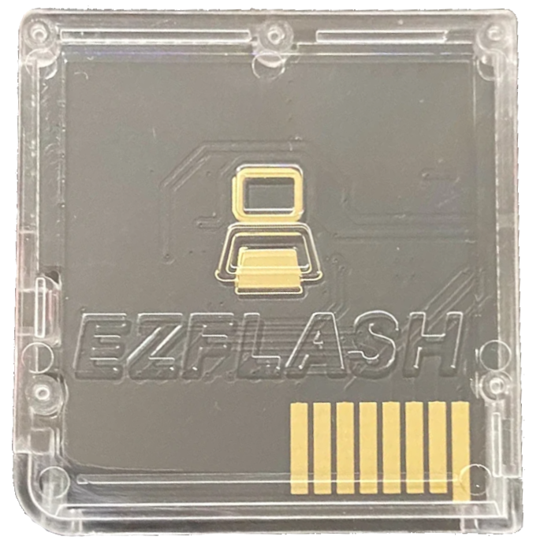

{ align=right width="115"}
# EZ Flash Parallel
## ezflash.cn

!!! warning "Known Issues"

    This cart is known to have a few problems due to its flawed hardware:
    
    1. The SD access on this cart is fairly slow which may cause some games & homebrew to run with slowdown.
    
    2. Sleep mode on this cart is broken. Closing the DS lid causes the screen to turn off, but the game continues to run.

    3. In some cases, this cart needs the paper trick to be read by the console due to inconsistent shell quality.

!!! danger "Warning"

    Do not run the game `Casper's Scare School: Spooky Sports Day` on any Kernel below 1.06, this will **brick** the cart due to an oversight with the save patch system on kernels 1.05 and below.

---

### Setup Guide:

=== "Pico-Launcher"

    !!! info "Kernel Info"

        Pico-Launcher is the game menu for the DS-Pico (an open source DS flashcart by the LNH team) and other supported carts. Combined with Pico-Loader, it can be used as a full kernel, and supports almost all retail DS games. It features a material-inspired user interface, and an extremely fast loader.

        Keep in mind however, that issues like sleep mode on the EZ Flash Parallel are a hardware problem and will not be solved by running an alterate loader like Pico-Launcher. It is however faster than EZDS's Wood kernel, even on the Parallel's dreadfully slow SD I/O.

    !!! warning "Cheats and Soft-Reset"

        Note that Pico-Launcher/Loader currently does not support using cheats, and soft-reset to the game menu is also unsupported. If these features are important to you, consider using EZDS Wood.

    ### Setup Guide:

    1. Format the SD card you are using by following the [formatting tutorial.](../tutorials/formatting.md){target="_blank"}

    1. Download the latest [Pico Package for EZFlash Parallel.](https://picoarchive.cdn.blobfrii.com/pico_package_EZP.zip)

    1. Extract the `pico_package_EZP.zip` file with [7-Zip](https://www.7-zip.org/), or your native file manager app. Then, copy *the contents* into the root of your SD card.
    
    1. Create a `Games` folder in your SD card root, and place any `.nds` game ROMs you'd like to play inside.
    
    1. The files on your SD card should now look like this:
    
        - { align=left width="600"}
    
    1. Insert the SD card back into your cart, plug the cart into your DS, and see if it boots into the menu.

=== "EZDS Wood"

    1. Format the SD card you are using by following the [formatting tutorial.](../tutorials/formatting.md){target="_blank"}
    
    1. Download the [EZ-Flash 1.06 Kernel](https://www.ezflash.cn/zip/ezpkernelen20240425.zip)
    
    1. Open/extract the zip file, and copy *the contents* into the root of your SD card.
    
    1. A cheat database is included, but if you want to use a different one, download the DSJ [cheat database.](https://gbatemp.net/threads/deadskullzjrs-nds-i-cheat-databases.488711)
        
    1. You will need the `usrcheat.dat` file from the download link in the post. Copy this file to `__ezds/cheats/` on your SD card. (Replace the existing `usrcheat.dat` file)
    
    1. Create a `Games` folder in your SD card root, and place your `.nds` game ROMs inside. You can also create additional folders to help with organizing/categorizing your ROMs.

    1. The files on your SD card should now look like this:
    
        - { align=left width="600"}
    
    1. Insert the SD card back into your cart, plug the cart into your DS, and see if it boots into the menu.
    
    !!! tip "Themes"
    
        Looking to change the default theme? Check out the themes repository at [themes.flashcarts.net](https://themes.flashcarts.net)!