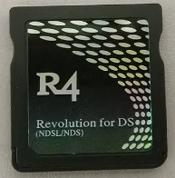

{ align=right width="115"}
# Original R4
## r4ds.com

!!! warning

    These carts are limited to SD-class cards, meaning only up to 2GB size cards will work. **SDHC and SDXC (cards above 2GB) will not work.**

!!! info

    The M3 Simply has identical hardware to an original R4. Therefore, it can use the same WoodR4 kernel!

### Setup Guide:

1. Format the SD card you are using by following [this guide.](https://wiki.hacks.guide/wiki/Formatting_an_SD_card)

1. Download the [R4DS WoodR4 1.62 kernel.](http://flashcard-archive.ds-homebrew.com/R4_original_M3_Simply/R4DS_Wood_R4_1.62.zip)

1. Open/extract the zip file, and copy *the contents* into the root of your SD card.

1. If you'd like to be able to use cheats on your games, download a [cheat database.](https://github.com/DeadSkullzJr/NDS-i-Cheat-Databases/releases/latest)

1. You will need the `usrcheat.7z` file. Extract it using [7-Zip](https://www.7-zip.org/), inside you will find a `usrcheat.dat` file. Copy this file to `__rpg/cheats/` on your SD card. (Create the `cheats` folder if it doesn't exist)

1. Create a `Games` folder in your SD card root, and place your `.nds` game ROMs inside. You can also create additional folders to help with organizing/categorizing your ROMs.

1. Insert the SD card back into your cart, plug the cart into your DS, and see if it boots into the menu.

!!! tip

    Since this cart is fairly size-constrained with the 2GB limitation, you may want to consider trimming your NDS roms with [NDSTokyoTrim](https://www.gamebrew.org/wiki/NDSTokyoTrim). This will trim off the extra unused data from your NDS ROMs, saving you SD card space at no cost!