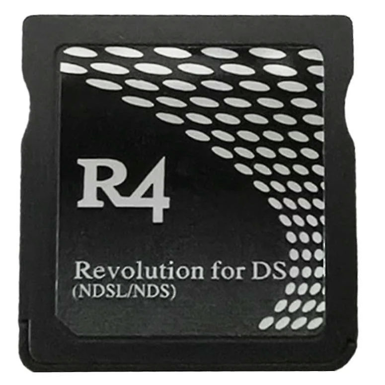
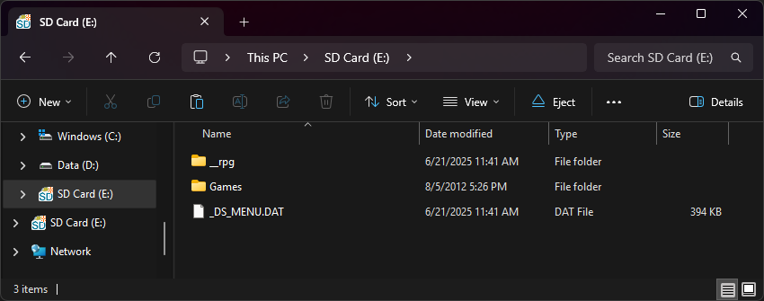
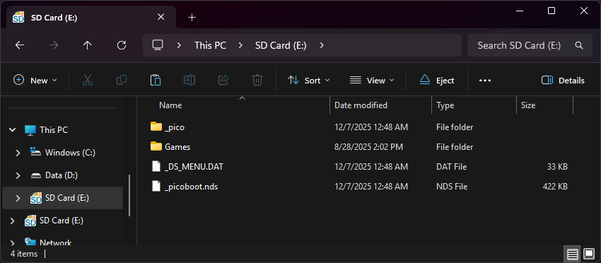

{ align=right width="115"}
# Original R4 & M3 Simply
## r4ds.com / m3adapter.com

!!! warning "SD Limitations"

    These carts are limited to SD-class cards, meaning only up to 2GB size cards will work. **SDHC and SDXC (cards above 2GB) will not work.**

    The M3 Simply has identical hardware to an original R4. Therefore, it can use the same kernels, but the same SD limitations apply.

### Setup Guide:

=== "WoodR4 1.62"

    1. Format the SD card you are using by following the [formatting tutorial.](../tutorials/formatting.md){target="_blank"}
    
    1. Download the [R4DS WoodR4 1.62 kernel.](https://archive.flashcarts.net/R4_original_M3_Simply/R4DS_Wood_R4_1.62.zip)
    
    1. Open/extract the zip file, then copy `__rpg` and `_DS_MENU.DAT` into the root of your SD card.
    
    1. If you'd like to be able to use cheats on your games, download a [cheat database.](https://gbatemp.net/threads/deadskullzjrs-nds-i-cheat-databases.488711)
        
    1. You will need the `usrcheat.dat` file from the download link in the post. Copy this file to `__rpg/cheats/` on your SD card. (Create the `cheats` folder if it doesn't exist)
    
    1. Create a `Games` folder in your SD card root, and place your `.nds` game ROMs inside. You can also create additional folders to help with organizing/categorizing your ROMs.
    
    1. The files on your SD card should now look like this:
    
         - { align=left width="600"}
    
    1. Insert the SD card back into your cart, plug the cart into your DS, and see if it boots into the menu.
    
    !!! tip "Post-Setup Enhancements"

        **Emulators**
        
        To emulate retro consoles on your DS like GBA, GB/C, NES, and others, you will need to download emulators.
        
        [Emulators Tutorial :octicons-arrow-right-16:](../tutorials/emulators.md){ .md-button }
        
        **Themes**
        
        Looking to customize your menu? Check out the AKMenu themes repository:
        
        [Themes Repository :octicons-arrow-right-16:](https://themes.flashcarts.net/akmenu/){ .md-button }

=== "Pico-Launcher"

    !!! info "Kernel Info"

        Pico-Launcher is the game menu for the DS-Pico (an open source DS flashcart by the LNH team) and other supported carts. Combined with Pico-Loader, it can be used as a full kernel, and supports almost all retail DS games. It features a material-inspired user interface, and an extremely fast loader.

    !!! warning "Soft-Reset Not Supported"

        Note that Pico-Launcher/Loader currently does not support soft-resetting to the game menu. If this is important to you, consider using WoodR4.

    1. Format the SD card you are using by following the [formatting tutorial.](../tutorials/formatting.md){target="_blank"}

    1. Download the latest [Pico Package for Original R4.](https://picoarchive.cdn.blobfrii.com/pico_package_R4.zip?picoloader={{pico_versions.loader}}&picolauncher={{pico_versions.launcher}}&fcnetrev={{pico_versions.fcnetrev}})
        - <small>Currently updated to Pico-Launcher `{{pico_versions.launcher}}` and Pico-Loader `{{pico_versions.loader}}`</small>

    1. Extract the `pico_package_R4.zip` file with [7-Zip](https://www.7-zip.org/), or your native file manager app. Then, copy *the contents* into the root of your SD card.
    
    1. If you'd like to be able to use cheats on your games, download a [cheat database.](https://gbatemp.net/threads/deadskullzjrs-nds-i-cheat-databases.488711){target="_blank"}
    
    1. You will need the `usrcheat.dat` file from the download link in the post. Copy this file into the `_pico` folder on your SD card.

    1. Create a `Games` folder in your SD card root, and place any `.nds` game ROMs you'd like to play inside.
    
    1. The files on your SD card should now look like this:
    
        - { align=left width="600"}
    
    1. Insert the SD card back into your cart, plug the cart into your DS, and see if it boots into the menu.

    !!! tip "Post-Setup Enhancements"

        **Emulators**
        
        To emulate retro consoles like GBA, GB/C, NES, and others, you will need to add emulators and configure their file associations for Pico-Launcher to display retro ROMs in the menu.
        
        [Emulators Tutorial :octicons-arrow-right-16:](../tutorials/emulators-pico.md){ .md-button }
        
        **Game Covers**
        
        Pico-Launcher supports showing game covers in cover flow layout mode, and on the top screen in icons mode. You will need to add cover images to your SD card to use this feature.
        
        [PicoCover :octicons-arrow-right-16:](https://scaletta.github.io/PicoCover/){ .md-button }
        
        **Themes**
        
        Looking to customize your DSpico interface? Check out the Pico themes repository:
        
        [Themes Repository :octicons-arrow-right-16:](https://themes.flashcarts.net/pico/){ .md-button }
        
        To create your own custom themes for Pico-Launcher, check out the themes creator:
        
        [Themes Creator :octicons-arrow-right-16:](https://santiagovalencia109.github.io/pl-Theme-Creator/){ .md-button }

!!! tip "Saving SD Space"

    Since this cart is fairly size-constrained with the 2GB limitation, you may want to consider trimming your NDS roms with [NDSTokyoTrim](https://www.gamebrew.org/wiki/NDSTokyoTrim). This will trim off the extra unused data from your NDS ROMs, saving you SD card space at no cost!