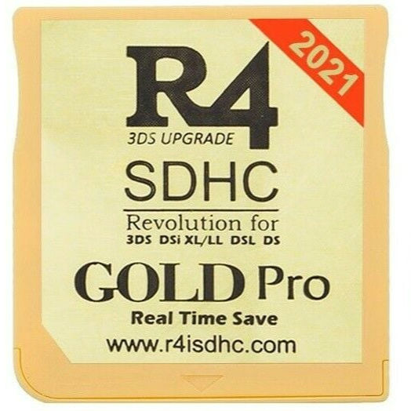
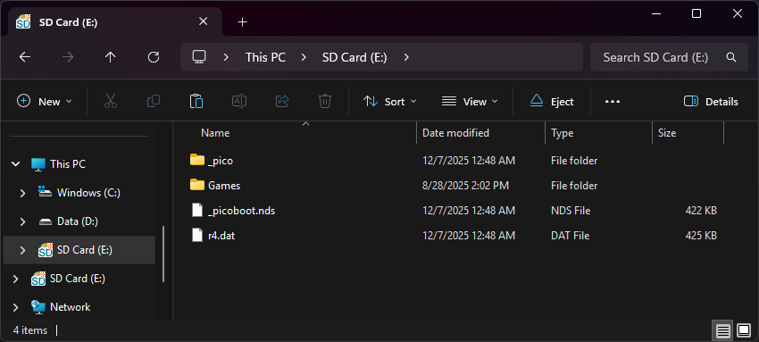

{ align=right width="115"}
# DSTTi DEMON-HW Carts (AKA Timebomb Carts)
## r4isdhc.com 2014+, r4i-sdhc.com, r4i-gold.eu, and others

!!! info

    DEMON carts are DSTTi clones with a customized firmware. The most notable difference is that these carts expect a specially padded `R4.dat` boot file. This is why booting other kernels than R4iMenu requires a bootstrap binary like nds-miniboot. Real-Time-Save is another feature exclusive to the DEMON family and it's R4iMenu kernel, which isn't found in any other DSTT/DSTTi based hardware.

    A list of all known DEMON carts can be found [here.](https://www.flashcarts.net/ysmenu-compat-ext#demon-dstti-clones)

### Setup Guide:

=== "R4iMenu"

    !!! info "Kernel Info"

        R4iMenu is compatible with **r4i-sdhc.com** and **r4isdhc.com (2014+)** carts. ***All other DEMON-HW based carts should use YSMenu or Pico-Loader instead.***

        Since the timebomb previously found in R4iMenu has been removed, it has become a good option for users that own supported carts, as it has better game compatibility than YSMenu, and supports Real-Time-Save. R4iMenu is also a decent kernel for playing romhacks and translation-patched games, as YSMenu can struggle to run those.

        YSMenu runs on all DEMON-HW carts. If you prefer the look and feel of YSMenu, you can choose to use it over R4iMenu, even if you have an R4iMenu-supported cart.

    1. Format the SD card you are using by following the [formatting tutorial.](../tutorials/formatting.md){target="_blank"}

    1. Download the appropriate kernel for your cart below, by checking the URL listed at the bottom of your cart's label:

        - [**r4isdhc.com** v4.3b kernel](https://github.com/Sanrax/YSMenu-Custom-Packages/releases/download/v7.06/r4isdhc.com_DEMON_4.3b.zip)

        - [**r4i-sdhc.com** v1.87b kernel](https://github.com/Sanrax/YSMenu-Custom-Packages/releases/download/v7.06/r4i-sdhc.com_DEMON_1.87b.zip)
            - *Please note that if your R4i-SDHC.COM cart has an "(i)" but no "Wi-Fi" or "V1.4" or "3DS" mark, it must use YSMenu instead!*

    1. Next, extract *the contents* of the downloaded kernel zip to your SD card.

    1. Create a `Games` folder in your SD card root, and place any `.nds` game ROMs you'd like to play inside.

    1. The files on your SD card should now look like this:
    
         - { align=left width="600"}

    1. Insert the SD back into the cart, plug the cart into the DS, and see if it boots into the menu.

=== "YSMenu"

    !!! info "Kernel Info"

        See [YSMenu Compatibility List's](https://www.flashcarts.net/ysmenu-compat-ext#demon-dstti-clones) `DEMON DSTTi Clones` section for a full list of compatible carts.

        YSMenu is a simple, fast, and stable kernel, featuring a menu UI resembling the original R4. It's a great choice for most DSTT-based flashcart users. However, it does lack RTS (Real Time Save), so check out the R4iMenu tab if that is something you're interested in.

    1. Format the SD card you are using by following the [formatting tutorial.](../tutorials/formatting.md){target="_blank"}

    1. Download the [RetroGameFan YSMenu 7.06 kernel.](https://gbatemp.net/download/retrogamefan-multi-cart-update.35737/download)

    1. Extract the YSMenu .7z file you downloaded using [7-Zip](https://www.7-zip.org/), then go into the `DSTTi-Clone YSMenu` folder.

    1. From this folder, copy the following files/folders to your SD card root:

        - `Games` folder

        - `TTMenu` folder

        - `TTMenu.dat`

    1. Download [this `R4.dat`](https://archive.flashcarts.net/YSMenu/DEMON_common/R4.dat), and place it in SD card root as well.

    1. Place any `.nds` game ROMs you'd like to play into the `Games` folder.

    1. The files on your SD card should now look like this:
    
         - { align=left width="600"}

    1. Insert the SD card back into your cart, plug the cart into your DS, and see if it boots into the menu.

    !!! tip "Themes"

        Looking to change the default theme? Check out the YSMenu themes repository at [themes.flashcarts.net](https://themes.flashcarts.net/ysmenu/)!

=== "Pico-Launcher"

    !!! info "Kernel Info"

        Pico-Launcher is compatible with **ALL** DSTT hardware, including all DEMON carts. Combined with Pico-Loader, it can be used as a full kernel, and supports almost all retail DS games. It features a material-inspired user interface, and an extremely fast loader.

    !!! warning "Cheats, Soft-Reset, and RTS"

        Note that Pico-Launcher/Loader currently does not support using cheats, and soft-reset to the game menu is also unsupported. If these features are important to you, consider using R4iMenu or YSMenu. Note that if cheats are a primary concern, YSMenu is the best choice. R4iMenu can have issues with some cheat codes.
        
        Real-Time-Save (save states), are only supported in R4iMenu. Follow the R4iMenu guide if this is a feature you'd like to use.

    1. Format the SD card you are using by following the [formatting tutorial.](../tutorials/formatting.md){target="_blank"}

    1. Download the latest [Pico Package for DSTT](https://picoarchive.cdn.blobfrii.com/pico_package_DSTT.zip?picoloader={{pico_versions.loader}}&picolauncher={{pico_versions.launcher}}&fcnetrev={{pico_versions.fcnetrev}}).

    1. Extract the `pico_package_DSTT.zip` file with [7-Zip](https://www.7-zip.org/), or your native file manager app.

    1. From within the extracted files, copy the following files/folders to your SD card root:

        - `_pico` folder

        - `_picoboot.nds`

        - `r4.dat`

    1. Create a `Games` folder in your SD card root, and place any `.nds` game ROMs you'd like to play inside.

    1. The files on your SD card should now look like this:
    
         - { align=left width="600"}

    1. Insert the SD back into the cart, plug the cart into the DS, and see if it boots into the menu.

=== "AKMenu-Next"

    !!! info "Kernel Info"

        AKMenu-Next is an alternative kernel based on akmenu4 (used in Wood R4 and AKAIO) and uses nds-bootstrap (and optionally Pico-Loader) to load games. This is an option if you have games, ROM hacks or fan translations that do not work on YSMenu or R4iMenu, and is also an option if you want a Wood R4 style interface.

    1. Download the latest release of [AKMenu-Next Flashcart Edition.](https://github.com/coderkei/akmenu-next/releases/latest/download/akmenu-next-flashcart.zip)

    1. Extract the downloaded `akmenu-next-flashcart.zip` file with [7-Zip](https://www.7-zip.org/).

    1. From within the akmenu-next files, copy the following files/folders to your SD card root:

        - `_nds` folder
        - `_pico` folder
        - `BOOT.NDS`

    1. Download the latest release of [nds-bootstrap.](https://github.com/DS-Homebrew/nds-bootstrap/releases/latest/download/nds-bootstrap.zip)

    1. Extract the downloaded `nds-bootstrap.zip` file with [7-Zip](https://www.7-zip.org/).

    1. Copy the *contents* of the files from the extracted `nds-bootstrap.zip` file to the `_nds` folder on your SD card.

    #### Pico-Loader (Experimental)

    If you would like to also use the experimental [Pico-Loader](https://github.com/LNH-team/pico-loader/) please follow the below steps, otherwise skip this section.
    Please bear in mind that Pico-Loader is still experimental and lacks soft-reset and cheat support. Any bugs should be reported on the [Pico-Loader Issues Page](https://github.com/LNH-team/pico-loader/issues).

    1. Download the latest release of [Pico-Loader for DSTT](https://github.com/LNH-team/pico-loader/releases/latest/download/Pico_Loader_DSTT.zip).

    1. Extract the downloaded `Pico_Loader_DSTT.zip` file with [7-Zip](https://www.7-zip.org/).

    1. Copy the *contents* of the files from the extracted `Pico_Loader_for_DSTT.zip` file to the `_pico` folder on your SD card.

    1. This loader can be selected by going to the settings in AKMenu-Next and finding the option labeled "Game Loader".

    #### Cheats

    1. If you'd like to be able to use cheats on your games, download a [cheat database.](https://gbatemp.net/threads/deadskullzjrs-nds-i-cheat-databases.488711)
    
    1. You will need the `usrcheat.dat` file from the download link in the post. Copy this file to `_nds/akmenunext/cheats/` on your SD card. (Create the `cheats` folder if it doesn't exist)

    #### Autobooting

    1. Open the `Autoboot` folder within the AKMenu-Next files.
    
    1. Copy the contents of the `R4i-SDHC` folder (do not copy the folder itself) to the root of your SD card.

    1. Create a `Games` folder in your SD card root, and place your `.nds` game ROMs inside. You can also create additional folders to help with organizing/categorizing your ROMs.
    
    1. The files on your SD card should now look like this:
    
        - { align=left width="600"}
    
    1. Insert the SD card back into your cart, plug the cart into your DS, and see if it boots into the menu.

    !!! tip "Themes"

        Looking to change the default theme? Check out the themes repository at [themes.flashcarts.net](https://themes.flashcarts.net)!

!!! warning

    There have been reports of users buying DSTTi DEMON carts from AliExpress and instead receiving an Ace3DS+/R4iLS clone, but still labeled to look like a DEMON cart. If your cart says `Can't open _dsmenu.dat` or `Couldn't find _DS_MENU.DAT` after setting up the kernel, you need to follow the [Ace3DS+/R4iLS guide](./ace3ds_r4ils.md) instead.

!!! info "Timebombs"

    While some old versions of the stock kernel have timebombs (error that triggers past a certain date), none of the kernels provided in this guide have one.

    If you'd like to learn more about flashcart timebombs and what they do, check out the [Timebomb Misconceptions](https://www.flashcarts.net/ds-timebomb) page on Flashcarts.net!
