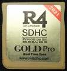
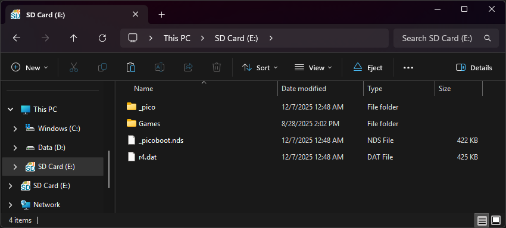
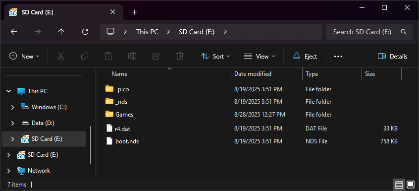
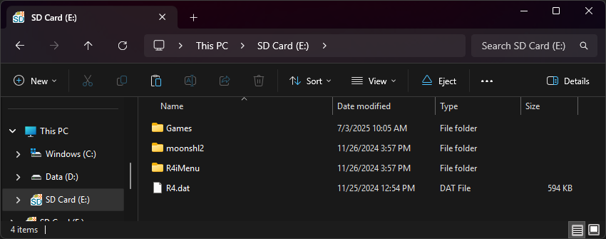
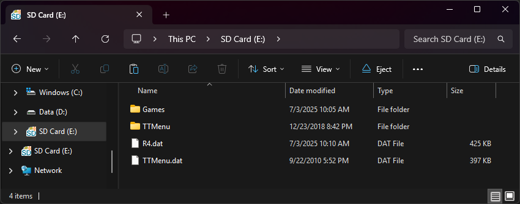

{ align=right width="115"}
# DSTTi DEMON-HW Carts (AKA Timebomb Carts)
## r4isdhc.com 2014+, r4i-sdhc.com, r4i-gold.eu, and others

!!! info "Cart Info"

    DEMON carts are DSTTi clones with a customized firmware. The most notable difference is that these carts expect a specially padded `R4.dat` boot file. This is why booting other kernels than R4iMenu requires a bootstrap binary like nds-miniboot. Real-Time-Save is another feature exclusive to the DEMON family and it's R4iMenu kernel, which isn't found in any other DSTT/DSTTi based hardware.

    A list of all known DEMON carts can be found [here.](https://www.flashcarts.net/ysmenu-compat-ext#demon-dstti-clones)

### Setup Guide:

=== "Pico-Launcher"

    !!! note "Kernel Info"

        Pico-Launcher is compatible with **ALL** DSTT hardware, including all DEMON carts. Combined with Pico-Loader, it can be used as a full kernel, and supports almost all retail DS games. It features a material-inspired user interface, and an extremely fast loader.

    ??? warning "Soft-Reset & RTS Not Supported"

        Note that Pico-Launcher/Loader currently does not support soft-resetting to the game menu. If this is important to you, consider using R4iMenu or YSMenu.
        
        Real-Time-Save (save states), are only supported in R4iMenu. Follow the R4iMenu guide if this is a feature you'd like to use.

    1. Format the SD card you are using by following the [formatting tutorial.](../tutorials/formatting.md){target="_blank"}

    1. Download the latest [Pico Package for DSTT.](https://picoarchive.cdn.blobfrii.com/pico_package_DSTT.zip?picoloader={{pico_versions.loader}}&picolauncher={{pico_versions.launcher}}&fcnetrev={{pico_versions.fcnetrev}})
        - <small>Currently updated to Pico-Launcher `{{pico_versions.launcher}}` and Pico-Loader `{{pico_versions.loader}}`</small>

    1. Extract the `pico_package_DSTT.zip` file with [7-Zip](https://www.7-zip.org/), or your native file manager app.

    1. From within the extracted files, copy the following files/folders to your SD card root:

        - `_pico` folder

        - `_picoboot.nds`

        - `r4.dat`

    1. If you'd like to be able to use cheats on your games, download a [cheat database.](https://gbatemp.net/threads/deadskullzjrs-nds-i-cheat-databases.488711){target="_blank"}
    
    1. You will need the `usrcheat.dat` file from the download link in the post. Copy this file into the `_pico` folder on your SD card.

    1. Create a `Games` folder in your SD card root, and place any `.nds` game ROMs you'd like to play inside.

    1. The files on your SD card should now look like this:
    
         - { align=left width="600"}

    1. Insert the SD back into the cart, plug the cart into the DS, and see if it boots into the menu.

    !!! tip "Post-Setup Enhancements"

        **Emulators**
        
        To emulate retro consoles like GBA, GB/C, NES, and others, you will need to add emulators and configure their file associations for Pico-Launcher to display retro ROMs in the menu.
        
        [Emulators Tutorial :octicons-arrow-right-16:](../tutorials/emulators-pico.md){ .md-button }
        
        **Game Covers**
        
        Pico-Launcher supports showing game covers in cover flow layout mode, and on the top screen in icons mode. You will need to add cover images to your SD card to use this feature.
        
        [PicoCover :octicons-arrow-right-16:](https://scaletta.github.io/PicoCover/){ .md-button }
        
        **Themes**
        
        Looking to customize your DSpico interface? Check out the Pico themes repository:
        
        [Themes Repository :octicons-arrow-right-16:](https://themes.flashcarts.net/pico/){ .md-button }
        
        To create your own custom themes for Pico-Launcher, check out the themes creator:
        
        [Themes Creator :octicons-arrow-right-16:](https://santiagovalencia109.github.io/pl-Theme-Creator/){ .md-button }

=== "AKMenu-Next"

    !!! note "Kernel Info"

        AKMenu-Next is an alternative kernel based on akmenu4 (used in Wood R4 and AKAIO) and uses Pico-Loader (and optionally nds-bootstrap) to load games. This is an option if you prefer the Wood UI and it's themes over Pico-Launcher.
    
    ??? warning "Soft-Reset Not Supported for Pico-Loader"

        Note that Pico-Loader inside AKMenu-Next currently does not support soft-resetting to the game menu. If this is important to you, consider using YSMenu, R4iMenu or using the nds-bootstrap loader within AKMenu-Next.

    1. Download the latest release of [AKMenu-Next Flashcart Edition.](https://github.com/coderkei/akmenu-next/releases/latest/download/akmenu-next-flashcart.zip)

    1. Extract the downloaded `akmenu-next-flashcart.zip` file with [7-Zip](https://www.7-zip.org/).

    1. From within the akmenu-next files, copy the following files/folders to your SD card root:

        - `_nds` folder
        - `_pico` folder
        - `BOOT.NDS`

    1. Go into the `Autoboot` folder and then go into the `R4i-SDHC` folder. Copy `R4.dat` to your SD card root.

    1. Download the latest release of [Pico-Loader for DSTT](https://github.com/LNH-team/pico-loader/releases/latest/download/Pico_Loader_DSTT.zip).

    1. Extract the downloaded `Pico_Loader_DSTT.zip` file with [7-Zip](https://www.7-zip.org/).

    1. Copy the *contents* of the files from the extracted `Pico_Loader_for_DSTT.zip` file to the `_pico` folder on your SD card.

    1. If you'd like to be able to use cheats on your games, download a [cheat database.](https://gbatemp.net/threads/deadskullzjrs-nds-i-cheat-databases.488711)
    
    1. You will need the `usrcheat.dat` file from the download link in the post. Copy this file to `_nds/akmenunext/cheats/` on your SD card. (Create the `cheats` folder if it doesn't exist)

    1. Create a `Games` folder in your SD card root, and place your `.nds` game ROMs inside. You can also create additional folders to help with organizing/categorizing your ROMs.
    
    1. The files on your SD card should now look like this:
    
        - { align=left width="600"}
    
    1. Insert the SD card back into your cart, plug the cart into your DS, and see if it boots into the menu.

    ??? info "nds-bootstrap installation (Optional)"

        1. Download the latest release of [nds-bootstrap](https://github.com/DS-Homebrew/nds-bootstrap/releases/latest/download/nds-bootstrap.zip).

        1. Extract the downloaded nds-bootstrap.zip file with [7-Zip](https://www.7-zip.org/).

        1. Copy the contents of the files from the extracted `nds-bootstrap.zip` file to the `_nds` folder on your SD card.

        1. In AKMenu-Next, press `Start` and go to `Settings`. Go to the `nds-bootstrap settings` tab and change the `Game Loader` to `nds-bootstrap`.

    !!! tip "Post-Setup Enhancements"

        **Plugins**
        
        To emulate retro consoles like GBA, GB/C, NES, and others or to play media such as videos, you will need to add plugins to AKMenu-Next:
        
        [Plugins Tutorial :octicons-arrow-right-16:](https://coderkei.github.io/akmenu-next-docs/guides/plugins/#__tabbed_1_1){ .md-button }
        
        **Themes**
        
        Looking to customize your DSpico interface? Check out the AKMenu themes repository:
        
        [Themes Repository :octicons-arrow-right-16:](https://themes.flashcarts.net/akmenu/){ .md-button }

=== "R4iMenu"

    !!! note "Kernel Info"

        R4iMenu is compatible with **r4i-sdhc.com** and **r4isdhc.com (2014+)** carts. ***All other DEMON-HW based carts should use Pico-Loader, AKMenu-Next or YSMenu instead.***

        Since the timebomb previously found in R4iMenu has been removed, it has become a good option for users that own supported carts, as it has better game compatibility than YSMenu, and supports Real-Time-Save. R4iMenu is also a decent kernel for playing romhacks and translation-patched games, as YSMenu can struggle to run those.

        Note that R4iMenu also has the following limitations:
        
        - Filenames cannot be longer than 80 characters (including the extension)
        - R4iMenu can only display a maximum of 300 games total, regardless of folder sorting.
        - Homebrew compiled with calico libnds does not work.

    1. Format the SD card you are using by following the [formatting tutorial.](../tutorials/formatting.md){target="_blank"}

    1. Download the appropriate kernel for your cart below, by checking the URL listed at the bottom of your cart's label:

        - [**r4isdhc.com** v4.3 kernel](https://github.com/Sanrax/YSMenu-Custom-Packages/releases/download/v7.06/r4isdhc.com_DEMON_4.3.zip)

        - [**r4i-sdhc.com** v1.87b kernel](https://github.com/Sanrax/YSMenu-Custom-Packages/releases/download/v7.06/r4i-sdhc.com_DEMON_1.87b.zip)
            - *Please note that if your R4i-SDHC.COM cart has an "(i)" but no "Wi-Fi" or "V1.4" or "3DS" mark, it must use YSMenu instead!*

    1. Next, extract *the contents* of the downloaded kernel zip to your SD card.

    1. Create a `Games` folder in your SD card root, and place any `.nds` game ROMs you'd like to play inside.

    1. The files on your SD card should now look like this:
    
         - { align=left width="600"}

    1. Insert the SD back into the cart, plug the cart into the DS, and see if it boots into the menu.

    !!! tip "Post-Setup Enhancements"

        **Emulators**
        
        To emulate retro consoles on your DS like GBA, GB/C, NES, and others, you will need to download emulators.
        
        [Emulators Tutorial :octicons-arrow-right-16:](../tutorials/emulators.md){ .md-button }

=== "YSMenu"

    !!! note "Kernel Info"

        See [YSMenu Compatibility List's](https://www.flashcarts.net/ysmenu-compat-ext#demon-dstti-clones) `DEMON DSTTi Clones` section for a full list of compatible carts.

        YSMenu is a simple, fast, and stable kernel, featuring a menu UI resembling the original R4. It's a great choice for most DSTT-based flashcart users. However, it does lack RTS (Real Time Save), so check out the R4iMenu tab if that is something you're interested in.
        
        Note that YSMenu has issues with some romhacks - the loader will not recognize the romhack in its patch database, causing it to throw `errcode -4` when attempting to load it. Please use Pico-Launcher, AKMenu-Next or R4iMenu for romhacks.

    1. Format the SD card you are using by following the [formatting tutorial.](../tutorials/formatting.md){target="_blank"}

    1. Download the [DEMON YSMenu package.](https://github.com/Sanrax/YSMenu-Custom-Packages/releases/download/v7.06/DEMON_YSMenu_7.06.zip)

    1. Next, extract *the contents* of `DEMON_YSMenu_7.06.zip` to your SD card.

    1. Place any `.nds` game ROMs you'd like to play into the `Games` folder.

    1. The files on your SD card should now look like this:
    
         - { align=left width="600"}

    1. Insert the SD card back into your cart, plug the cart into your DS, and see if it boots into the menu.

    !!! tip "Post-Setup Enhancements"

        **Emulators**
        
        To emulate retro consoles on your DS like GBA, GB/C, NES, and others, you will need to download emulators.
        
        [Emulators Tutorial :octicons-arrow-right-16:](../tutorials/emulators.md){ .md-button }
        
        **Themes**
        
        Looking to customize your menu? Check out the YSMenu themes repository:
        
        [Themes Repository :octicons-arrow-right-16:](https://themes.flashcarts.net/ysmenu/){ .md-button }

---

!!! warning

    There have been reports of users buying DSTTi DEMON carts from AliExpress and instead receiving an Ace3DS+/R4iLS clone, but still labeled to look like a DEMON cart. If your cart says `Can't open _dsmenu.dat` or `Couldn't find _DS_MENU.DAT` after setting up the kernel, you need to follow the [Ace3DS+/R4iLS guide](./ace3ds_r4ils.md) instead.

!!! info "Timebombs"

    While some old versions of the stock kernel have timebombs (error that triggers past a certain date), none of the kernels provided in this guide have one.

    If you'd like to learn more about flashcart timebombs and what they do, check out the [Timebomb Misconceptions](https://www.flashcarts.net/ds-timebomb) page on Flashcarts.net!
