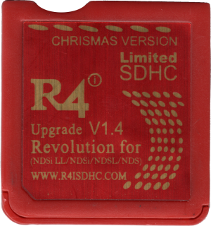

{ align=right width="115"}
# R4i SDHC Christmas / DS HappyBox v1.4
## r4isdhc.com

!!! warning

    This cart is an R4SDHC clone, and like the R4SDHC, SD I/O implementation is wonky since its SDHC I/O code is closely based off of the original R4's I/O, meant for SD class cards rather than SDHC ones. This causes the cart to be unstable with SD cards bigger than 4GB. (It will work with larger cards, but they may cause issues. Consider yourself warned.)

    It can also behave as a DSTT in some scenarios when it detects DSi/3DS hardware. This is why the package below includes the original kernel configured to autoboot YSMenu, so that YSMenu is able to boot even if the cart loads into DSTT mode.

### Setup Guide:

1. Format the SD card you are using by following the [formatting tutorial.](../tutorials/formatting.md){target="_blank"}

1. Download the [R4i SDHC Christmas YSMenu package.](https://github.com/Sanrax/YSMenu-Custom-Packages/releases/download/v7.06/R4i_SDHC_Christmas_YSMenu_7.06.zip)

1. Next, extract *the contents* of the downloaded kernel zip to your SD card.

1. Place any `.nds` game ROMs you'd like to play into the `Games` folder.

1. Insert the SD back into the cart, plug the cart into the DS, and see if it boots into the menu.