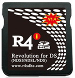
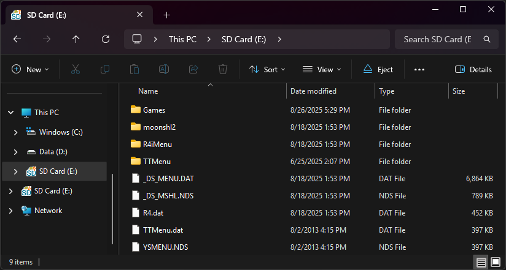

{ align=right width="115"}
# R4i SDHC v1.4
## r4sdhc.com

!!! warning

    This cart is an R4SDHC clone, and like the R4SDHC, SD I/O implementation is wonky since its SDHC I/O code is closely based off of the original R4's I/O, meant for SD class cards rather than SDHC ones. This causes the cart to be unstable with SD cards bigger than 4GB. (It will work with larger cards, but they may cause issues if you use more than 4GB of the SD space. Consider yourself warned.)

!!! note

    This cart can behave as a DSTT in some scenarios when it detects DSi/3DS hardware. This is why the package below includes both the original kernel and YSMenu, because no solution to make YSMenu the default kernel is guaranteed to work, given that the cart can switch between hardware modes depending on its boot environment. You can choose to use either the stock kernel or YSMenu, whichever is more convenient. If a game fails to boot on the stock kernel, load `YSMENU.NDS` to launch YSMenu, then launch the game in YSMenu.

### Setup Guide:

1. Format the SD card you are using by following the [formatting tutorial.](../tutorials/formatting.md){target="_blank"}

1. Download the [R4i SDHC V1.4 package.](https://github.com/Sanrax/YSMenu-Custom-Packages/releases/download/v7.06/R4i_SDHC_Christmas_YSMenu_7.06.zip)

1. Next, extract *the contents* of the downloaded kernel zip to your SD card.

1. Create a `Games` folder in your SD card root. You can also create additional folders to help with organizing/categorizing your ROMs.

1. Place any `.nds` game ROMs you'd like to play into the `Games` folder.

1. The files on your SD card should now look like this :

     - { align=left width="600"}

1. Insert the SD back into the cart, plug the cart into the DS, and see if it boots into the menu.