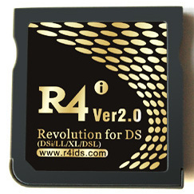

{ align=right width="115"}
# R4i Gold 2.0
## r4ids.com

!!! info

    This cart is an Acekard 2i clone that has an AKAIO build available.

### Setup Guide:

1. Format the SD card you are using by following the [formatting tutorial.](../tutorials/formatting.md){target="_blank"}

1. Download the [R4iDS.com AKAIO 1.8.6a kernel.](https://archive.flashcarts.net/r4ids.com/r4ids.com_Gold_2.0_AKAIO_1.8.6a.zip)

1. Open/extract the zip file, and copy *the contents* into the root of your SD card.

1. If you'd like to be able to use cheats on your games, download a [cheat database.](https://gbatemp.net/threads/deadskullzjrs-nds-i-cheat-databases.488711)
    
1. You will need the `usrcheat.dat` file from the download link in the post. Copy this file to `__aio/cheats/` on your SD card. (Create the `cheats` folder if it doesn't exist)

1. Create a `Games` folder in your SD card root, and place your `.nds` game ROMs inside. You can also create additional folders to help with organizing/categorizing your ROMs.

1. Insert the SD card back into your cart, plug the cart into your DS, and see if it boots into the menu.

!!! tip "Themes"

    Looking to change the default theme? Check out the themes repository at [themes.flashcarts.net](https://themes.flashcarts.net)!