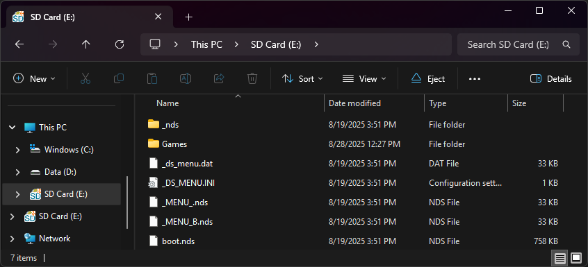

{ align=right width="115"}
# Original R4iGold.cc
## r4igold.cc

!!! info

    The original r4igold.cc cart is a clone of the Galaxy Eagle. Unfortunately, the Galaxy Eagle itself is a bad clone of the Acekard 2i, and neither AKAIO nor BL2CK work properly on it. While BL2CK boots, it will freeze on a white screen when attempting to load any commercial ROM file. Therefore, AKMenu-Next is the recommended primary kernel for Galaxy Eagle and related carts, so that nds-bootstrap can be used to load games. As an alternative option, the stock kernel is also provided, but it will likely be able to run less games than AKMenu-Next.

### Setup Guide:

=== "AKMenu-Next"

    1. Download the latest release of [AKMenu-Next Flashcart Edition.](https://github.com/coderkei/akmenu-next/releases/latest/download/akmenu-next-flashcart.zip)

    1. Extract the downloaded `akmenu-next-flashcart.zip` file with [7-Zip](https://www.7-zip.org/).

    1. From within the akmenu-next files, copy the following files/folders to your SD card root:

        - `_nds` folder
        - `BOOT.NDS`

    1. Download the latest release of [nds-bootstrap.](https://github.com/DS-Homebrew/nds-bootstrap/releases/latest/download/nds-bootstrap.zip)

    1. Extract the downloaded `nds-bootstrap.zip` file with [7-Zip](https://www.7-zip.org/).

    1. Copy the *contents* of the files from the extracted `nds-bootstrap.zip` file to the `_nds` folder on your SD card.

    1. If you'd like to be able to use cheats on your games, download a [cheat database.](https://gbatemp.net/threads/deadskullzjrs-nds-i-cheat-databases.488711)
    
    1. You will need the `usrcheat.dat` file from the download link in the post. Copy this file to `_nds/akmenunext/cheats/` on your SD card. (Create the `cheats` folder if it doesn't exist)

    1. Open the `Autoboot` folder within the AKMenu-Next files.
    
    1. Copy the *contents* of the `Galaxy Eagle` folder (do not copy the folder itself) to the root of your SD card.

    1. Create a `Games` folder in your SD card root, and place your `.nds` game ROMs inside. You can also create additional folders to help with organizing/categorizing your ROMs.
    
    1. The files on your SD card should now look like this:
    
        - { align=left width="600"}
    
    1. Insert the SD card back into your cart, plug the cart into your DS, and see if it boots into the menu.

    !!! tip "Themes"

        Looking to change the default theme? Check out the themes repository at [themes.flashcarts.net](https://themes.flashcarts.net)!

=== "R4iGold.cc v2.6"

    !!! warning "Kernel Info"

        Keep in mind that this kernel is outdated. Some newer games will refuse to boot, but this is useable alternative if AKMenu-Next's nds-bootstrap loader fails to load something.
    
    1. Format the SD card you are using by following the [formatting tutorial.](../tutorials/formatting.md){target="_blank"}
    
    1. Download the [R4iGold.cc v2.6 kernel.](https://archive.flashcarts.net/r4igold.cc/r4igold.cc_Kernel_2.6.zip)
    
    1. Open/extract the zip file, and copy *the contents* into the root of your SD card.

    1. If you'd like to be able to use cheats on your games, download a [cheat database.](https://gbatemp.net/threads/deadskullzjrs-nds-i-cheat-databases.488711)
    
    1. You will need the `cheat.dat` file from the download link in the post. Copy this file to the `_SYSTEM_` on your SD card.
    
    1. Create a `Games` folder in your SD card root, and place your `.nds` game ROMs inside. You can also create additional folders to help with organizing/categorizing your ROMs.
    
    1. The files on your SD card should now look like this:
    
        - { align=left width="600"}
    
    1. Insert the SD card back into your cart, plug the cart into your DS, and see if it boots into the menu.