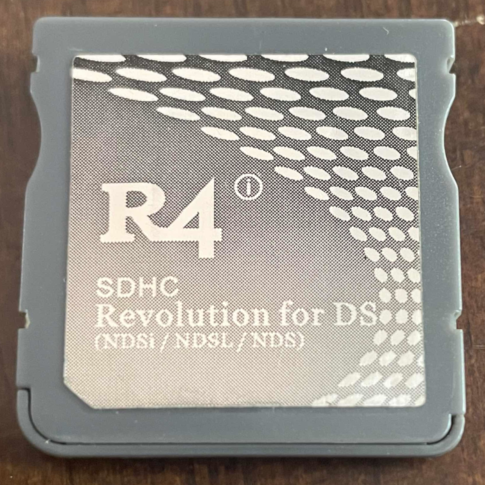

{ align=right width="115"}
# R4i SDHC RTS
## r4rts.com

!!! info

    These carts are clones of the M3 DS Real cart. They advertised RTS support in their stock kernel, similar to the M3's RTS support in its Sakura kernel. As the cart is M3 hardware at the end of the day, it's compatible with M3 YSMenu & MultiMenuDS after being booted with Lifehackerhansol's flashcart-bootstrap. A package containing the bootstrap and both kernels for this cart is provided in the setup instructions below.

### Setup Guide:

=== "YSMenu"

    1. Format the SD card you are using by following [this guide.](https://wiki.hacks.guide/wiki/Formatting_an_SD_card)

    1. Download the [r4rts.com YSMenu 7.06 package.](https://github.com/Sanrax/YSMenu-Custom-Packages/releases/download/v7.06/r4rts.com_YSMenu_7.06.zip)

    1. Next, extract *the contents* of the downloaded kernel zip to your SD card.

    1. Place any `.nds` game ROMs you'd like to play into the `Games` folder.

    1. Insert the SD back into the cart, plug the cart into the DS, and see if it boots into the menu.

=== "MultiMenuDS"

    !!! info

        MultiMenuDS is a kernel that provides an AKMenu/Wood style frontend while using the TTMenu game loader. It supports Acekard themes & cheats and is also able to make use of nds-bootstrap.

    1. Format the SD card you are using by following [this guide.](https://wiki.hacks.guide/wiki/Formatting_an_SD_card)

    1. Download the [MultiMenu R4i SDHC RTS Package.](https://github.com/coderkei/MultiMenuDS/releases/latest/download/R4RTS_MultiMenu.zip)

    1. Open/extract the zip file, and copy *the contents* into the root of your SD card.

    1. If you'd like to be able to use cheats on your games, download a [cheat database.](https://github.com/DeadSkullzJr/NDS-i-Cheat-Databases/releases/latest)

    1. You will need the `usrcheat.7z` file. Extract it using [7-Zip](https://www.7-zip.org/), inside you will find a `usrcheat.dat` file. Copy this file to `TTMenu/cheats/` on your SD card. (Create the `cheats` folder if it doesn't exist)

    1. Create a `Games` folder in your SD card root, and place your `.nds` game ROMs inside. You can also create additional folders to help with organizing/categorizing your ROMs.

    1. Insert the SD card back into your cart, plug the cart into your DS, and see if it boots into the menu.

    1. (Optional) Download the [nds-bootstrap package](https://github.com/DS-Homebrew/nds-bootstrap/releases/latest/download/nds-bootstrap.zip) and extract it. Copy `nds-bootstrap-release.nds` to the `_nds` folder on your SD card.

    !!! tip

        This kernel uses the TTMenu game loader which some ROM Hacks are not compatible with. If you get an error code when loading a ROM Hack, Follow Step 8 above. Afterwards highlight the game and press `Y` and then press `Y` again for Game Settings. Change option under `Use ROM loader` from `default` to `nds-bootstrap`. Press `A` to save.

!!! tip

    If you'd like to use RTS (Real-Time-Save), you can also use the cart's stock kernel, provided below. Do keep in mind though that game compatibility won't be as good as YSMenu, and the RTS feature itself can be hit-or-miss.

    - [Download r4rts.com Kernel 2.8a](https://archive.flashcarts.net/r4rts.com/old/r4rts.com_Kernel_2.8a.zip)