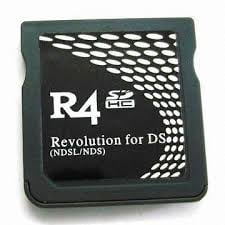

{ align=right width="115"}
# Original R4SDHC
## r4sdhc.com, ndslr4.com

!!! warning

    This cart's SD I/O implementation is wonky since its SDHC I/O code is closely based off of the original R4's I/O, meant for SD class cards rather than SDHC ones. This causes the cart to be unstable with SD cards bigger than 4GB. (It will work with larger cards, but they will likely cause issues. Consider yourself warned.)

### Setup Guide:

1. Format the SD card you are using by following the [formatting tutorial.](../tutorials/formatting.md){target="_blank"}

1. Download the [R4SDHC YSMenu package.](https://github.com/Sanrax/YSMenu-Custom-Packages/releases/download/v7.06/R4SDHC_YSMenu_7.06.zip)

1. Next, extract *the contents* of the downloaded kernel zip to your SD card.

1. Place any `.nds` game ROMs you'd like to play into the `Games` folder.

1. The files on your SD card should now look like this:

    - { align=left width="600"}

1. Insert the SD back into the cart, plug the cart into the DS, and see if it boots into the menu.

---

!!! info "Info and Credits"

    This YSMenu package contains quite a few fixes and improvements. In the past, YSMenu needed to be chainloaded via the stock kernel. However thanks to Deletecat at DSi Mode Hacking Discord, a new way to load YSMenu on these carts was found, by hex-editing a flashcard-bootstrap binary into the original kernel's `_ds_menu.dat` file.
    
    A full list of improvements in this package:
    
    - R4SDHC Bootstrap to load TTMenu.dat - Deletecat & Lifehackerhansol
    - Fixed r4dldi.dat for homebrew - Lifehackerhansol
    - Fixed ttreset.dat soft-reset - twiztidsinz on GBATemp
    - YSMenu theme - ShaolinAssassin on DeviantArt