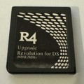

{ align=right width="115"}
# R4-III / R4 Upgrade
## r4dsl.net, r4-dsl.net, r4iiinew.com, r4iii.com

!!! info

    These carts are usually either N5 or R4SDHC clones. The r4dsl.net/r4iii.com variant is an N5 clone, and will load any nds file as `_DS_MENU.DAT`, provided the cart's `_R4__III.DAT` file is present on the SD card root. The `_R4_III.DAT` file is essentially the same thing as the N5's `_AX_MENU.DAT`. The r4-dsl.net variant is an R4SDHC clone, but doesn't need any bootstrap to load YSMenu. It can directly boot any nds file as `_DS_MENU.DAT`, no other files needed.

    Because both cart variants end up loading `_DS_MENU.DAT`, this package is compatible with both. If you'd like to know which variant you have, try deleting `_R4__III.DAT` from your SD card and check whether or not the cart still boots. If it does, it's an r4-dsl.net cart. If it doesn't boot without the file, it's an r4dsl.net cart.

!!! warning

    Like the R4SDHC, this cart's SD I/O implementation is wonky since its SDHC I/O code is closely based off of the original R4's I/O, meant for SD class cards rather than SDHC ones. This causes the cart to be unstable with SD cards bigger than 4GB. (It will work with larger cards, but they may cause issues. Consider yourself warned.)

### Setup Guide:

1. Format the SD card you are using by following [this guide.](https://wiki.hacks.guide/wiki/Formatting_an_SD_card)

1. Download the [R4-III/Upgrade YSMenu package.](https://github.com/Sanrax/YSMenu-Custom-Packages/releases/download/v7.06/R4-III_Upgrade_YSMenu_7.06.zip)

1. Next, extract *the contents* of the downloaded kernel zip to your SD card.

1. Place any `.nds` game ROMs you'd like to play into the `Games` folder.

1. Insert the SD back into the cart, plug the cart into the DS, and see if it boots into the menu.