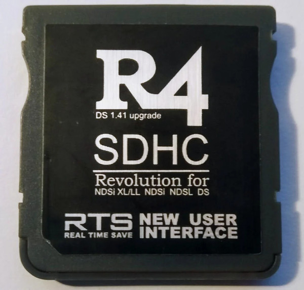

{ align=right width="115"}
# R4iSDHC RTS Black
## r4isdhc.com

!!! info

    These carts are clones of the M3 DS Real cart. They advertised RTS support in their stock kernel, similar to the M3's RTS support in its Sakura kernel. As the cart is M3 hardware at the end of the day, it's compatible with M3 loaders such as M3DS YSMenu and M3DS Pico-Launcher. Thanks to LifeHackerHansol's work on M3DS flashcart-bootstrap, the R4 RTS Black cart now has a way to autoboot both of these kernels.
    
!!! warning

    This does not apply to the 2025 r4isdhc.com Black RTS cart! Those carts are regular DEMON-HW DSTTi clones, like the rest of the 2014+ r4isdhc.com carts. If you have this cart, please see [this page](r4i-sdhc.md) for setup instead.
    
### Setup Guide:

=== "YSMenu"

    1. Format the SD card you are using by following the [formatting tutorial.](../tutorials/formatting.md){target="_blank"}
    
    1. Download the [r4isdhc.com RTS Black YSMenu 7.06 package.](https://github.com/Sanrax/YSMenu-Custom-Packages/releases/download/v7.06/r4isdhc.com_RTS_Black_YSMenu_7.06.zip)
    
    1. Next, extract *the contents* of the downloaded kernel zip to your SD card.
    
    1. Place any `.nds` game ROMs you'd like to play into the `Games` folder.
    
    1. The files on your SD card should now look like this:
    
        - { align=left width="600"}
    
    1. Insert the SD back into the cart, plug the cart into the DS, and see if it boots into the menu.
    
    !!! tip "Themes"
    
        Looking to change the default theme? Check out the YSMenu themes repository at [themes.flashcarts.net](https://themes.flashcarts.net/ysmenu/)!

=== "Pico-Launcher"

    !!! info "Kernel Info"

        Pico-Launcher is the game menu for the DS-Pico (an open source DS flashcart by the LNH team) and other supported carts. Combined with Pico-Loader, it can be used as a full kernel, and supports almost all retail DS games. It features a material-inspired user interface, and an extremely fast loader.

    !!! warning "Cheats, Soft-Reset and RTS"

         Note that Pico-Launcher/Loader currently does not support using cheats, and soft-reset to the game menu is also unsupported. If these features are important to you, consider using YSMenu.

         RTS is only supported on the stock kernel, provided at the bottom of the page.

    1. Format the SD card you are using by following the [formatting tutorial.](../tutorials/formatting.md){target="_blank"}

    1. Download the latest [Pico Package for M3DS Real.](https://picoarchive.cdn.blobfrii.com/pico_package_M3DS.zip?picoloader={{pico_versions.loader}}&picolauncher={{pico_versions.launcher}}&fcnetrev={{pico_versions.fcnetrev}})

    1. Extract the `pico_package_M3DS.zip` file with [7-Zip](https://www.7-zip.org/), or your native file manager app.

    1. From within the extracted files, copy the following files/folders to your SD card root:

        - `_pico` folder

        - `_picoboot.nds`
        
        - `_ds_menu.sys`
    
    1. Create a `Games` folder in your SD card root, and place any `.nds` game ROMs you'd like to play inside.
    
    1. The files on your SD card should now look like this:
    
        - { align=left width="600"}
    
    1. Insert the SD card back into your cart, plug the cart into your DS, and see if it boots into the menu.

---

!!! tip

    If you'd like to use RTS (Real-Time-Save), you can also use the cart's stock kernel, provided below. Do keep in mind though that game compatibility won't be as good as YSMenu, and the RTS feature itself can be hit-or-miss.

    - [Download r4isdhc.com RTS Black Kernel 3.2](https://archive.flashcarts.net/r4isdhc.com/old/r4isdhc.com_RTS_black_Kernel_3.2.zip)