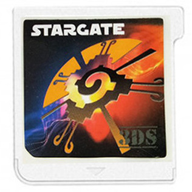

{ align=right width="115"}
# Stargate 3DS
## stargate-3ds.com

!!! warning "Important Info"

    The Stargate 3DS is not as capable as full 3DS custom firmware (Luma3DS), and has some drawbacks:

    - For 3DS games, ONLY `.3ds` **encrypted** ROMs are supported. The Stargate will **not** launch `.cia` files, nor will it launch decrypted `.3ds` ROMs.

    - Stargate DS mode only works on stock 3DS consoles. On consoles that have CFW installed, a [Stargate-launcher `.cia`](https://archive.flashcarts.net/stargate-3ds.com/SG_Launcher_CFW) needs to be used.

    - While both exFAT and FAT32 are supported, FAT32 is recommended because DS homebrew apps (such as emulators), do not function when the SD card is formatted to exFAT.
        - This is because the DS mode's DLDI only functions on FAT32. However, commercial NDS and 3DS ROMs work on both exFAT and FAT32.

    - Some 3DS games straight up do not work on the Stargate, due to anti-piracy measures in some 3DS games. Most notably, Pokemon US/UM has been reported to not work.
        - If you have CFW installed, you can manually patch some 3DS ROMs to remove AP measures and make them work on Stargate. Keep in mind that this *only* works with CFW installed, since bypassing signature checks is necessary to run patched `.3ds` ROMs. See [this GBATemp thread](https://gbatemp.net/threads/stargate-3ds-is-pretty-good.658534) for more info.

### Setup Guide:

1. Format the SD card you are using to FAT32 by following the [formatting tutorial.](../tutorials/formatting.md){target="_blank"}
    - You can also use exFAT if you'd like, but remember that DS homebrew won't work, as per the warning above.

1. Download the [Stargate 3DS DS-mode kernel.](https://archive.flashcarts.net/stargate-3ds.com/stargate-3ds.com_Kernel_1.0.zip)

1. Open/extract the zip file, and copy *the contents* into the root of your SD card.

1. If you'd like to be able to use cheats on your NDS games, download a [cheat database.](https://github.com/DeadSkullzJr/NDS-i-Cheat-Databases/releases/latest)

1. You will need the `usrcheat.7z` file. Extract it using [7-Zip](https://www.7-zip.org/), inside you will find a `usrcheat.dat` file. Copy this file to `sg_system/cheats/` on your SD card. (Create the `cheats` folder if it doesn't exist)

1. Create an `NDS Games` folder in your SD card root, and place your `.nds` game ROMs inside. You can also create additional folders to help with organizing/categorizing your ROMs.

1. Place your **encrypted** `.3ds` ROMs on the root of your SD card.

1. Insert the SD card back into your cart, then plug the cart into your 3DS. You should see one of your 3DS ROMs pop up as a cartridge game.

1. Use the buttons to cycle through the 3DS game ROMs on your SD. To use DS mode, press in both the left and right buttons on the cart, and then release. Launch the Alex Rider game that pops up.
    - To exit DS mode, click the home button to go back to the 3DS system menu, and then press in both left and right again to switch the cart into 3DS mode.

!!! tip "Themes"

    Looking to change the default theme? Check out the themes repository at [themes.flashcarts.net](https://themes.flashcarts.net)!

    For Stargate, themes go inside `sg_system/ui` on your SD, since this kernel uses `sg_system` instead of `__rpg` as the kernel folder.