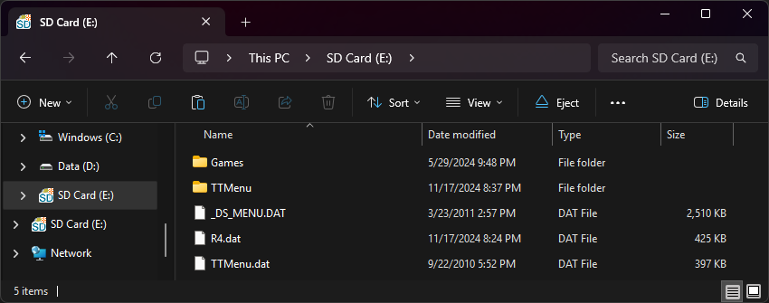

{ align=right width="115"}
# R4i SDHC Brand New V2.0
## r4isdhc.com / R4i SDHC 9 on PCB

!!! info

    These carts are very old demon-hardware DSTTi clones, and have a special quirk - they load part of the cart's firmware from a file on the SD card - `_DS_MENU.DAT`. When the `_DS_MENU.DAT` file is present on the SD, it will behave like a normal demon DSTT clone - checks for an R4.dat to load, and shows `MENU?` if the file isn't found. If the SD card is empty however, the cart will load to a white screen.

### Setup Guide:

1. Format the SD card you are using by following the [formatting tutorial.](../tutorials/formatting.md){target="_blank"}

1. Download the [r4isdhc.com Brand New V2.0 YSMenu 7.06 package.](https://github.com/Sanrax/YSMenu-Custom-Packages/releases/download/v7.06/r4isdhc.com_Brand-New_V2.0_YSMenu_7.06.zip)

1. Next, extract *the contents* of the downloaded kernel zip to your SD card.

1. Place any `.nds` game ROMs you'd like to play into the `Games` folder.

1. The files on your SD card should now look like this:

    - { align=left width="600"}

1. Insert the SD back into the cart, plug the cart into the DS, and see if it boots into the menu.

!!! tip "Themes"

    Looking to change the default theme? Check out the YSMenu themes repository at [themes.flashcarts.net](https://themes.flashcarts.net/ysmenu/)!