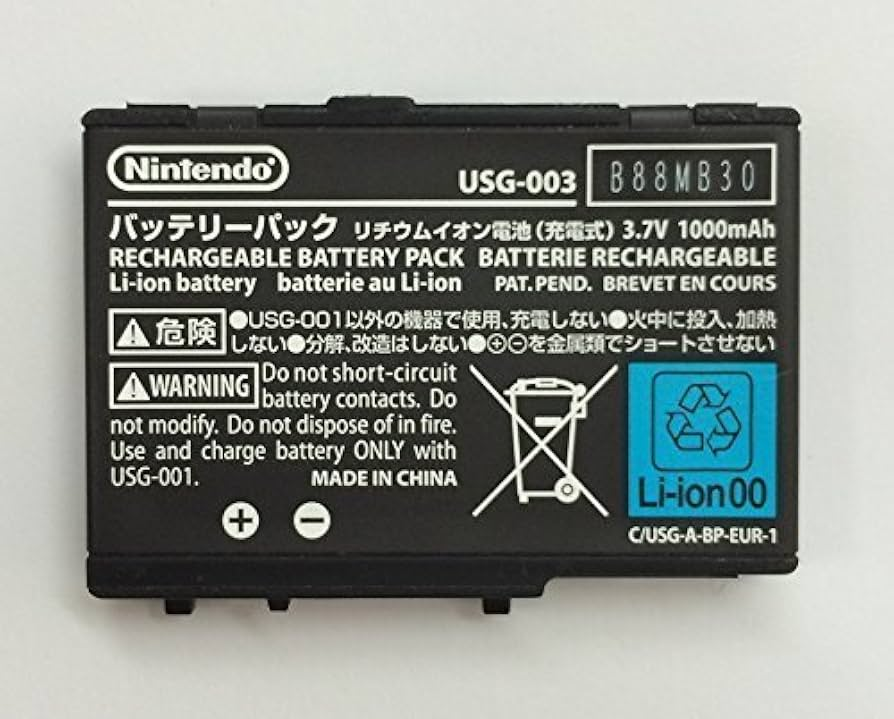{ align=right width="115"}
# DS Family Battery Guide
## Guide to buying new batteries

!!! danger

    If your current DS battery is swollen, expanded or leaking, this can be a potential safety hazard if not handled correctly. [Please see here](https://www.ifixit.com/Wiki/What_to_do_with_a_swollen_battery) for safety information and disposal advice.

!!! warning

    We do not guarantee the information here is correct or accurate, this information is collected from the DS & 3DS community from various sources & forums.

As the DS family of consoles ages, many original batteries for these consoles are becoming worn out with poor battery life or becoming swollen and failing (if swollen, read the warning above before handling).

Many “new” replacement batteries sold online are counterfeit or low quality, with poor runtime and possible safety risks. Without knowing what to look for, the fake batteries are often the easiest to find.

This guide helps you find safe, reliable replacement batteries for your DS console, including community recommended options and batteries to avoid.

*Are you interested in measuring the run-time of your DS battery? [DS Battery Life Timer](https://www.gamebrew.org/wiki/DS_Battery_Life_Timer)  by snailface is an excellent homebrew tool to measure your DS battery life.*

*Refer to the [Official Battery Life Information](#official-battery-life-information) section for information on official battery life times.*

Please select the tab relevant for your DS console below:

### Battery Guides:

=== "Original DS (Phat)"

    ### Original DS Batteries to avoid:

    - Any battery claiming to be original or OEM. New OEM batteries have not been sold on the market for years, and any that are will already be past their usable life.
    - Any battery claiming an outrageous capacity such as 2000mAh.
    - Batteries sold by iFixit - They sell the same generic/bootleg batteries at a steep markup, the same seen on online marketplaces.
    - Any battery that looks like this or similar:
    
        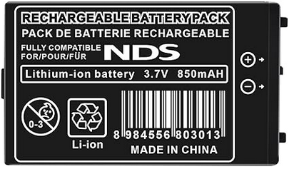{ align=left width="215"}

    ***Why avoid batteries that meet this criteria?*** Community reports have found that many do not meet their rated capacity, sometimes being as low as 200 to 300 mAh, leading to poor battery life. They can also provide unstable voltage, causing low battery warnings even when fully charged. Their fire safety and reliability are also questionable and should not be trusted.

    ### Original DS Batteries to get:

    These batteries have been recommended by the community and can typically be found on online shopping marketplaces such as Amazon and Ebay, The battery manufacturer's website or a Reseller. As their capacity is similar to the OEM battery, they should have a similar battery life.

    #### Original DS Batteries

    - OSTENT Nintendo DS Battery 850mAh (It **must** say "OSTENT" on the battery wrapper itself, and must be this exact capacity, otherwise it is **fake**!)

        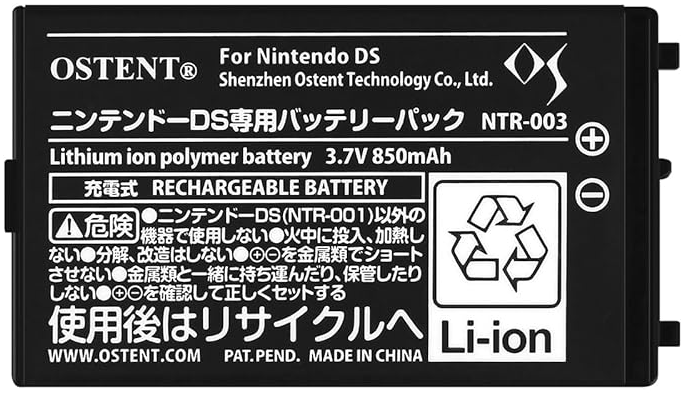{width="215"}

    - Cameron Sino CS-NTR003SL 850mAh Battery

        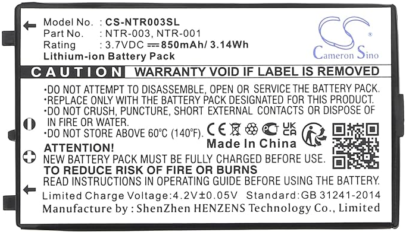{width="215"}

    - Cellonic Nintendo DS Battery 850mAh

        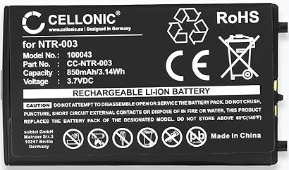{width="215"}

    #### GBA SP Batteries that will work in an Original DS

    !!! Warning
        
        These batteries are not officially supported for the Original DS and are only technically compatible because the Original DS and GBA SP share the same battery size, voltage and pin layout. They should be considered a last resort if you cannot obtain a suitable battery. Use on an Original DS at your own risk.

    - FunnyPlaying MaxPlay 950mAh LiPo Battery for GBA SP

        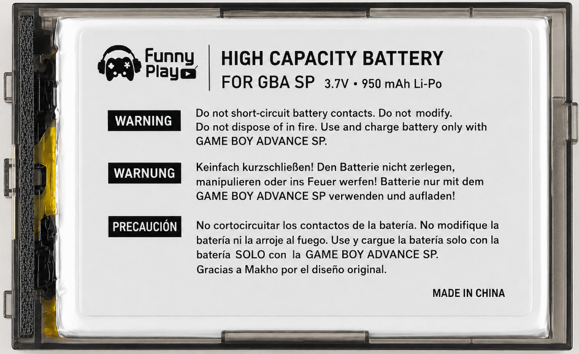{width="215"}

    - Helder MegaBat800 800mAh battery for GBA SP

        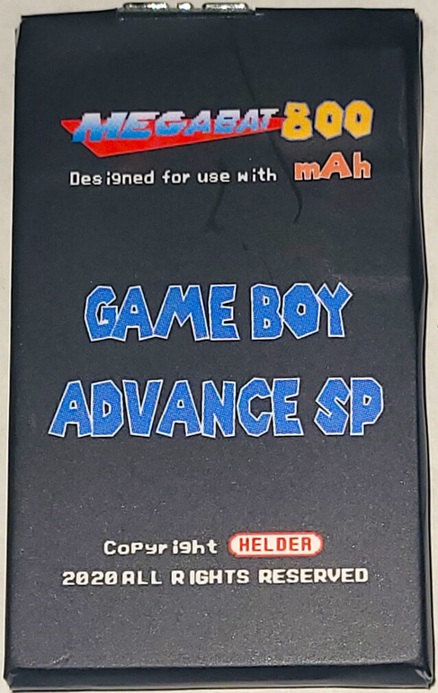{width="215"}

=== "DS Lite"

    ### DS Lite Batteries to avoid:

    - Any battery claiming to be original or OEM. New OEM batteries have not been sold on the market for years, and any that are will already be past their usable life.
    - Any battery claiming an outrageous capacity such as 2000mAh.
    - Batteries sold by iFixit - They sell the same generic/bootleg batteries at a steep markup, the same seen on online marketplaces.
    - Any batteries that look like these or similar:
    
        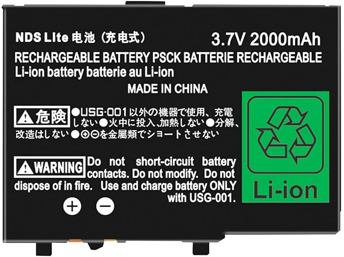{ align=left width="215"} 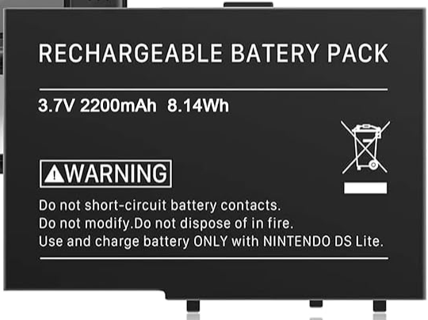{ align=left width="215"}

    ***Why avoid batteries that meet this criteria?*** Community reports have found that many do not meet their rated capacity, sometimes being as low as 200 to 300 mAh, leading to poor battery life. They can also provide unstable voltage, causing low battery warnings even when fully charged. Their fire safety and reliability are also questionable and should not be trusted.

    ### DS Lite Batteries to get:

    These batteries have been recommended by the community and can typically be found on online shopping marketplaces such as Amazon and Ebay, The battery manufacturer's website or a Reseller. As their capacity is similar to the OEM battery, they should have a similar battery life.

    - OSTENT Nintendo DS Lite Battery 1000mAh (It **must** say "OSTENT" on the battery wrapper itself, and must be this exact capacity, otherwise it is **fake**!)

        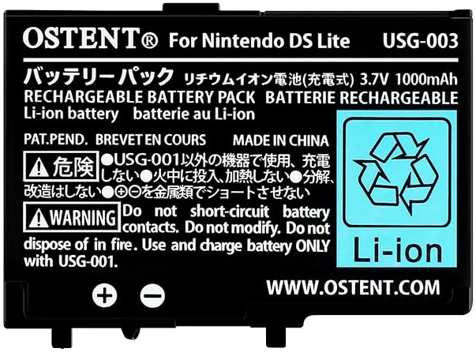{width="215"}

    - Cameron Sino CS-USG003SL 850mAh Battery

        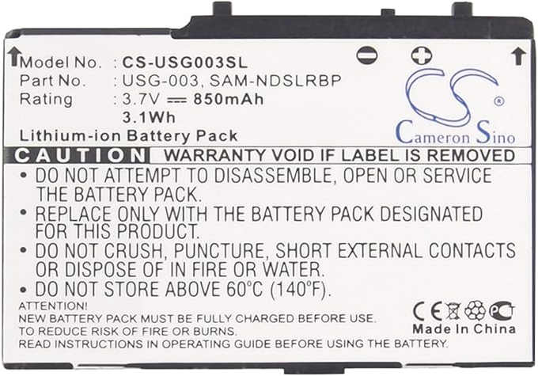{width="215"}

    - Helder MegaBat800 800mAh battery for NDS LITE

        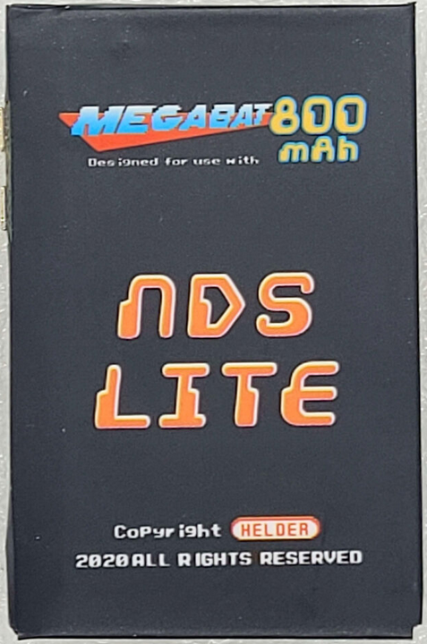{width="215"}

=== "DSi"

    ### DSi Batteries to avoid:

    - Any battery claiming to be original or OEM. New OEM batteries have not been sold on the market for years, and any that are will already be past their usable life.
    - Any battery claiming an outrageous capacity such as 2000mAh.
    - Batteries sold by iFixit - They sell the same generic/bootleg batteries at a steep markup, the same seen on online marketplaces.
    - Any batteries that look like these or similar:
    
        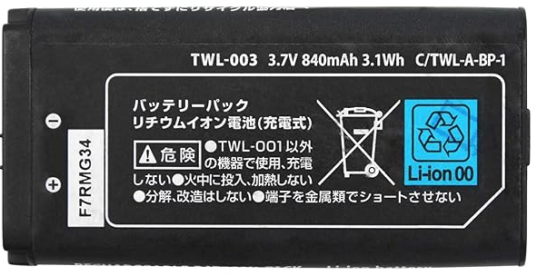{ align=left width="215"} 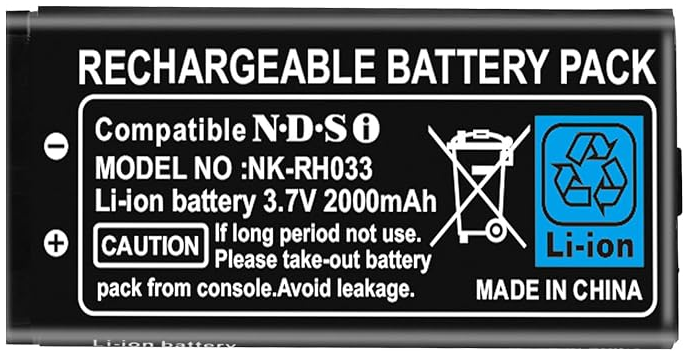{ align=left width="215"}

    ***Why avoid batteries that meet this criteria?*** Community reports have found that many do not meet their rated capacity, sometimes being as low as 200 to 300 mAh, leading to poor battery life. They can also provide unstable voltage, causing low battery warnings even when fully charged. Their fire safety and reliability are also questionable and should not be trusted.

    ### DSi Batteries to get:

    These batteries have been recommended by the community and can typically be found on online shopping marketplaces such as Amazon and Ebay, The battery manufacturer's website or a Reseller. As their capacity is similar to the OEM battery, they should have a similar battery life.

    - OSTENT Nintendo DSi Battery 840mAh (It **must** say "OSTENT" on the battery wrapper itself, and must be this exact capacity, otherwise it is **fake**!)

        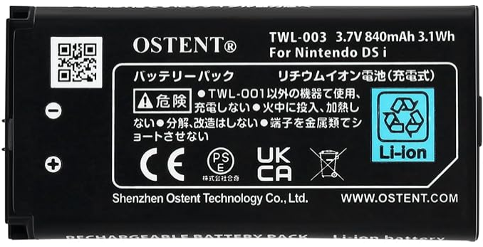{width="215"}

    - Cameron Sino CS-TWL003SL 550mAh Battery

        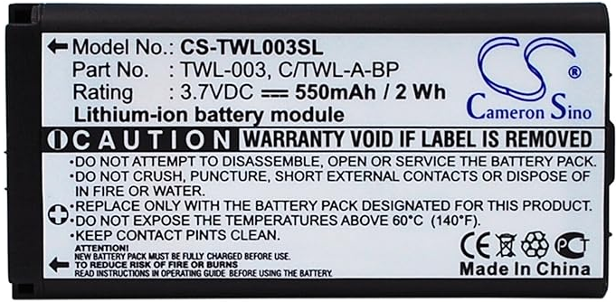{width="215"}

=== "DSi XL"

    ### DSi XL Batteries to avoid:

    - Any battery claiming to be original or OEM. New OEM batteries have not been sold on the market for years, and any that are will already be past their usable life.
    - Any battery claiming an outrageous capacity such as 2000mAh.
    - Batteries sold by iFixit - They sell the same generic/bootleg batteries at a steep markup, the same seen on online marketplaces.
    - Any battery that looks like this or similar:
    
        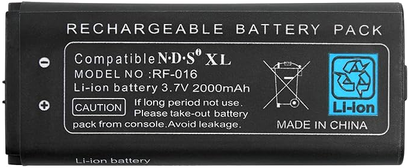{ align=left width="215"}

    ***Why avoid batteries that meet this criteria?*** Community reports have found that many do not meet their rated capacity, sometimes being as low as 200 to 300 mAh, leading to poor battery life. They can also provide unstable voltage, causing low battery warnings even when fully charged. Their fire safety and reliability are also questionable and should not be trusted.

    ### DSi XL Batteries to get:

    These batteries have been recommended by the community and can typically be found on online shopping marketplaces such as Amazon and Ebay, The battery manufacturer's website or a Reseller. As their capacity is similar to the OEM battery, they should have a similar battery life.

    - Cellonic Nintendo DSi XL Battery 900mAh

        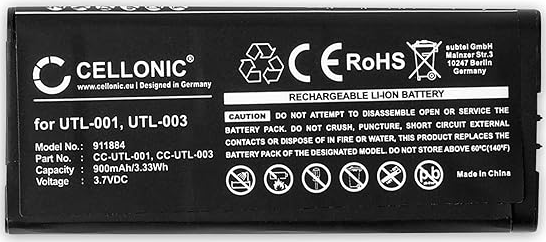{width="215"}

    - Cameron Sino CS-UTL003SL 900mAh Battery

        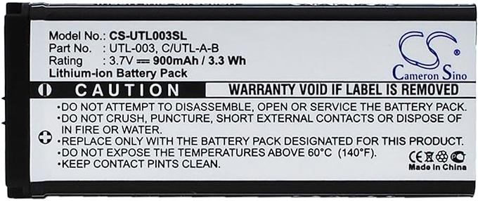{width="215"}

### Official Battery Life Information

Please refer to these articles by Nintendo on Official Battery Life Figures. Good quality replacement batteries should aproximately meet the battery life estimates provided by Nintendo:

- [Original DS & DS Lite Battery Life](https://en-americas-support.nintendo.com/app/answers/detail/a_id/4045/~/how-long-does-the-battery-in-a-nintendo-ds%2Fds-lite-last-before-it-needs-to-be)

- [DSi & DSi XL Battery Life](https://en-americas-support.nintendo.com/app/answers/detail/a_id/3833/~/how-long-does-the-battery-in-a-nintendo-dsi%2Fnintendo-dsi-xl-last-before-it)
