# Welcome!
{style="float:right; margin:0 0 1rem 1rem; width:clamp(80px,40vw,270px);"}

Meet Ryuuko, our cute flashcart expert who will help you set up your flashcart!

This page contains guides for setting up various carts we commonly encounter over on the r/flashcarts subreddit. Carts are grouped by the hardware family they belong to. Find your cart and click on it to get taken to its corresponding instructions page. You can also hover over links to see a cart preview.

If you'd like to improve this resource or add new carts, feel free to create a pull request in the GitHub repository!

## Cart Guides

---

### DSTT/i Family

- [**Timebomb [DEMON-HW] Carts**](cart-guides/r4i-sdhc.md "") - r4isdhc.com 2014+, r4i-sdhc.com, and more
- [**DSTT/i and Clones**](cart-guides/dstti.md "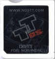") - [See YSMenu Compatibility List](https://www.flashcarts.net/ysmenu-compat-ext)
- [**R4i SDHC Renovation V2.10T & V2.20T**](cart-guides/v2_10T.md "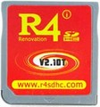") - r4sdhc.com
- [**R4i SDHC Brand New V2.0**](cart-guides/v2_0.md "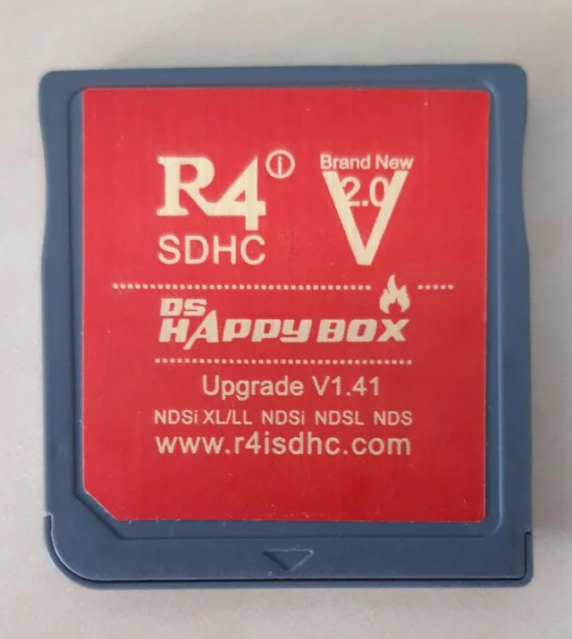") - r4isdhc.com

### R4 and R4SDHC Family

- [**Ace3DS+/R4iLS**](cart-guides/ace3ds_r4ils.md "") - See cart list (1)
- [**Gateway Blue**](cart-guides/gwblue.md "") - gateway-3ds.com
- [**EX4DS**](cart-guides/ex4ds.md "") - ex4ds.com
- [**Original R4**](cart-guides/r4ds.md "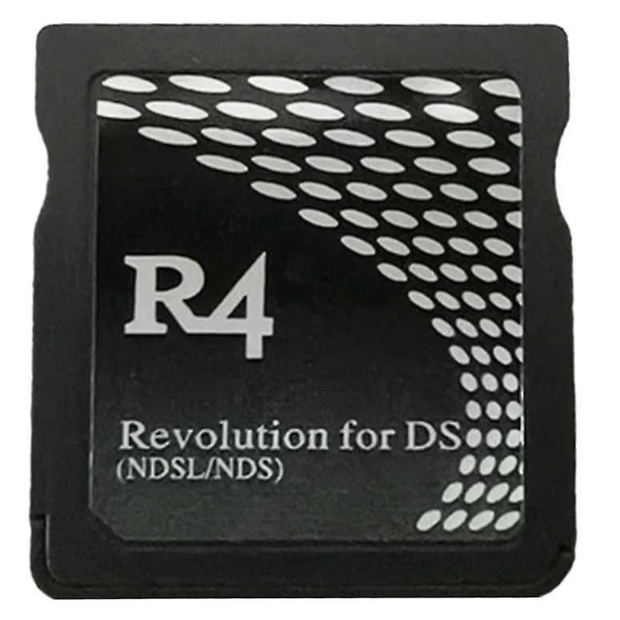") - r4ds.com
- [**M3 Simply**](cart-guides/r4ds.md "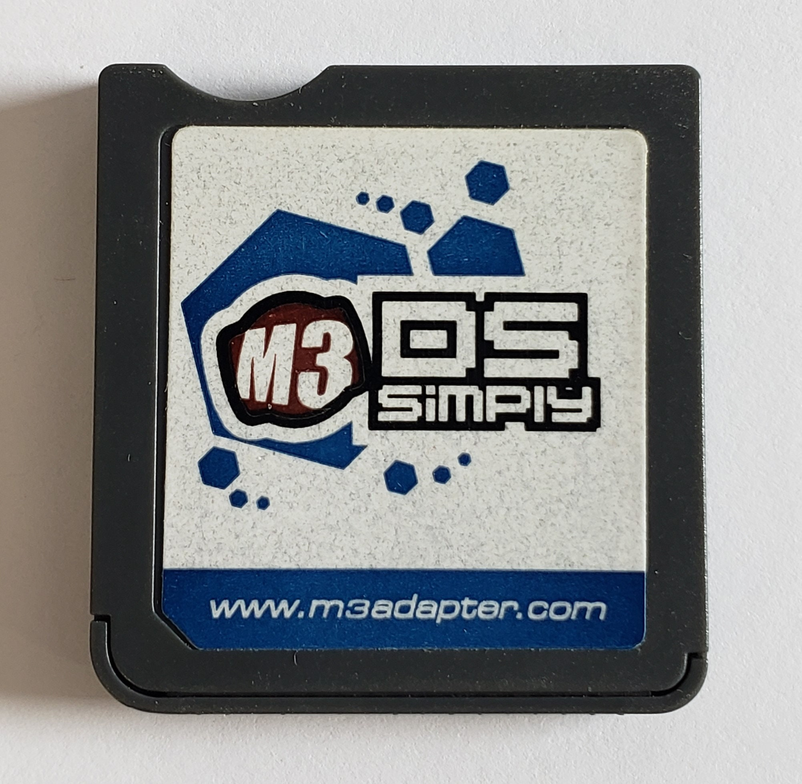") - m3adapter.com
- [**Original R4SDHC**](cart-guides/r4sdhc.md "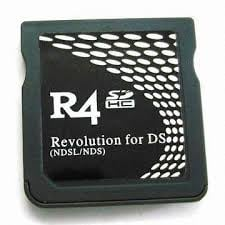") - r4sdhc.com
- [**R4SDHC Christmas**](cart-guides/r4christmas.md "") - r4isdhc.com
- [**R4i SDHC Christmas**](cart-guides/r4i_christmas.md "") - r4isdhc.com
- [**R4i SDHC V1.4**](cart-guides/r4i_sdhc_v1.4.md "") - r4sdhc.com
- [**R4DS Happybox**](cart-guides/r4christmas.md "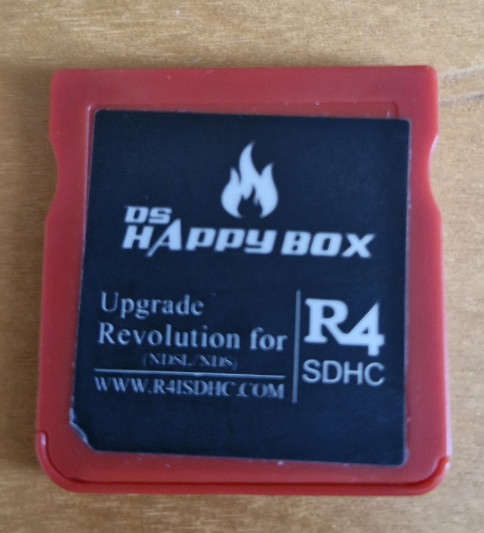") - r4isdhc.com
- [**R4 Upgrade/R4-III**](cart-guides/r4upgrade.md "") - r4dsl.net
- [**N5**](cart-guides/n5.md "") - dsn5.com
- [**R4 Deluxe**](cart-guides/r4deluxe.md "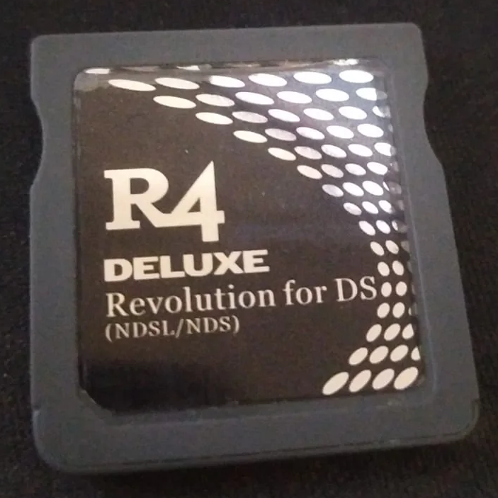") - r4deluxe.com

1.  **Compatibility List**
    - Ace3DS+
    - Ace3DS X
    - \### in 1 combo cart
    - r4azure.com carts
    - r4inp.com carts
    - r4isdhc.com.cn carts
    - r4iwood.cn carts
    - r4isdhc.hk 2020+ carts
    - r4li.com carts
    - r4infinity.com 2
    - r4ixds.com 2014 white version
    - woodr4isdhc.com carts
    - ge.ndsi.in GEi HOT

### R4iTT Family

- [**BL2CK Carts**](cart-guides/bl2ck.md) - See cart list (1)
- [**R4DS Pro**](cart-guides/r4dspro.md "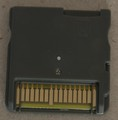") - See cart list (2)

1.  **Compatibility List**
    - *Default Version:*
        - Acekard 2/2.1/2i clone carts that can't boot AKAIO 1.9.0
        - R4i Gold 3DS Plus (r4ids.cn) with faulty DS mode
        - R4i Infinity A.C. Kard
        - r4i3d.com NEW, 2012+
        - r4igold.cc 3DS, New
        - r4infinity.com Dual-Core, V1.6
        - r4isdhc.com Dual-Core (no year number)
        - r4isdhc.com NEW/2013 carts
        - r4isdhc.hk carts with no year number, or before 2020
        - r4isdhc.in carts
        - R4iTT 3DS NEW, RTS
        - r4ixds.com 2014-2016 non-white
        - r4i-3dsnew.com carts
        - r4i-drive.com carts
        - r4i-gold.com 3DS Gold Pro, 2013 carts
        - r4i-gold.me 2013-2015
        - r4sdhc.com R4i SDHC Renovation V3DSU
        - r4ultra.com carts that can't boot R4 Ultra AKAIO 1.8.6a
        - r4i-u.com carts
        - r4ds-i.com.cn carts
        - r4-pro.com carts
        - super4i.com R4i Super
    - *Amaze3DS Version:*
        - r4igold.cc Wood carts
        - Amaze3DS carts

2.  **Compatibility List**
    - AliExpress R4DS Pro carts
    - r4iplat.com carts
    - r4i-d.com carts
    - r4i-3dsnew.com carts

### Acekard Family

- [**Acekard 2/2.1/2i**](cart-guides/acekard.md "") - acekard.com
- [**R4 Ultra**](cart-guides/r4ultra.md "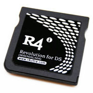") - r4ultra.com
- [**R4i+ 3DS/DS Gold & R4i 3DS RTS**](cart-guides/r4ids_cn.md "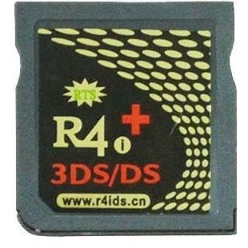") - r4ids.cn
- [**R4i Gold (Non-3DS)**](cart-guides/r4ids_cn_non_3ds.md "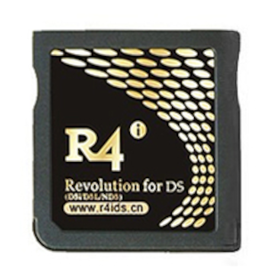") - r4ids.cn
- [**R4iDS.com Original**](cart-guides/r4ids_com.md "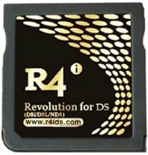") - r4ids.com
- [**R4i Gold 2.0**](cart-guides/r4ids_com_2_0.md "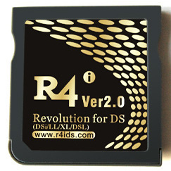") - r4ids.com

### SuperCard Family

- [**DSOne SDHC**](cart-guides/dsone.md "") - supercard.sc

### M3 Family

- [**M3 DS Real**](cart-guides/m3dsreal.md "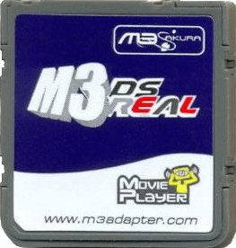") - m3adapter.com
- [**iTouchDS**](cart-guides/itouchds.md "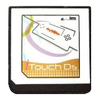") - m3adapter.com
- [**R4iSDHC RTS Black**](cart-guides/rts_black.md "") - r4isdhc.com
- [**R4i SDHC RTS**](cart-guides/r4rts.md "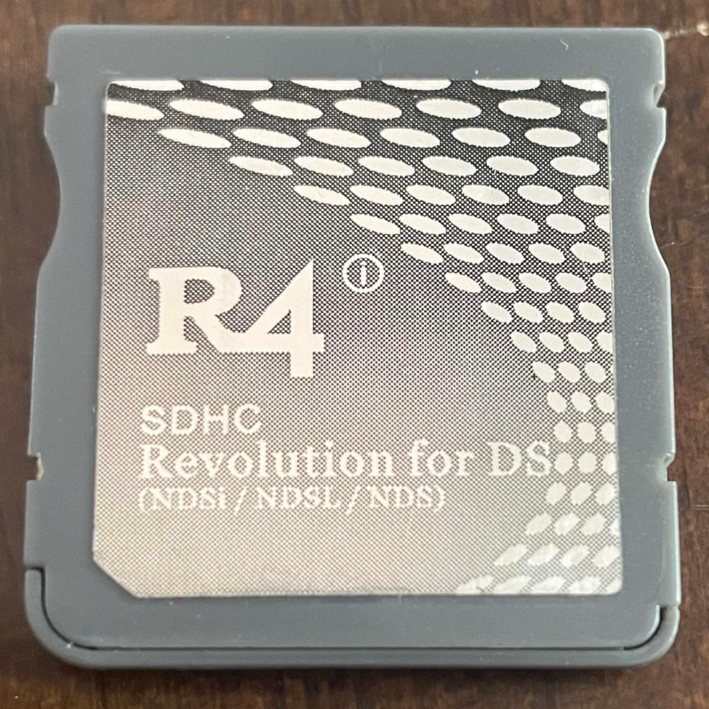") - r4rts.com

### Other Flashcarts

- [**Stargate 3DS**](cart-guides/stargate.md "") - stargate-3ds.com
- [**EZ Flash Parallel**](cart-guides/ezflash_parallel.md "") - ezflash.cn
- [**N-Card and Clones**](cart-guides/ncard.md "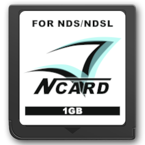") - dsgba.com

&nbsp;