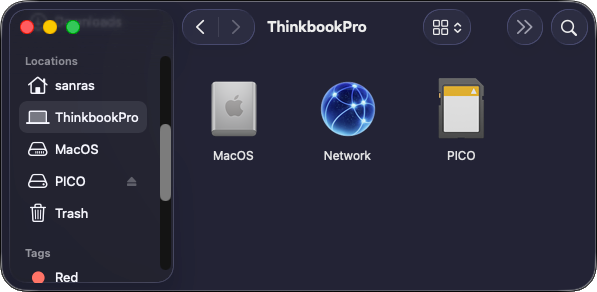

{ align=right width="60"}
# Clearing MacOS Dotfiles

!!! info "What Are MacOS Dotfiles?"

    MacOS creates `._` files for each file it copies into a FAT32 partition. This means that if you copy `GreatGame.nds` to your SD card, MacOS will also create a corresponding dotfile for it on your SD card next to the file: `._GreatGame.nds`.
    
    These dotfiles are used for metadata, and MacOS will hide them when browsing files in Finder. However, this is a MacOS-specific behavior, and they will be displayed as normal files by any other device.

Flashcart kernels will mistake MacOS metadata files for regular ROM files, which can clutter up the cart's UI. Therefore, it's advised to remove them after using MacOS to manage your flashcart's SD.

### Removing Dotfiles With `dot_clean`

1. Insert the SD card into your Mac. It will mount under `/Volumes/`, named after the card's label. `/Volumes/PICO` is the example label we will be using in these steps.

2. Open Finder, then press ++cmd+shift+c++. This should take you to the "Computer" view in Finder where you can see all drives mounted on the system.

    :   

3. Open the Terminal app (press ++cmd+space++ to launch Spotlight Search, type `Terminal`, then press ++return++).

4. Type `dot_clean -m⠀` (with the trailing space) in Terminal, but do not press ++return++ yet.

5. Go back to the Finder window you opened earlier. Drag and drop your SD card from Finder into the Terminal window.

6. You should now have the SD path filled into Terminal. In our example with the `PICO` labeled SD, the terminal should show `dot_clean -m /Volumes/PICO`

7. Press ++return++ to run the command and remove dotfiles. If successful, the command will not show any output in the terminal, but will still apply the changes to your SD.