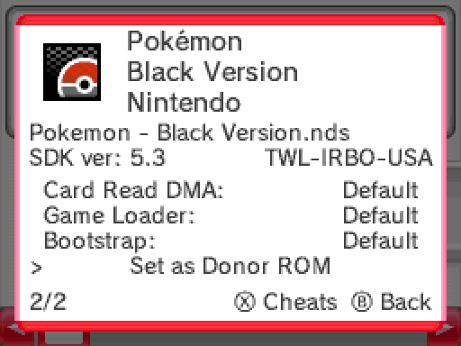

{ align=right width="115"}
# Running DSiWare on Flashcarts

!!! warning "DSiWare Compatibility"

    Running DSiWare on NDS hardware is not a stable experience. As DSiWare is meant to run in DSi mode with larger RAM and higher clock speeds than NDS, some titles will run with no audio playback and/or outright crash later on, with a few that will occasionally run with slowdown. A Memory Expansion Pak may also be required to run some DSiWare in NDS mode. For example, *Dragon Quest Wars* will not launch on a DS unless the pak is inserted.

    A list of DS-mode compatible DSiWare can be found in the [TWiLight Menu++ GitHub Repository](https://github.com/DS-Homebrew/TWiLightMenu/blob/master/universal/include/compatibleDSiWareMap.h).

### Setup Guide:

By following either method, nds-bootstrap will be installed in order to run DSiWare.

=== "TWiLight Menu++"

    1. First setup TWiLight as either [primary](twilight.md) or [secondary](twilight-dualboot.md) kernel on your flashcart.

    1. After setting up TWiLight Menu++, you will need to place your DSiWare (with `.nds` extension) in `/roms/dsi` on your SD card.

        !!! note

            If your DSiWare dump is a file with no file extension, you can change the filename and add `.nds` to the end to get TWiLight Menu++ to pick it up in the menu.

            For example, if you have a DSiWare dump of *Zelda: Four Swords* with the filename `00000000`, you can rename the file to `Zelda Four Swords.nds`, before placing it inside `/roms/dsi`

    1. You will now need to find a DS game built with SDK 5.x to use as a donor ROM for DSiWare. Place the donor ROM in `/roms/nds`.

        !!! tip
            {align=left width="115"}

            DSi-Enhanced games, such as *Pokémon: Black Version* are usually built with SDK5.x, which makes them a good candidate for usage as a donor ROM. You can check the SDK version of any game by highlighting it in TWiLight and pressing `Y`.

    1. Highlight the donor game in TWiLight, and press `Y` to open the ROM info menu. Scroll down to the bottom, and select `Set as Donor ROM`.

    1. You are now ready to play DSiWare! Head to `/roms/dsi` in TWiLight and choose a game to launch.

    1. **[Optional]** - To improve compatibility, insert a Slot-2 Memory Expansion Pak if you are using a DS Lite or NDS.

=== "Flashcart Kernels"

    1. Download [NDSForwarder-DSi](https://github.com/lifehackerhansol/NDSForwarder-DSi/releases/latest/download/NDSForwarder.nds) to the flashcart's SD card root.

    1. Download the [nds-bootstrap forwarder pack](https://github.com/RocketRobz/NTR_Forwarder/releases/latest/download/DS.Game.Forwarder.pack.nds-bootstrap.7z).

    1. Extract the contents of the `for SD Card root` folder to the root of your flashcart's SD card.

    1. After setting up the nds-bootstrap forwarder pack, you will need to place your DSiWare (with `.nds` extension) in `/roms/dsi` on your SD card.

        !!! note

            If your DSiWare dump is a file with no file extension, you can change the filename and add `.nds` to the end to get both NDSForwarder-DSi and the flashcart kernel to pick it up.

            For example, if you have a DSiWare dump of *Zelda: Four Swords* with the filename `00000000`, you can rename the file to `Zelda Four Swords.nds`, before placing it inside `/roms/dsi`

    1. You will now need to find a DS game built with SDK 5.x to use as a donor ROM for DSiWare. Place the donor ROM in `/roms/nds`.

        DSi-Enhanced games, such as *Pokémon: Black Version* are usually built with SDK5.x, which makes them a good candidate for usage as a donor ROM.

    === "Setting a Donor ROM"

        1. Launch `NDSForwarder.nds`.

        1. Press `A` on `Install`.

        1. Navigate to the donor game's location, press `A`, and select `Install`.

        1. In the flashcart kernel, head to `/forwarders` and choose the donor game to launch.

        1. Hold the `Y` button to open a menu where you can then set the game as a donor ROM.

    === "Adding a DSiWare title"

        1. Launch `NDSForwarder.nds`.

        1. Press `A` on `Install`.

        1. Navigate to the DSiWare's location, press `A`, and select `Install`.

        1. You are now ready to play DSiWare! Head to `/forwarders` in the flashcart kernel and choose a game to launch.

        1. **[Optional]** - To improve compatibility, insert a Slot-2 Memory Expansion Pak if you are using a DS Lite or NDS.

=== "DSpico with Pico-Launcher"

    !!! note

        This only works if your DSpico is booted on a DSi or 3DS. It will not load DSiWare on the Original DS or DS Lite.

    1. You need to acquire a copy of the DSi NAND files. If you have a DSi with HiyaCFW, you can copy the files from your DSi's SD card for this. If you do not have HiyaCFW, you can use GodMode9i booted on your DSpico to copy the files needed from the `nand:/` drive on it. GodMode9i offers a Copy & Paste functionality to do this.

    1. From your DSi NAND files, copy the below folders & files to the DSpico SD card:

        - `photo`
        - `shared1`
        - `shared2`
        - `sys`
        - A copy of the Nintendo DS ARM7 BIOS Dump inside the `_pico` folder named as `biosnds7.rom`. (You may need to rename it to this). [Follow this guide](https://wiki.ds-homebrew.com/ds-index/ds-bios-firmware-dump) for obtaining a BIOS dump.

    1. After doing the above, Add your DSiWare with the `.nds` file extension. You can now run DSiWare on your DSpico!

    !!! note

        If your DSiWare dump is a file with no file extension, you can change the filename and add `.nds` to the end to get Pico-Launcher to pick it up.

=== "DSpico with AKMenu-Next"

    !!! note

        This only works if your DSpico is booted on a DSi or 3DS. It will not load DSiWare on the Original DS or DS Lite.

    1. You need to acquire a copy of the DSi NAND files. If you have a DSi with HiyaCFW, you can copy the files from your DSi's SD card for this. If you do not have HiyaCFW, you can use GodMode9i booted on your DSpico to copy the files needed from the `nand:/` drive on it. GodMode9i offers a Copy & Paste functionality to do this.

    1. From your DSi NAND files, copy the below folders & files to the DSpico SD card:

        - `photo`
        - `shared1`
        - `shared2`
        - `sys`
        - A copy of the Nintendo DS ARM7 BIOS Dump inside the `_pico` folder named as `biosnds7.rom`. (You may need to rename it to this). [Follow this guide](https://wiki.ds-homebrew.com/ds-index/ds-bios-firmware-dump) for obtaining a BIOS dump.

    1. Boot up AKMenu-Next and ensure that the `Game Loader` inside the settings is set to `Pico-Loader` and that you have your DSpico booted on a DSi or 3DS.

    1. After doing the above, Add your DSiWare with the `.nds` file extension. You can now run DSiWare on your DSpico!

    !!! note

        If your DSiWare dump is a file with no file extension, you can change the filename and add `.nds` to the end to get AKMenu-Next to pick it up.