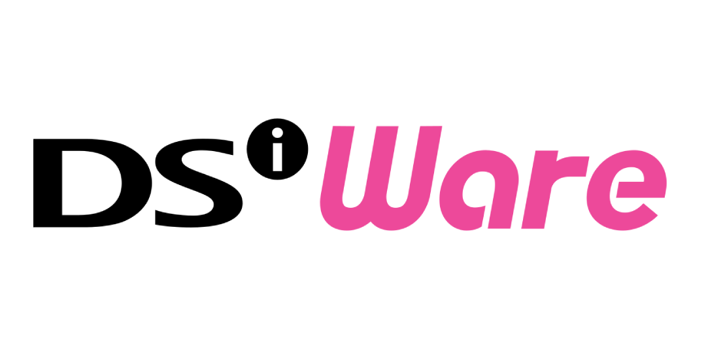
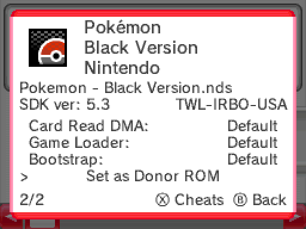
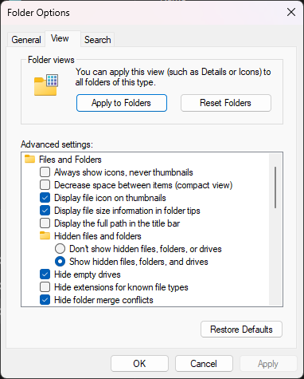

{ align=right width="115"}
# Running DSiWare on Flashcarts

### Setup Guide:

=== "TWiLight Menu++"

    !!! warning "DSiWare Compatibility"

        Running DSiWare on NDS hardware is not a stable experience. As DSiWare is meant to run in DSi mode with larger RAM and higher clock speeds than NDS, some titles will run with no audio playback and/or outright crash later on, with a few that will occasionally run with slowdown. A Memory Expansion Pak may also be required to run some DSiWare in NDS mode. For example, *Dragon Quest Wars* will not launch on a DS unless the pak is inserted.
    
        A list of DS-mode compatible DSiWare can be found in the [TWiLight Menu++ GitHub Repository](https://github.com/DS-Homebrew/TWiLightMenu/blob/master/universal/include/compatibleDSiWareMap.h).
    
    1. First setup TWiLight as either [primary](https://wiki.ds-homebrew.com/twilightmenu/installing-flashcard) or [secondary](twilight-dualboot.md) kernel on your flashcart.

    1. After setting up TWiLight Menu++, you will need to place your DSiWare (with `.nds` extension) in `/roms/dsi` on your SD card.

        !!! note

            If your DSiWare dump is a file with no file extension, you can change the filename and add `.nds` to the end to get TWiLight Menu++ to pick it up in the menu.

            For example, if you have a DSiWare dump of *Zelda: Four Swords* with the filename `00000000`, you can rename the file to `Zelda Four Swords.nds`, before placing it inside `/roms/dsi`

    1. You will now need to find a DS game built with SDK 5.x to use as a donor ROM for DSiWare. Place the donor ROM in `/roms/nds`.

        !!! tip
            {align=left width="115"}

            DSi-Enhanced games, such as *Pokémon: Black Version* are usually built with SDK5.x, which makes them a good candidate for usage as a donor ROM. You can check the SDK version of any game by highlighting it in TWiLight and pressing `Y`.

    1. Highlight the donor game in TWiLight, and press `Y` to open the ROM info menu. Scroll down to the bottom, and select `Set as Donor ROM`.

    1. You are now ready to play DSiWare! Head to `/roms/dsi` in TWiLight and choose a game to launch.

    1. **[Optional]** - To improve compatibility, insert a Slot-2 Memory Expansion Pak if you are using a DS Lite or NDS.

=== "Flashcart Kernels"

    !!! warning "DSiWare Compatibility"

        Running DSiWare on NDS hardware is not a stable experience. As DSiWare is meant to run in DSi mode with larger RAM and higher clock speeds than NDS, some titles will run with no audio playback and/or outright crash later on, with a few that will occasionally run with slowdown. A Memory Expansion Pak may also be required to run some DSiWare in NDS mode. For example, *Dragon Quest Wars* will not launch on a DS unless the pak is inserted.
    
        A list of DS-mode compatible DSiWare can be found in the [TWiLight Menu++ GitHub Repository](https://github.com/DS-Homebrew/TWiLightMenu/blob/master/universal/include/compatibleDSiWareMap.h).

    1. Download [NDSForwarder-DSi](https://github.com/lifehackerhansol/NDSForwarder-DSi/releases/latest/download/NDSForwarder.nds) to the flashcart's SD card root.

    1. Download the [nds-bootstrap forwarder pack](https://github.com/RocketRobz/NTR_Forwarder/releases/latest/download/DS.Game.Forwarder.pack.nds-bootstrap.7z).

    1. Extract the forwarder pack .7z file you downloaded using [7-Zip](https://www.7-zip.org/), then go into the extracted files.
    
    1. Copy the *contents* of the `for SD Card root` folder to the root of your flashcart's SD card.

    1. After setting up the nds-bootstrap forwarder pack, you will need to place your DSiWare (with `.nds` extension) in `/roms/dsi` on your SD card.

        !!! note

            If your DSiWare dump is a file with no file extension, you can change the filename and add `.nds` to the end to get both NDSForwarder-DSi and the flashcart kernel to pick it up.

            For example, if you have a DSiWare dump of *Zelda: Four Swords* with the filename `00000000`, you can rename the file to `Zelda Four Swords.nds`, before placing it inside `/roms/dsi`

    1. You will now need to find a DS game built with SDK 5.x to use as a donor ROM for DSiWare. Place the donor ROM in `/roms/nds`.

        - DSi-Enhanced games, such as *Pokémon: Black Version* are usually built with SDK5.x, which makes them a good candidate for usage as a donor ROM.

    #### Setting a Donor ROM

    1. Launch `NDSForwarder.nds`.

    1. Press `A` on `Install`.

    1. Navigate to the donor game's location, press `A`, and select `Install`.

    1. In the flashcart kernel, head to `/forwarders` and choose the donor game to launch.

    1. Hold the `Y` button to open a menu where you can then set the game as a donor ROM.

    #### Adding a DSiWare title

    1. Launch `NDSForwarder.nds`.

    1. Press `A` on `Install`.

    1. Navigate to the DSiWare's location, press `A`, and select `Install`.

    1. You are now ready to play DSiWare! Head to `/forwarders` in the flashcart kernel and choose a game to launch.

    1. **[Optional]** - To improve compatibility, insert a Slot-2 Memory Expansion Pak if you are using a DS Lite or NDS.

=== "DSpico with Pico-Launcher"

    !!! info "Console Compatibility"

        This only works if your DSpico is running on a DSi or 3DS system. It will not load DSiWare on the Original NDS or DS Lite, since those consoles are missing the upgraded DSi hardware for running DSi-mode apps.

    1. Download the [DSpico BIOS and NAND dumper utility.](https://git.deletecat.com/Deletecat/pico_file_dump/releases/download/latest/pico_file_dump.nds)

    1. Place `pico_file_dump.nds` on your DSpico's SD card root.

    1. Create a `DSiWare` folder on your SD card root, and place any DSiWare ROMs you'd like to play inside.

        !!! note "DSiWare File Types"

            If your DSiWare dump is a file with no file extension, you can change the filename and add `.nds` to the end to get Pico-Launcher to pick it up.

    1. Eject the SD card, insert it back into your DSpico, then boot into the cart.

    1. In the menu, navigate to and launch `pico_file_dump.nds`. Dumping will begin.

    1. Once all files have been dumped, press the power button to turn off the system.

    1. DSiWare and encrypted DS ROMs can now be played! Navigate to the `DSiWare` folder and launch a game to play.

    **Optional Filesystem Cleanup**

    If you don't like the folder clutter caused by copying all the NAND files to the DSpico SD card, you can hide them from the menu by setting the hidden attribute on any files or folders you want hidden.
    
    !!! note "Windows-only"

        The following instructions assume Windows is used. Linux/Mac instructions will be added later, but it is possible to hide files and folders on those operating systems as well, with different steps.

    1. Navigate to the SD card root on your PC's file explorer.

    1. While holding the CTRL (Control) key, click on any folders you would like to hide from Pico-Launcher's file list. The following files and folders are recommended to be hidden:
        - `photo` folder
        - `shared1` folder
        - `shared2` folder
        - `sys` folder
        - `_picoboot.nds`

    1. After selecting the last file, release the CTRL key, then right click on one of the selected files. In the right click menu, select `Properties`.

    1. A properties window will open. Under the `Attributes` section, check the `Hidden` box, then press `OK`.

    1. A pop-up window will appear asking to confirm changes. Choose "Apply changes to the selected items, subfolders, and files", then press `OK`.

    1. The selected files should disappear from the file manager. This is normal. You can view them again by enabling "Show hidden files" in File Explorer's "Folder Options" menu.
        - {align=left width="300"}
    
    1. Since the BIOS and NAND files have already been dumped, `pico_file_dump.nds` is no longer necessary and can be deleted from the SD card root.

    1. Insert the SD card back into your DSpico and boot into the menu. The hidden files should no longer show up in the menu list, but DSiWare will still work!

=== "DSpico with AKMenu-Next"

    !!! info "Console Compatibility"

        This only works if your DSpico with AKMenu-Next is running on a DSi or 3DS system. It will not load DSiWare on the Original NDS or DS Lite, since those consoles are missing the upgraded DSi hardware for running DSi-mode apps.

    1. Download the [DSpico BIOS and NAND dumper utility.](https://git.deletecat.com/Deletecat/pico_file_dump/releases/download/latest/pico_file_dump.nds)

    1. Place `pico_file_dump.nds` on your DSpico's SD card root.

    1. Create a `DSiWare` folder on your SD card root, and place any DSiWare ROMs you'd like to play inside.

        !!! note "DSiWare File Types"

            If your DSiWare dump is a file with no file extension, you can change the filename and add `.nds` to the end to get AKMenu-Next to pick it up.

    1. Eject the SD card, insert it back into your DSpico, then boot into the cart.

    1. In the menu, navigate to and launch `pico_file_dump.nds`. Dumping will begin.

    1. Once all files have been dumped, press the power button to turn off the system.

    1. Boot up AKMenu-Next and ensure that `Game Loader` in settings is set to `Pico-Loader`.

    1. DSiWare and encrypted DS ROMs can now be played! Navigate to the `DSiWare` folder and launch a game to play.

    **Optional Filesystem Cleanup**

    If you don't like the folder clutter caused by copying all the NAND files to the DSpico SD card, you can hide them from the menu by setting the hidden attribute on any files or folders you want hidden.
    
    !!! note "Windows-only"

        The following instructions assume Windows is used. Linux/Mac instructions will be added later, but it is possible to hide files and folders on those operating systems as well, with different steps.

    1. Navigate to the SD card root on your PC's file explorer.

    1. While holding the CTRL (Control) key, click on any folders you would like to hide from AKMenu-Next's file list. The following files and folders are recommended to be hidden:
        - `_pico` folder
        - `photo` folder
        - `shared1` folder
        - `shared2` folder
        - `sys` folder
        - `_picoboot.nds`
        - `boot.nds`

    1. After selecting the last file, release the CTRL key, then right click on one of the selected files. In the right click menu, select `Properties`.

    1. A properties window will open. Under the `Attributes` section, check the `Hidden` box, then press `OK`.

    1. A pop-up window will appear asking to confirm changes. Choose "Apply changes to the selected items, subfolders, and files", then press `OK`.

    1. The selected files should disappear from the file manager. This is normal. You can view them again by enabling "Show hidden files" in File Explorer's "Folder Options" menu.
        - {align=left width="300"}
    
    1. Since the BIOS and NAND files have already been dumped, `pico_file_dump.nds` is no longer necessary and can be deleted from the SD card root.

    1. Insert the SD card back into your DSpico and boot into the menu. The hidden files should no longer show up in the menu list, but DSiWare will still work!