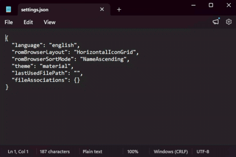

{ align=right width="40"}
# Setting Up Emulators on Pico-Launcher

!!! info

    Pico-Launcher supports launching homebrew apps, such as emulators, with argv parameters. This guide will help you download emulators and configure the file associations feature to launch roms directly from Pico-Launcher's menu with the correct emulator.

    Users of other flashcart kernels should use the main [emulators guide.](./emulators.md)

### Nintendo Consoles

=== "GBA"

    !!! info
        
        GBARunner 2 and 3 are both hypervisors for running GBA games on DS hardware. Setup guides for both are provided, as currently, some games run better on one than the other GBARunner2 is the older and more stable release, while GBARunner3 is the in-development successor to GBARunner2.
        
        However, note that you cannot associate both GBARunners to the `.gba` file extension at the same time. Therefore if you'd like to have both available for use, it's recommended to setup GBARunner3 with a file association, and then launch GBARunner2 manually when you'd like to use it.
    
    === "GBARunner2"

        1. Download [DSL Enhanced GBARunner2.](https://github.com/unresolvedsymbol/GBARunner2-DSL-Enhanced/releases/download/v20201019-DSL_97447fe/GBARunner2_arm9dldi_ds.nds)

        1. Navigate to the `_pico` folder on your SD card. Inside it, create an `emulators` folder.
        
        1. Place `GBARunner2_arm9dldi_ds.nds` inside the `emulators` folder.

        1. A `settings.json` file should be present in the `_pico` folder. Open it with a text editor such as Notepad.
            - If you can't find a `settings.json` inside `_pico`, you have not started up pico-launcher before, and will need to do so first.

        1. Add (copy/paste) this GBA association key into the `fileAssociations` key in `settings.json`:
            ``` json
                "gba": {
                  "appPath": "/_pico/emulators/GBARunner2_arm9dldi_ds.nds"
                }
            ```

            !!! tip "Adding Keys to `fileAssociations`"

                Here's a demonstration of how to add keys to the `fileAssociations` key:

                

                !!! note

                    If you choose to use multiple emulators in this guide, you will need to separate your file association keys using a comma:
                
                    ``` json
                    "abc": {
                      "appPath": "/path/to/program.nds"
                    },// (1)!
                    "xyz": {
                      "appPath": "/path/to/app.nds"
                    }
                    ```

                    1. This comma separates the `abc` key from the `xyz` key in this example.

        1. Create a `_gba` folder on your SD card root. (**NOT** inside `_pico`!)
         
        1. Obtain a GBA BIOS dump. Rename the file to `bios.bin` if it isn't named that already.
        
        1. Place the `bios.bin` file in the `_gba` folder.
        
            !!! note
            
                If you are unable to obtain a GBA BIOS .bin file, you may skip the two steps above. Keep in mind however, that GBARunner2 will fallback to the built in open-source BIOS, which will lead to worse game compatibility.
        
        1. On your SD card root, create a `ROMs` folder, and then create a `GBA` folder inside it. Place your `.gba` game ROMs inside.
        
        1. Place the SD card back into your cart, and boot into Pico-Launcher.
        
        1. To play GBA games, navigate to `/ROMs/GBA`, then select a GBA ROM.
    
    === "GBARunner3"
        
        1. Download the [GBARunner3 zip file.](https://files.deletecat.com/GBARunner3-hicode.zip)
        
        1. Open/extract `GBARunner3-hicode.zip`.

        1. From the extracted files, copy the `_gba` folder to your SD card root.
         
        1. Obtain a GBA BIOS dump. Rename the file to `bios.bin` if it isn't named that already.
            - This is *NOT* optional. GBARunner3 requires a bios file.
        
        1. Place the `bios.bin` file in the `_gba` folder.

        1. Navigate to the `_pico` folder on your SD card. Inside it, create an `emulators` folder.
        
        1. From the extracted files, copy `GBARunner3.nds` into the `emulators` folder.

        1. A `settings.json` file should be present in the `_pico` folder. Open it with a text editor such as Notepad.
            - If you can't find a `settings.json` inside `_pico`, you have not started up pico-launcher before, and will need to do so first.

        1. Add (copy/paste) this GBA association key into the `fileAssociations` key in `settings.json`:
            ``` json
                "gba": {
                  "appPath": "/_pico/emulators/GBARunner3.nds"
                }
            ```

            !!! tip "Adding Keys to `fileAssociations`"

                Here's a demonstration of how to add keys to the `fileAssociations` key:

                

                !!! note

                    If you choose to use multiple emulators in this guide, you will need to separate your file association keys using a comma:
                
                    ``` json
                    "abc": {
                      "appPath": "/path/to/program.nds"
                    },// (1)!
                    "xyz": {
                      "appPath": "/path/to/app.nds"
                    }
                    ```

                    1. This comma separates the `abc` key from the `xyz` key in this example.
        
        1. On your SD card root, create a `ROMs` folder, and then create a `GBA` folder inside it. Place your `.gba` game ROMs inside.
        
        1. Place the SD card back into your cart, and boot into Pico-Launcher.
        
        1. To play GBA games, navigate to `/ROMs/GBA`, then select a GBA ROM.

=== "GB/C"

    1. Download the [GameYob zip file.](https://github.com/Stewmath/GameYob/releases/download/v0.5.2/gameyob.zip)
    
    1. Navigate to the `_pico` folder on your SD card. Inside it, create an `emulators` folder.

    1. Open/extract `gameyob.zip`, and locate `gameyob.nds` inside. Copy this file into the `emulators` folder.

    1. A `settings.json` file should be present in the `_pico` folder. Open it with a text editor such as Notepad.
        - If you can't find a `settings.json` inside `_pico`, you have not started up pico-launcher before, and will need to do so first.

    1. Add (copy/paste) these GB and GBC association keys into the `fileAssociations` key in `settings.json`:
        ``` json
            "gb": {
              "appPath": "/_pico/emulators/gameyob.nds"
            },
            "gbc": {
              "appPath": "/_pico/emulators/gameyob.nds"
            }
        ```

        !!! tip "Adding Keys to `fileAssociations`"

            Here's a demonstration of how to add keys to the `fileAssociations` key:

            

            !!! note

                If you choose to use multiple emulators in this guide, you will need to separate your file association keys using a comma:
            
                ``` json
                "abc": {
                  "appPath": "/path/to/program.nds"
                },// (1)!
                "xyz": {
                  "appPath": "/path/to/app.nds"
                }
                ```

                1. This comma separates the `abc` key from the `xyz` key in this example.

    1. On your SD card root, create a `ROMs` folder, and then create a `GB` folder inside it. Place your `.gb` or `.gbc` game ROMs inside.
     
    1. Obtain a GameBoy Color BIOS dump. Rename the file to `gbc_bios.bin` if it isn't named that already.
    
    1. Place the `gbc_bios.bin` file in `/ROMs/GB`.
    
        !!! note
        
            If you are unable to obtain a GBC BIOS .bin file, you may skip the two steps above. However, GameYob will not be able to run games in color without the BIOS file, so you will only be able to emulate games in grayscale.
    
    1. Place the SD card back into your cart, and boot into Pico-Launcher.
    
    1. To play GB/C games, navigate to `/ROMs/GB`, then select a GB or GB/C ROM.

=== "SNES"

    !!! warning "Not ARGV Compatible"

        Unlike other emulators on this page, SNEmulDS is currently not able to be launched with argv from Pico-Launcher. Therefore, you will have to manually launch SNEmulDS from Pico-Launcher's menu first before selecting a ROM file to play.

    === "SNEmulDS 0.6a"

        !!! warning
        
            SNEmulDS has fairly low game compatibility, so expect results to be hit or miss. Some games may run flawlessly, some may be buggy, and some may be completely unplayable. You can get an idea of what will work and what settings to use by checking the [compatibility list](https://wiki.gbatemp.net/wiki/SNEmulDS_Compatibility_List).
    
        1. Download the [SNEmulDS 0.6a zip file.](../assets/snemulds_0.6a.zip)
        
        1. Create an `Emulators` folder on your SD card root.
        
        1. Open/extract `snemulds_0.6a.zip`, and locate `SNEmulDS.nds` inside. Copy this file to the `Emulators` folder on your SD card.
        
        1. Copy `snemul.cfg` to your SD card root, then open the file with Notepad. Change the `ROMPath = /SNES` line to `ROMPath = /ROMs/SNES`, and save the file.
        
        1. On your SD card root, create a `ROMs` folder, and then create a `SNES` folder inside it. Place your `.sfc` or `.smc` game ROMs inside.
        
        1. Place the SD card back into your cart, and boot into the menu.
        
        1. To play SNES games, navigate to the `Emulators` folder, launch `SNEmulDS.nds`, and select a SNES ROM in the menu.
    
    === "SNEmulDS 0.6d"

        !!! note

            This is Coto's fork of SNEmulDS. It's more up to date and has some compatibility fixes for games and aims to fix bugs. However, it can also have some regressions in the overall user experience, so 0.6a is also available for download in the other tab. Try both and choose which one you like best.

            See [Coto's README](https://github.com/cotodevel/snemulds/blob/master/README.md) for more info on this fork.
        
        !!! warning
        
            SNEmulDS has fairly low game compatibility, so expect results to be hit or miss. Some games may run flawlessly, some may be buggy, and some may be completely unplayable. You can get an idea of what will work and what settings to use by checking the [compatibility list](https://wiki.gbatemp.net/wiki/SNEmulDS_Compatibility_List).
    
        1. Download the [SNEmulDS 0.6d zip file.](../assets/SNEmulDS-0.6d-NTR-TGDS1.65.zip)
        
        1. Create an `Emulators` folder on your SD card root.
        
        1. Open/extract `SNEmulDS-0.6d-NTR-TGDS1.65.zip`, and locate `SNEmulDS.nds` inside. Copy this file to the `Emulators` folder on your SD card.
        
        1. From the extracted files, copy `snemul.cfg` to your SD card root.
        
        1. On your SD card root, create a `ROMs` folder, and then create a `SNES` folder inside it. Place your `.sfc` or `.smc` game ROMs inside.
        
        1. Place the SD card back into your cart, and boot into the menu.
        
        1. To play SNES games, navigate to the `Emulators` folder, launch `SNEmulDS.nds`, and select a SNES ROM in the menu.

=== "NES"

    1. Download the [NesDS NDS file.](https://github.com/DS-Homebrew/NesDS/releases/latest/download/nesDS.nds)
    
    1. Navigate to the `_pico` folder on your SD card. Inside it, create an `emulators` folder.

    1. Copy `nesDS.nds` into the `emulators` folder.

    1. A `settings.json` file should be present in the `_pico` folder. Open it with a text editor such as Notepad.
        - If you can't find a `settings.json` inside `_pico`, you have not started up pico-launcher before, and will need to do so first.
    
    1. Add (copy/paste) this NES association key into the `fileAssociations` key in `settings.json`:
        ``` json
            "nes": {
              "appPath": "/_pico/emulators/nesDS.nds"
            }
        ```

        !!! tip "Adding Keys to `fileAssociations`"

            Here's a demonstration of how to add keys to the `fileAssociations` key:

            

            !!! note

                If you choose to use multiple emulators in this guide, you will need to separate your file association keys using a comma:
            
                ``` json
                "abc": {
                  "appPath": "/path/to/program.nds"
                },// (1)!
                "xyz": {
                  "appPath": "/path/to/app.nds"
                }
                ```

                1. This comma separates the `abc` key from the `xyz` key in this example.
    
    1. On your SD card root, create a `ROMs` folder, and then create a `NES` folder inside it. Place your `.nes` game ROMs inside.
    
    1. Place the SD card back into your cart, and boot into Pico-Launcher.
    
    1. To play NES games, navigate to `/ROMs/NES`, then select an NES ROM.

### Atari Consoles

=== "Atari 2600"

    1. Download the [StellaDS NDS file.](https://github.com/wavemotion-dave/StellaDS/releases/latest/download/StellaDS.nds)
    
    1. Navigate to the `_pico` folder on your SD card. Inside it, create an `emulators` folder.
    
    1. Copy `StellaDS.nds` to the `emulators` folder.

    1. A `settings.json` file should be present in the `_pico` folder. Open it with a text editor such as Notepad.
        - If you can't find a `settings.json` inside `_pico`, you have not started up pico-launcher before, and will need to do so first.
    
    1. Add (copy/paste) this Atari 2600 association key into the `fileAssociations` key in `settings.json`:
        ``` json
            "a26": {
              "appPath": "/_pico/emulators/StellaDS.nds"
            }
        ```
        - See the [GBA section](./emulators-pico.md/#__tabbed_2_1) for a demonstration of how to add keys if you are confused.
    
    1. On your SD card root, create a `ROMs` folder, and then create a `2600` folder inside it. Place your `.a26` game ROMs inside.
        - (You can rename `.bin` Atari 2600 ROMs to `.a26` if necessary)
    
    1. Place the SD card back into your cart, and boot into Pico-Launcher.
    
    1. To play Atari 2600 games, navigate to `/ROMs/2600`, then select a ROM.

=== "Atari 5200"

    1. Download the [A5200DS NDS file.](https://github.com/wavemotion-dave/A5200DS/releases/latest/download/A5200DS.nds)
    
    1. Navigate to the `_pico` folder on your SD card. Inside it, create an `emulators` folder.
    
    1. Copy `A5200DS.nds` to the `emulators` folder.
    
    1. A `settings.json` file should be present in the `_pico` folder. Open it with a text editor such as Notepad.
        - If you can't find a `settings.json` inside `_pico`, you have not started up pico-launcher before, and will need to do so first.
    
    1. Add (copy/paste) this Atari 5200 association key into the `fileAssociations` key in `settings.json`:
        ``` json
            "a52": {
              "appPath": "/_pico/emulators/A5200DS.nds"
            }
        ```
        - See the [GBA section](./emulators-pico.md/#__tabbed_2_1) for a demonstration of how to add keys if you are confused.

    1. On your SD card root, create a `ROMs` folder, and then create two folders inside: `5200` and `BIOS`.
    
    1. Place your `.a52` game ROMs inside the `5200` folder.
         - (You can rename `.bin` Atari 5200 ROMs to `.a52` if necessary)
    
    1. Obtain an Atari 5200 BIOS dump. Rename the file to `5200.rom` if it isn't named that already.
    
    1. Place the `5200.rom` file in `/ROMs/BIOS`.
    
        !!! note
        
            If you are unable to obtain an Atari 5200 BIOS file, you may skip the two steps above. A built-in open-source BIOS is provided by the emulator, but some games don't have full compatibility with the built-in BIOS.
    
    1. Place the SD card back into your cart, and boot into Pico-Launcher.
    
    1. To play Atari 5200 games, navigate to `/ROMs/5200`, then select a ROM.

=== "Atari 7800"

    1. Download the [A7800DS NDS file.](https://github.com/wavemotion-dave/A7800DS/releases/latest/download/A7800DS.nds)
    
    1. Navigate to the `_pico` folder on your SD card. Inside it, create an `emulators` folder.
    
    1. Copy `A7800DS.nds` to the `emulators` folder.
    
    1. A `settings.json` file should be present in the `_pico` folder. Open it with a text editor such as Notepad.
        - If you can't find a `settings.json` inside `_pico`, you have not started up pico-launcher before, and will need to do so first.
    
    1. Add (copy/paste) this Atari 7800 association key into the `fileAssociations` key in `settings.json`:
        ``` json
            "a78": {
              "appPath": "/_pico/emulators/A7800DS.nds"
            }
        ```
        - See the [GBA section](./emulators-pico.md/#__tabbed_2_1) for a demonstration of how to add keys if you are confused.

    1. On your SD card root, create a `ROMs` folder, and then create two folders inside: `7800` and `BIOS`.
    
    1. Place your `.a78` game ROMs inside the `7800` folder.
        - (You can rename `.bin` Atari 7800 ROMs to `.a78` if necessary)

        !!! note
        
            NTSC ROMs are strongly recommended by the developer. PAL ROMs have more scanlines and render more slowly, causing the sound to be wrong. All testing was also done with only NTSC ROMs.
    
    1. Obtain an Atari 7800 High Score ROM dump. Rename the file to `highscore.rom` if it isn't named that already.
    
    1. Place the `highscore.rom` file in `/ROMs/BIOS`.
    
        !!! note
        
            If you are unable to obtain an Atari 7800 highscore.rom file, you may skip the two steps above. The emulator will work without it, but your high scores won't be saved.
    
    1. Place the SD card back into your cart, and boot into Pico-Launcher.
    
    1. To play Atari 7800 games, navigate to `/ROMs/7800`, then select a ROM.

=== "Atari 800/400"

    1. Download the [A8DS NDS file.](https://github.com/wavemotion-dave/A8DS/releases/latest/download/A8DS.nds)
    
    1. Navigate to the `_pico` folder on your SD card. Inside it, create an `emulators` folder.
    
    1. Copy `A8DS.nds` to the `emulators` folder.
    
    1. A `settings.json` file should be present in the `_pico` folder. Open it with a text editor such as Notepad.
        - If you can't find a `settings.json` inside `_pico`, you have not started up pico-launcher before, and will need to do so first.
    
    1. Add (copy/paste) this Atari 800/400 association key into the `fileAssociations` key in `settings.json`:
        ``` json
            "car": {
              "appPath": "/_pico/emulators/A8DS.nds"
            },
            "xex": {
              "appPath": "/_pico/emulators/A8DS.nds"
            },
            "atr": {
              "appPath": "/_pico/emulators/A8DS.nds"
            },
            "atx": {
              "appPath": "/_pico/emulators/A8DS.nds"
            }
        ```
        - See the [GBA section](./emulators-pico.md/#__tabbed_2_1) for a demonstration of how to add keys if you are confused.
    
    1. On your SD card root, create a `ROMs` folder, and then create two folders inside: `800` and `BIOS`.
    
    1. Place your 8-bit Atari game ROMs inside the `800` folder.
    
        - The following game types are supported by A8DS:
            - `CAR` and `ROM` cartridge-based games up to 1MB in size
            - `XEX` Atari 8-bit executable images
            - `ATR` and `ATX` disk-based games
            - Atari 5200 cartridge based games (up to 128K Super Carts)
    
    1. A8DS optionally supports Atari BIOSes for more accurate emulation. An open source "Altirra" BIOS is built-in, but official Atari BIOSes will provide the best performance, if you are able to obtain them.
        
        - The following optional BIOSes are supported by A8DS:
            - `atarixl.rom` - Atari 16k XL/XE BIOS (NTSC Rev 02 - BB 01.02, 10.May.1983)
            - `atariosb.rom` - 12k Atari 800 OS-B revision BIOS (NTSC OS-B version 2) - for older games
            - `ataribas.rom` - 8k Atari BASIC cartridge (Rev C)
            - `a5200.rom` - 2k Atari 5200 BIOS ROM (Rev 1)

    1. Place all BIOS files you have obtained and want to use in `/ROMs/BIOS`.
    
    1. Place the SD card back into your cart, and boot into Pico-Launcher.
    
    1. To play Atari 800/400 games, navigate to `/ROMs/800`, then select a ROM.

### Sega Consoles

=== "Sega Genesis/MegaDrive"
    
    !!! info "PicoDriveTWL vs jEnesisDS"

        PicoDriveTWL is a port of the PicoDrive emulator to DS hardware. It supports argv, so it can launch roms directly from the pico-launcher menu without having to launch the emulator directly first. PicoDrive is a more accurate emulator, but generally a bit slower than jEnesisDS. If you feel like a game is slightly choppy on PicoDriveTWL, you may want to fall back to using jEnesisDS instead.

    === "PicoDriveTWL"

        1. Download the [PicoDriveTWL NDS file.](https://github.com/DS-Homebrew/PicoDriveTWL/releases/download/v2.0.2/PicoDriveTWL.nds)
    
        1. Navigate to the `_pico` folder on your SD card. Inside it, create an `emulators` folder.
        
        1. Copy `PicoDriveTWL.nds` to the `emulators` folder.
    
        1. A `settings.json` file should be present in the `_pico` folder. Open it with a text editor such as Notepad.
            - If you can't find a `settings.json` inside `_pico`, you have not started up pico-launcher before, and will need to do so first.
        
        1. Add (copy/paste) these MegaDrive/Genesis association keys into the `fileAssociations` key in `settings.json`:
            ``` json
                "gen": {
                  "appPath": "/_pico/emulators/PicoDriveTWL.nds"
                },
                "smd": {
                  "appPath": "/_pico/emulators/PicoDriveTWL.nds"
                },
                "md": {
                  "appPath": "/_pico/emulators/PicoDriveTWL.nds"
                }
            ```
            - See the [GBA section](./emulators-pico.md/#__tabbed_2_1) for a demonstration of how to add keys if you are confused.
        
        1. On your SD card root, create a `ROMs` folder, and then create a `Genesis` folder inside it. Place your `.md`, `.gen`, or `.smd` game ROMs inside.
        
        1. Place the SD card back into your cart, and boot into Pico-Launcher.
        
        1. To play Sega Genesis games, navigate to `/ROMs/Genesis`, then select a ROM.

    === "jEnesisDS"

        !!! warning "Not ARGV Compatible"

            Unlike other emulators on this page, jEnesisDS is not able to be launched with argv from Pico-Launcher. Therefore, you will have to manually launch jEnesisDS from Pico-Launcher's menu first before selecting a ROM file to play.
        
        1. Download the [jEnesisDS zip file.](../assets/jenesisds_0.7.4.zip)
        
        1. Create an `Emulators` folder on your SD card root.
        
        1. Open/extract `jenesisds_0.7.4.zip`, and locate `jEnesisDS.nds` inside. Copy this file to the `Emulators` folder on your SD card.
        
        1. On your SD card root, create a `ROMs` folder, and then create a `Genesis` folder inside it. Place your Genesis game ROMs inside.
    
            !!! warning "Supported File Types"
    
                jEnesisDS **requires** ROMs to be in `.gen`, `.bin`, or `.smd` format to be recognized in the file browser. If you have `.md` ROMs, rename them to `.gen` or `.bin` before placing them on your SD card.

                You can find a batch script [here](../assets/rename_md.bat) to rename all your `.md` files quickly. Place `rename_md.bat` in the same folder as your `.md` ROMs, then double click on it to run the script. It will ask whether to rename your files to `.gen` or `.bin`. After you make a choice, all `.md` files in the folder will be renamed to the target extension.
        
        1. Place the SD card back into your cart, and boot into the menu.
        
        1. To play Sega Genesis games, navigate to the `Emulators` folder, launch `jEnesisDS.nds`, and select a ROM in the menu.

=== "Sega Master System & Sega Game Gear"

    1. Download the [S8DS zip file.](https://github.com/FluBBaOfWard/S8DS/releases/latest/download/S8DS.zip)
    
    1. Navigate to the `_pico` folder on your SD card. Inside it, create an `emulators` folder.
    
    1. Open/extract `S8DS.zip`, and locate `S8DS.nds` inside. Copy this file to the `emulators` folder.

    1. A `settings.json` file should be present in the `_pico` folder. Open it with a text editor such as Notepad.
        - If you can't find a `settings.json` inside `_pico`, you have not started up pico-launcher before, and will need to do so first.
    
    1. Add (copy/paste) these Master System & Game Gear association keys into the `fileAssociations` key in `settings.json`:
        ``` json
            "sms": {
              "appPath": "/_pico/emulators/S8DS.nds"
            },
            "gg": {
              "appPath": "/_pico/emulators/S8DS.nds"
            },
            "sg": {
              "appPath": "/_pico/emulators/S8DS.nds"
            },
            "sc": {
              "appPath": "/_pico/emulators/S8DS.nds"
            }
        ```
        - See the [GBA section](./emulators-pico.md/#__tabbed_2_1) for a demonstration of how to add keys if you are confused.
    
    1. On your SD card root, create a `ROMs` folder, and then create three folders inside: `SMS`, `GG`, and `BIOS`.
    
    1. Place your Sega Master System or Game Gear `.sms` or `.gg` game ROMs inside the `SMS` and `GG` folders, respectively.

        !!! tip "More SEGA 8-Bit Consoles Supported"
    
            S8DS also supports more consoles than just Master System and Game Gear. The pre-made assocations config provided above also adds support for SG and SC series consoles, using the `.sg` and `.sc` ROM extensions. Sega System-E / SG AC / MegaTech is also supported, using MAME format `.zip` ROMs. If you would like to make use of this, edit the associations config and associate `.zip` files with S8DS.

            A list of supported consoles and arcade roms can be found in the [S8DS README](https://github.com/FluBBaOfWard/S8DS/blob/main/README.md).

    1. [Optional] Place any BIOS files you'd like to use with S8DS in `/ROMs/BIOS`.
        - You will need to set S8DS to use the BIOS in the emulator settings: Options -> Machine -> Bios Settings

    1. On your SD card root, create a `data` folder, then create a `S8DS` folder inside.
        - This folder is only used by the emulator for save files and configuration, so you don't need to place anything inside.
    
    1. Place the SD card back into your cart, and boot into Pico-Launcher.
    
    1. To play Master System & Game Gear games, navigate to `/ROMs/SMS` or `/ROMs/GG`, then select a ROM.

### Miscellaneous Consoles

=== "NeoGeo Pocket"

    1. Download the [NGPDS zip file.](https://github.com/FluBBaOfWard/NGPDS/releases/latest/download/NGPDS.zip)
    
    1. Navigate to the `_pico` folder on your SD card. Inside it, create an `emulators` folder.
    
    1. Open/extract `NGPDS.zip`, and locate `NGPDS.nds` inside. Copy this file to the `emulators` folder.

    1. A `settings.json` file should be present in the `_pico` folder. Open it with a text editor such as Notepad.
        - If you can't find a `settings.json` inside `_pico`, you have not started up pico-launcher before, and will need to do so first.
    
    1. Add (copy/paste) these NeoGeo Pocket / Color association keys into the `fileAssociations` key in `settings.json`:
        ``` json
            "ngp": {
              "appPath": "/_pico/emulators/NGPDS.nds"
            },
            "ngc": {
              "appPath": "/_pico/emulators/NGPDS.nds"
            }
        ```
        - See the [GBA section](./emulators-pico.md/#__tabbed_2_1) for a demonstration of how to add keys if you are confused.
    
    1. On your SD card root, create a `ROMs` folder, and then create two folders inside: `NGPocket` and `BIOS`.
    
    1. Place your NeoGeo Pocket `.ngp` or `.ngc` game ROMs inside the `NGPocket` folder.

    1. Obtain a NeoGeo Pocket (for monochrome games), and a NeoGeo Pocket Color BIOS. The following BIOS names are pre-configured, but you can change them later in the emulator settings:
        - NGP Color BIOS: `ngp-color-bios.ngp`
        - NGP Monochrome BIOS: `ngp-bnw-bios.ngp`

    1. Place your NeoGeo Pocket BIOS files in `/ROMs/BIOS`. Rename them as needed to match the naming listed above, or change the BIOS paths in settings.

    1. On your SD card root, create a `data` folder, then create a `NGPDS` folder inside.

    1. Download this [`settings.cfg`](../assets/NGPDS/settings.cfg), and place it in `/data/NGPDS` on your SD.
    
    1. Place the SD card back into your cart, and boot into Pico-Launcher.
    
    1. To play NeoGeo Pocket games, navigate to `/ROMs/NGPocket`, then select a ROM.

=== "NeoGeo"

    !!! warning "Not ARGV Compatible"

        Unlike other emulators on this page, NeoDS is not able to be launched with argv from Pico-Launcher. Therefore, you will have to manually launch NeoDS from Pico-Launcher's menu first before selecting a ROM file to play.

    1. Download the [NeoDS NDS file.](https://github.com/flashcarts/AOS/raw/refs/heads/master/extras/APP/NeoDS.nds)
    
    1. Create an `Emulators` folder on your SD card root.
    
    1. Copy `NeoDS.nds` to the `Emulators` folder on your SD card.
    
    1. On your SD card root, create a `ROMs` folder, and then create a `NeoGeo` folder inside.
    
    1. Also on the SD card root, create a `data` folder, and then create a `NeoDS` folder inside.

    1. Download [this `_NeoDS.ini` file](../assets/_NeoDS.ini), and place it inside `/data/NeoDS`.

    1. NeoDS requires ROMs to be converted to `.neo` format before they can be used with the emulator. Follow the documentation [found here](https://github.com/flashcarts/AOS/blob/master/extras/NeoDS-ReadMe.md) to convert your ROMs.
    
    1. Once your ROMs are converted, place them in `/ROMs/NeoGeo` on your SD card. 
    
    1. Place the SD card back into your cart, and boot into the menu.
    
    1. To play NeoGeo games, navigate to the `Emulators` folder, launch `NeoDS.nds`, and select a ROM in the menu.

=== "PC-Engine/TurboGrafx-16"

    1. Download the [NitroGrafx zip file.](https://github.com/FluBBaOfWard/NitroGrafx/releases/download/v0.9.0/NitroGrafx0_9_0.zip)
    
    1. Navigate to the `_pico` folder on your SD card. Inside it, create an `emulators` folder.
    
    1. Open/extract `NitroGrafx0_9_0.zip`, and locate `NitroGrafx.nds` inside. Copy this file to the `emulators` folder.

    1. A `settings.json` file should be present in the `_pico` folder. Open it with a text editor such as Notepad.
        - If you can't find a `settings.json` inside `_pico`, you have not started up pico-launcher before, and will need to do so first.
    
    1. Add (copy/paste) these TurboGrafx association keys into the `fileAssociations` key in `settings.json`:
        ``` json
            "pce": {
              "appPath": "/_pico/emulators/NitroGrafx.nds"
            },
            "iso": {
              "appPath": "/_pico/emulators/NitroGrafx.nds"
            },
            "cue": {
              "appPath": "/_pico/emulators/NitroGrafx.nds"
            }
        ```
        - See the [GBA section](./emulators-pico.md/#__tabbed_2_1) for a demonstration of how to add keys if you are confused.
    
    1. On your SD card root, create a `ROMs` folder, and then create a `TurboGrafx` folder inside it.
    
    1. Place your TurboGrafx/PC-Engine `.pce` game ROMs inside the `TurboGrafx` folder. CD based games are also supported, in `.iso` format or `.bin`/`.cue` format.

    1. [Optional] NitroGrafx needs a CD-ROM BIOS to play CD games. If you want to play those games, place a CD-ROM BIOS inside the `TurboGrafx` folder.
        - You will need to set NitroGrafx to use the BIOS in the emulator settings: Options -> Machine -> Bios Settings -> Select Bios

    1. On your SD card root, create a `data` folder, then create a `NitroGrafx` folder inside.
        - This folder is only used by the emulator for save files and configuration, so you don't need to place anything inside.
    
    1. Place the SD card back into your cart, and boot into Pico-Launcher.
    
    1. To play TurboGrafx games, navigate to `/ROMs/TurboGrafx`, then select a ROM.

=== "ColecoVision"

    1. Download the [ColecoDS NDS file.](https://github.com/wavemotion-dave/ColecoDS/releases/latest/download/ColecoDS.nds)
    
    1. Navigate to the `_pico` folder on your SD card. Inside it, create an `emulators` folder.
        
    1. Copy `ColecoDS.nds` to the `emulators` folder.

    1. A `settings.json` file should be present in the `_pico` folder. Open it with a text editor such as Notepad.
        - If you can't find a `settings.json` inside `_pico`, you have not started up pico-launcher before, and will need to do so first.
    
    1. Add (copy/paste) these ColecoVision association keys into the `fileAssociations` key in `settings.json`:
        ``` json
            "col": {
              "appPath": "/_pico/emulators/ColecoDS.nds"
            },
            "cas": {
              "appPath": "/_pico/emulators/ColecoDS.nds"
            },
            "com": {
              "appPath": "/_pico/emulators/ColecoDS.nds"
            },
            "cv": {
              "appPath": "/_pico/emulators/ColecoDS.nds"
            },
            "ddp": {
              "appPath": "/_pico/emulators/ColecoDS.nds"
            },
            "dsk": {
              "appPath": "/_pico/emulators/ColecoDS.nds"
            },
            "mtx": {
              "appPath": "/_pico/emulators/ColecoDS.nds"
            },
            "msx": {
              "appPath": "/_pico/emulators/ColecoDS.nds"
            },
            "m5": {
              "appPath": "/_pico/emulators/ColecoDS.nds"
            },
            "pen": {
              "appPath": "/_pico/emulators/ColecoDS.nds"
            },
            "pv": {
              "appPath": "/_pico/emulators/ColecoDS.nds"
            },
            "pv1": {
              "appPath": "/_pico/emulators/ColecoDS.nds"
            }
        ```
        - See the [GBA section](./emulators-pico.md/#__tabbed_2_1) for a demonstration of how to add keys if you are confused.
    
    1. On your SD card root, create a `ROMs` folder, and then create two folders inside: `Coleco` and `BIOS`.
    
    1. Place your ColecoVision game ROMs inside the `Coleco` folder.
        
        !!! note "Supported ROM Types"
        
            ColecoDS supports *lots* of similar hardware games. The following file extensions are supported:

            `.cas`, `.col`, `.com`, `.cv`, `.ddp`, `.dsk`, `.mtx`, `.msx`, `.m5`, `.pen`, `.pv`, `.pv1`

            See the [ColecoDS README](https://github.com/wavemotion-dave/ColecoDS/blob/main/README.md) for more information.
            
    1. Obtain a ColecoVision BIOS dump. Rename the file to `coleco.rom` if it isn't named that already.
    
    1. Place the `coleco.rom` file in `/ROMs/BIOS`.

        !!! tip "Supported BIOS Files"

            As ColecoDS supports lots of similar architecture devices as well, it also has support for many more BIOSes.
            
            See the [ColecoDS README](https://github.com/wavemotion-dave/ColecoDS/blob/main/README.md) for a full list of supported BIOSes.
    
    1. Place the SD card back into your cart, and boot into Pico-Launcher.
    
    1. To play ColecoVision games, navigate to `/ROMs/Coleco`, then select a ROM.

=== "IntelliVision"

    1. Download the [NintelliVision NDS file.](https://github.com/wavemotion-dave/NINTV-DS/releases/latest/download/NINTV-DS.nds)
    
    1. Navigate to the `_pico` folder on your SD card. Inside it, create an `emulators` folder.
        
    1. Copy `NINTV-DS.nds` to the `emulators` folder.

    1. A `settings.json` file should be present in the `_pico` folder. Open it with a text editor such as Notepad.
        - If you can't find a `settings.json` inside `_pico`, you have not started up pico-launcher before, and will need to do so first.
    
    1. Add (copy/paste) this IntelliVision association key into the `fileAssociations` key in `settings.json`:
        ``` json
            "int": {
              "appPath": "/_pico/emulators/NINTV-DS.nds"
            }
        ```
        - See the [GBA section](./emulators-pico.md/#__tabbed_2_1) for a demonstration of how to add keys if you are confused.
    
    1. On your SD card root, create a `ROMs` folder, and then create two folders inside: `INTV` and `BIOS`.
    
    1. Place your IntelliVision `.int` game ROMs inside the `INTV` folder.
            
    1. Obtain at minimum, the two required BIOS dumps for NintelliVision: `grom.bin` and `exec.bin`.

        !!! note "Supported BIOS Files"
        
            NintelliVision supports extra BIOS files for maximum game compatibility, and the developer advises users to obtain copies of all supported BIOSes to get the best experience with NintelliVision. Below is a list of supported BIOSes and their hashes:

            - `grom.bin` - **[REQUIRED]** 2KB, CRC32: `683A4158`
            - `exec.bin` - **[REQUIRED]** 8KB, CRC32: `CBCE86F7`
            - `ivoice.bin` - [Optional] For Intellivoice games - 2KB, CRC32: `0DE7579D`
            - `ecs.bin` - [Optional] For ECS games - 24KB, CRC32: `EA790A06`
            - `wbexec.bin` - [Optional] For full Tutorvision mode - 16KB, CRC32: `7558A4CF`
            - `wbgrom.bin` - [Optional] For full Tutorvision mode - 2KB, CRC32 `82736456`
    
    1. Place your IntelliVision BIOS files in `/ROMs/BIOS`.
    
    1. Place the SD card back into your cart, and boot into Pico-Launcher.
    
    1. To play IntelliVision games, navigate to `/ROMs/INTV`, then select a ROM.