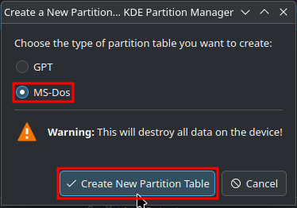
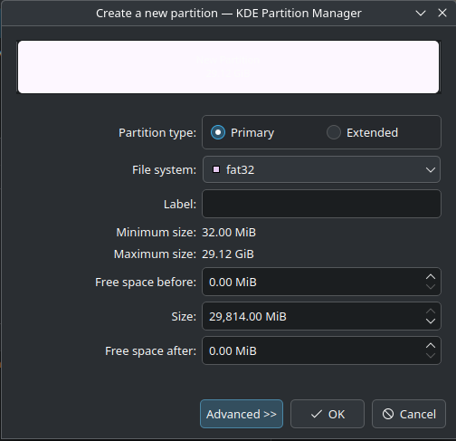

# Formatting a microSD Card

!!! info
    
    Choose the tab corresponding to the operating system you are using to format your SD card. Windows or Linux systems are recommended, but MacOS should work as well if it's your only choice.

    **ChromeOS/Android/iOS are NOT reliable devices to format your SD card with!**

### Setup Guide:

=== "Windows"

    !!! warning
        
        Make sure to use the correct tab for your SD card size. This is important, or you may end up formatting to the wrong filesystem by choosing the wrong tab!

        Formatting an SD card will WIPE ALL FILES on it. If you have any data on the SD card that you would like to keep, back it up your PC before formatting.
    
    === "32GB or Smaller"

        1. Download the latest version of [SD Memory Card Formatter.](https://www.sdcard.org/downloads/formatter/sd-memory-card-formatter-for-windows-download/){target="_blank"}
            - Accept the End User License Agreement to start the download

        1. Insert your SD card into your computer.
        
        1. Run `SD Card Formatter Setup` (the `.exe` file) in the downloaded `.zip` file with Administrator privileges, then install the program.
        
        1. Run `SD Card Formatter` from the Start Menu.
        
        1. Select your SD card’s drive letter for `Select Card`.
            - Make sure you choose the correct drive letter, otherwise you might accidentally erase the wrong drive!
        
        1. Ensure that `Quick Format` is selected.
        
        1. Click `Format`.
        
        1. Click `OK`.
        
        1. Wait for the format to finish.
        
        1. Click `OK`.

        1. Close the SD Card Formatter program.
    
    === "64GB or Larger"

        1. Download the latest version of [SD Memory Card Formatter.](https://www.sdcard.org/downloads/formatter/sd-memory-card-formatter-for-windows-download/){target="_blank"}
            - Accept the End User License Agreement to start the download

        1. Insert your SD card into your computer.
        
        1. Run `SD Card Formatter Setup` (the `.exe` file) in the downloaded `.zip` file with Administrator privileges, then install the program.
        
        1. Run `SD Card Formatter` from the Start Menu.
        
        1. Select your SD card’s drive letter for `Select card`.
            - Make sure you choose the correct drive letter, otherwise you might accidentally erase the wrong drive!
        
        1. Ensure that `Quick Format` is selected.
        
        1. Click `Format`.
        
        1. Click `OK`.
        
        1. Wait for the format to finish.
        
        1. Click `OK`.

        1. Close the SD Card Formatter program.

            !!! warning "Note"
    
                **You're not done yet!** Your SD card will be formatted to exFAT at this point. The following steps will format it to FAT32.

        1. Download [GUIFormat.](http://ridgecrop.co.uk/index.htm?guiformat.htm){target="_blank"}

        1. Run `guiformat.exe`.

        1. Select your SD card’s drive letter for `Drive`.
            - Make sure you choose the correct drive letter, otherwise you might accidentally erase the wrong drive!
        
        1. Set `Allocation unit size` to `32768`.

        1. Ensure that `Quick Format` is selected.
        
        1. Click `Start`.
        
        1. Click `OK`.

            !!! note "Errors in GUIFormat"

                You may encounter an error while using GUIFormat. See below for possible codes and solutions:

                **Failed to open device: GetLastError()=32**

                - Close everything that may be using the SD card, such as any File Explorer windows.

                **GetLastError()=1117**

                - Your SD card write-protection switch may be enabled. The lock switch must be flipped upwards to allow writing to the SD card. (including formatting)
        
        1. Wait for the format to finish.
        
        1. Click `Close`.
    

=== "Linux"

    !!! warning
        
        The commands in this guide are case-sensitive. Enter them exactly as written, or there may be unintended consequences.

        Formatting an SD card will WIPE ALL FILES on it. If you have any data on the SD card that you would like to keep, back it up your PC before formatting.
    
    === "fdisk"
        
        1. Make sure your SD card is **not** inserted.

        1. Open a terminal window and run the command `watch lsblk`

        1. Insert the SD card and watch for a new device appearing in lsblk.

        1. Observe the output for the new device. It should match something like this:

            ```
            NAME        MAJ:MIN RM  SIZE RO TYPE MOUNTPOINT
            mmcblk0     179:0    0 29.7G  0 disk 
            └─mmcblk0p1 179:1    0 29.5G  0 part /run/media/user/FFFF-FFFF
            ```
        
        1. Take note of the name of the device that now appears. In the example above, it was `mmcblk0`, but it could show up as `sda` or `sdb`, if you use a USB adapter.
            - If `RO` is set to `1`, make sure the lock switch is not slid down.
            - Device name is **not** the partition name. In the example above, the device name is `mmcblk0`, and the partition name is `mmcblk0p1`.
        
        1. Hit CTRL + C to exit the menu.

        1. Run `sudo umount /dev/<device name>*` (do not replace the `*`)

        1. Install the `fdisk` and `dosfstools` packages using your package manager of choice, if they are not installed already.

        1. Run `sudo fdisk /dev/<device name>`

        1. Enter `o`. This will create a new MBR partition scheme.

        1. Enter `n`, then press enter until you're returned to the prompt.
            - The default values will work fine for all consoles.
        
        1. Enter `t`, then enter `0c`

        1. Enter `a`, and then `p`. Observe the output, and make sure the device is now formatted correctly:

            ```
            Disk /dev/mmcblk0: 29.72 GiB, 31914983424 bytes, 62333952 sectors
            Units: sectors of 1 * 512 = 512 bytes
            Sector size (logical/physical): 512 bytes / 512 bytes
            I/O size (minimum/optimal): 512 bytes / 512 bytes
            Disklabel type: dos
            Disk identifier: 0x########
            
            Device                Boot  Start      End  Sectors  Size Id Type
            /dev/<partition name>        8192 62333951 62325760 29.7G  c W95 FAT32 (LBA)
            ```
        
        1. If there are no issues, enter `w`. This will save changes and exit the fdisk program.

        1. Run `sudo mkfs.vfat /dev/<partition name> -s 64` to format the new partition to FAT32.

        1. Run `sudo eject /dev/<device name>`, then remove the SD. You're done!

    === "parted"

        1. Make sure your SD card is **not** inserted.

        1. Open a terminal window and run the command `watch lsblk`

        1. Insert the SD card and watch for a new device appearing in lsblk.

        1. Observe the output for the new device. It should match something like this:

            ```
            NAME        MAJ:MIN RM  SIZE RO TYPE MOUNTPOINT
            mmcblk0     179:0    0 29.7G  0 disk 
            └─mmcblk0p1 179:1    0 29.5G  0 part /run/media/user/FFFF-FFFF
            ```
        
        1. Take note of the name of the device that now appears. In the example above, it was `mmcblk0`, but it could show up as `sda` or `sdb`, if you use a USB adapter.
            - If `RO` is set to `1`, make sure the lock switch is not slid down.
            - Device name is **not** the partition name. In the example above, the device name is `mmcblk0`, and the partition name is `mmcblk0p1`.
        
        1. Hit CTRL + C to exit the menu.

        1. Install the `parted` and `dosfstools` packages using your package manager of choice, if they are not already installed.

        1. In your terminal, run `sudo parted /dev/<device name> mklabel msdos`

        1. Run `sudo parted -a opt /dev/<device name> mkpart primary fat32 0% 100%`

        1. Run `sudo mkfs.vfat /dev/<partition name> -s 64` to format the new partition to FAT32.

        1. Run `sudo eject /dev/<device name>`, then remove the SD. You're done!

    === "KDE Partition Manager"

        <div class="annotate" markdown>

        1. Make sure your SD card is **not** inserted.

        1. Open KDE Partition Manager, inputting your password as needed.

        1. Insert your SD card and click `Refresh Devices`. The new device that shows up in the left pane is your SD card.

        1. Click your SD card, then click the `New Partition Table` button at the top of the window.

        1. When asked, choose `MS-Dos`. Do **NOT** use `GPT`. (1)

        1. Right click the `unallocated` space in the right pane, and select `New`.

        1. When selecting your filesystem, choose `FAT32` from the drop-down menu. (2)

        1. Click `OK`, then click `Apply`, and then `Apply Pending Operations`.

        1. Eject your SD card. You're done!

        </div>

        1.  { width="400"}

        2. { width="400"}
            
=== "MacOS"

    !!! warning
        
        Make sure to use the correct tab for your SD card size. This is important, or you may end up formatting to the wrong filesystem by choosing the wrong tab!

        Formatting an SD card will WIPE ALL FILES on it. If you have any data on the SD card that you would like to keep, back it up your PC before formatting.

    === "32GB or Smaller"

        1. Download the latest version of [SD Memory Card Formatter.](https://www.sdcard.org/downloads/formatter/sd-memory-card-formatter-for-mac-download/){target="_blank"}
            - Accept the End User License Agreement to start the download

        1. Insert your SD card into your computer.

        1. Run `Install SD Card Formatter` (the `.mpkg` file) in the downloaded `.zip` file.

        1. Run `SD Card Formatter`

        1. Select your SD card for `Select Card`.
            - Make sure you choose the correct device, otherwise you might accidentally erase the wrong drive!
        
        1. Ensure that `Quick Format` is selected.

        1. Click `Format`.

        1. Wait for the format to finish.

        1. Click `OK`, then close the SD Card Formatter program.

        1. Eject your SD card, and then you're done!
    
    === "64GB or Larger"

        1. Download the latest version of [SD Memory Card Formatter.](https://www.sdcard.org/downloads/formatter/sd-memory-card-formatter-for-mac-download/){target="_blank"}
            - Accept the End User License Agreement to start the download

        1. Insert your SD card into your computer.

        1. Run `Install SD Card Formatter` (the `.mpkg` file) in the downloaded `.zip` file.

        1. Run `SD Card Formatter`

        1. Select your SD card for `Select Card`.
            - Make sure you choose the correct device, otherwise you might accidentally erase the wrong drive!
        
        1. Ensure that `Quick Format` is selected.

        1. Click `Format`.

        1. Wait for the format to finish.

        1. Click `OK`, then close the SD Card Formatter program.

            !!! warning "Note"
    
                **You're not done yet!** Your SD card will be formatted to exFAT at this point. The following steps will format it to FAT32.
        
        1. Choose a tab below based on the version of MacOS your computer is running to continue:

        === "OS X El Capitan (10.11) and later"

            1. Launch the Disk Utility application.

            1. Select `Show All Devices` in the top-left `View` panel.

            1. Select your SD card from the sidebar.
                - Make sure you choose the correct device, otherwise you might accidentally erase the wrong drive!

            1. Click `Erase` at the top.

            1. Ensure that `Format` is set to `MS-DOS (FAT32)`.
                - On El Capitan (10.11) through Catalina (10.15) choose `MS-DOS (FAT)`.
             
            1. Ensure that `Scheme` is set to `Master Boot Record`.
                - If `Scheme` does not appear, click `Cancel` and make sure to choose the device instead of a volume.
             
            1. Click `Erase`, then click `Close`.

            1. Eject your SD card, and then you're done!
        
        === "OS X Yosemite (10.10) and earlier"

            1. Launch the Disk Utility application.

            1. Select your SD card from the sidebar.
                - Make sure you choose the correct device, otherwise you might accidentally erase the wrong drive!
            
            1. Click `Partition` at the top.
                - If `Partition` does not appear, make sure to choose the device instead of a volume.
            
            1. Ensure that `Partition Layout` is set to `1 Partition`.

            1. Ensure that `Format` is set to `MS-DOS (FAT)`.

            1. From the `Options` button (below the partition table), select `Master Boot Record`.

            1. Click `OK`, then `Apply`, and then `Partition`.

            1. Eject your SD card, and then you're done!