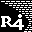
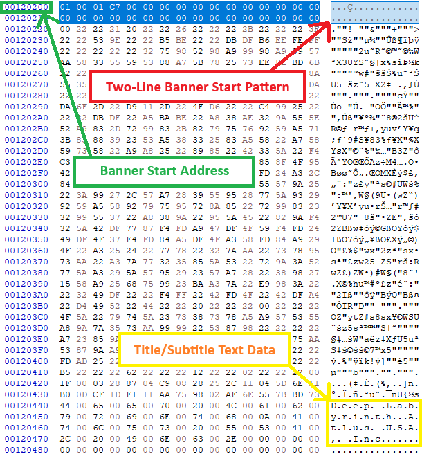
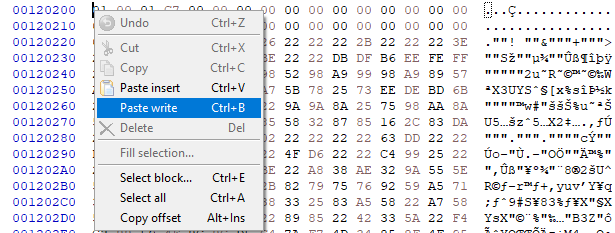

{ align=right width="80"}
# Changing Flashcart Banners
## R4iLS and Ace3DS+/X carts

!!! danger "Breaks Stock DSi/3DS Compatibility"

    Changing the icon or banner text of a flashcart will cause it to be blocked by DSi and 3DS firmware, *unless* CFW (Custom Firmware) is installed on the console. NDS and DS Lite are not affected by this, as they do not do any integrity checks on the game being loaded.

    **DO NOT follow this guide if you are using your flashcart on a stock DSi or 3DS without CFW!**

### Creating a Custom Icon

The first step to changing your flashcart's banner is to create a new icon for the cart to use. This can be as simple as just downloading an image you want to use, but if you would like the image to look good on NDS hardware, it's a good idea to manually edit and scale the image to match DS game icon specifications.

DS game icons have the following characteristics:

- 32 x 32px
- 16 colors max
- Color at index 0 is treated as transparent

---

[GIMP](https://www.gimp.org/downloads/) is a free image editor that can be used to create an icon that meets these requirements. While any editor can be used if you have more experience with alternative options, the following steps will be using GIMP.

1. Download and install GIMP, launch it, and open your image.

1. Crop your image to a 1:1 aspect ratio. Select the crop tool, and check `Fixed Aspect ratio`, setting it to `1:1`.

1. Select `Image` -> `Scale Image`, and type in a Width/Height of 32px. Hit `Scale`.

1. You should now have a square, 32px size image. Now, we can change the image to 16-color indexed mode. Select `Image` -> `Mode` -> `Indexed`. Select `Generate optimum palette`, and set maximum colors to 16.

1. After changing the image to indexed color, you can check the generated colormap by opening the colormap dialog. Select `Windows` -> `Dockable Dialogs` -> `Colormap`. This will show the 16 colors available in the image.

1. Check the color at index 0 (first in the colormap). It will be treated as transparent by the DS. If you don't want the color at index 0 to be transparent, re-arrange the colormap so a different color is at index 0. Right-click on the color boxes in the colormap window, and select `Rearrange Colormap...`.

1. Once you are happy with the colors and how the image looks, select `File` -> `Export As...`. Export the file as `.png`, keeping the default values.

### Creating a Banner File

Next, we need to convert the custom icon into a full NDS game banner with text that the console can read in the menu. There are multiple tools available to do this, and we will go over them below. NDS Banner Editor is a native program and a more advanced editor, while Banner Maker is a cross-platform webapp.

=== "NDS Banner Editor"

    1. Download [NDS Banner Editor](https://github.com/TheGameratorT/NDS_Banner_Editor/releases/latest) for your OS.
    
    1. Launch NDS Banner Editor, then select `File` -> `New`.
    
    1. Change the `Version` in the bottom right to `0x0001 - Regular DS`.
        
        ??? note "Animated Icons"

            While it is technically possible to write an animated DSi banner into a DS-mode ROM, it will likely overwrite non-banner addresses of the ROM that contain actual data due to an animated banner being much larger in size than a DS-mode static banner. For a flashcart, this data may or may not be used before the cart's exploit launches, so it's possible that overwriting these data areas of the ROM can stop the cart from booting. However, the cart should still be recoverable in this case by running cart-flasher from a DSi or 3DS system on the console's SD.

            Note that even if you are successful in applying an animated banner, the icon will only appear animated in the DSi menu. Due to a quirk of the DSi menu, it will always attempt to load animated banner data if it exists, regardless of whether or not the title is DSi-enhanced. The 3DS menu properly checks this, and will not load animated banners for DS-mode games.
    
    1. Click `Import Image`, and select the icon you created earlier.

    1. Next, edit the game title and subtitle text in the text box on the right side of the window. After you are done editing, click `Set All` to set the custom text for all regions. (Unless you want different text for different DS languages)

        ??? tip "Text Layouts"

            You can have up to three lines of text in the banner. Both three and two-line layouts are commonly used in retail games.
            
            For example, the following three-line text is used by *Castlevania - Order of Ecclesia*:
            ```
            Castlevania
            Order of Ecclesia
            Konami Digital Entertainment
            ```
    
            *Advance Wars: Dual Strike* uses a two-line layout:
            ```
            Advance Wars: Dual Strike
            Nintendo
            ```

    1. Select `File` -> `Save As...`, give the file a name, then save the `.bin` to your PC. This is your NDS banner data.

=== "Banner Maker"

    1. Open [Banner Maker](https://tasken.github.io/banner-maker/) in your PC's web browser.

    1. Upload your 32px, 16-colors game icon to the website.
        - If you didn't manually convert your image to meet these specifications, the website will automatically do so.

    1. Fill out the game title/subtitle boxes.

        ??? tip "Text Layouts"

            You can have up to three lines of text in the banner. Both three and two-line layouts are commonly used in retail games.
            
            For example, the following three-line text is used by *Castlevania - Order of Ecclesia*:
            ```
            Castlevania
            Order of Ecclesia
            Konami Digital Entertainment
            ```
    
            *Advance Wars: Dual Strike* uses a two-line layout:
            ```
            Advance Wars: Dual Strike
            Nintendo
            ```

    1. Underneath the preview, click the `Download banner.bin` button to download the resulting banner after you are done editing.

    1. Save the `banner.bin` to a folder on your PC. This is your NDS banner data.

#### Pre-made Banner Files

Below are a couple pre-made banner `.bin` files you can download and edit, or use as-is, if you'd like to skip making your own banner.

<div class="grid cards" markdown>

- [<span style="display: flex; align-items: center; gap: 1rem; color: var(--md-default-fg-color);">{ style="flex-shrink: 0" }<span style="flex: 1; text-align: center;"><strong>R4 i.L.S</strong><br>Revolution for DS</span></span>](../assets/Banner_Change/R4iLS_Banner_Red.bin)
- [<span style="display: flex; align-items: center; gap: 1rem; color: var(--md-default-fg-color);">{ style="flex-shrink: 0" }<span style="flex: 1; text-align: center;"><strong>R4 Revolution for i.L.S</strong><br>www.r4li.com</span></span>](../assets/Banner_Change/R4iLS_Banner.bin)
- [<span style="display: flex; align-items: center; gap: 1rem; color: var(--md-default-fg-color);">{ style="flex-shrink: 0" }<span style="flex: 1; text-align: center;"><strong>R4 SDHC Dual Core</strong><br>www.r4isdhc.com.cn</span></span>](../assets/Banner_Change/R4_Gold_Banner.bin)
- [<span style="display: flex; align-items: center; gap: 1rem; color: var(--md-default-fg-color);">{ style="flex-shrink: 0" }<span style="flex: 1; text-align: center;"><strong>R4 SDHC Dual Core</strong><br>www.r4isdhc.com.cn</span></span>](../assets/Banner_Change/R4_Silver_Banner.bin)

</div>

### Flashing the Custom Banner

The custom banner now needs to be written onto the cart. To do this, we will need to dump the flashrom, use a hex editor like HxD to edit the file, and then flash the modifed version back to the cart.

1. Download the latest release of [Cart-Flasher](https://github.com/tasken/Cart-Flasher/releases/download/v0.2-tinkatink/cart_flasher-9ebc5b5.nds) and place it on your flashcart's SD card.

1. Boot into your flashcart menu, and launch Cart-Flasher.

1. Accept the warning by pressing `A`.

1. Select `Ace3DS+` in the cart list, then select `Back up flash`.

1. Power off your system, then insert the SD card into your PC.

1. Navigate to `cart-backups` on the SD card, and copy `Ace3DSPlus-backup.bin` to your PC.

1. Download and install [HxD](https://mh-nexus.de/en/downloads.php?product=HxD20) (or any other hex editor for your operating system) on your PC.

1. Launch HxD, and open `Ace3DSPlus-backup.bin`. Also open your banner `.bin` file you saved from earlier. It should open in another tab in HxD.

1. We now need to find the start address of the banner data in your cart's flashrom, as we will be overwriting the data at this address with your custom banner.

1. Select the `Ace3DSPlus-backup.bin` tab, and then press ++ctrl+f++ to open the find window. Select `Unicode (UTF-16 little endian)` in the "Text encoding:" drop-down.

1. In the search field, type a section of text from the current banner. For R4iLS carts, the spoofed game is usually *Deep Labyrinth*. For Ace3DS+ and X carts, it's usually *SpongeBob's Atlantis Squarepantis*.

1. The search result should take you to the banner data area of the ROM. If you look right above the first occurrence of the title text in the ROM, you should see a block of unreadable data. This is the icon section of the banner data. The start of the banner data is marked by a pattern of two lines right above the icon section. The start of these two lines can have non-zero data in the first four bytes, and then the rest is zero-filled.

    :   {width="400"}

1. Identify the start address for your flashrom. In the example above using an R4iLS with Deep Labyrinth, the start address is `00120200`. We will need to write our new banner data here at this address.
    - For Ace3DS+ hardware using the Spongebob game banner, the banner start address should be `000F5E00`, but always verify the address yourself for your cart.

1. In HxD, click on the tab for your custom banner. Press ++ctrl+a++ to select all data, then press ++ctrl+c++ to copy all data to the clipboard.
    - If you get a warning from HxD that some data was not identically copied, that is fine. As the warning says, HxD uses its own clipboard for copying data and will copy data between HxD tabs correctly.

1. Place your cursor at the start address, right-click, and select `Paste write`. The banner data will overwrite the old data at the address.

    :   

1. Press the Save (:floppy_disk:) icon in HxD to save changes to `Ace3DSPlus-backup.bin`.

1. Rename the edited `Ace3DSPlus-backup.bin` to `Custom-Ace3DSPlus.bin`, and place it in the `cart-backups` folder on your SD.
    - You can use any name you'd like for the customized `.bin`, this is only a suggestion.

1. Boot into your flashcart menu, and launch Cart-Flasher.

1. Accept the warning by pressing `A`.

1. Select `Ace3DS+` in the cart list, then select `Write flash`.

1. Select your customized `.bin` file to write, then input the key combo to proceed.

1. Wait until the progress bar finishes, then press `A` to exit and reboot your console.

1. You should now see your new custom banner displayed in the console's menu!