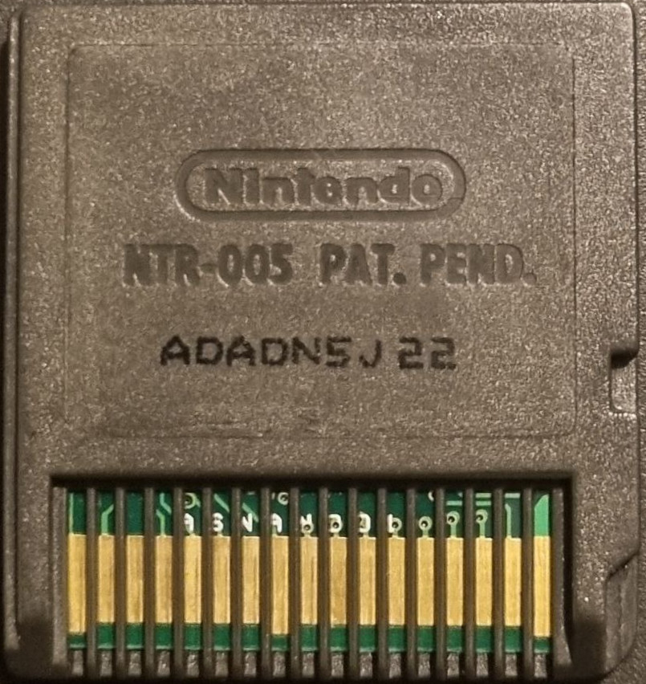

{ align=right width="115"}
# Converting Bootleg Games into a N-Card Flashcart

---

!!! warning "N-Card Carts"

    This tutorial only applies to N-Card based hardware. The best way to verify this is to check the back of the cart where the pins are located and look for text saying "**ASIC**" or "**ASNAND**".

    This tutorial requires a Nintendo DSi with Unlaunch. This guide cannot be performed on a Nintendo 3DS.

### Setup Guide:

1. Ensure your Nintendo DSi system has Unlaunch installed, as it is a requirement for this guide to work. [Follow this guide](https://dsi.cfw.guide/installing-unlaunch.html) on installing Unlaunch on your Nintendo DSi.

1. Download [GodMode9i](https://github.com/DS-Homebrew/GodMode9i/releases/download/v3.7.0/GodMode9i.nds) and place it on the root of your DSi/3DS SD card.

1. Download the [N-Card Conversion Package](../assets/N-Card-Conversion.zip) and extract it. Place the extracted `N-Card Conversion` folder on to the root of your DSi/3DS SD Card.

1. Insert your Game into the console and power it on. If you are using a 3DS, its normal for the 3DS to not recognise the inserted cartridge.

1. Launch Unlaunch's file browser by holding `A` + `B` while powering on your console. Navigate to the `N-Card Conversion` folder. Launch the `uDisk.nds` file while holding `Start` + `Select`. Unlaunch lists .nds files in alphabetical order, so if you have many .nds files, you may have to scroll until you find it.

1. You will now be shown a formatting screen. Select the `FULL FORMAT` option. It will check the N-Card for bad blocks and then perform a full format.

    !!! warning

        Do not power off your console while the uDisk is formatting the cart, this may cause your game cart to become bricked!

1. The formatting process is complete once it says `please copy xmenu.dat to card!`. Power off your console.

1. Power on your console and launch GodMode9i from Twilightmenu++ or Unlaunch. Enter the `[sd:]` drive and nagivate to the `N-Card Conversion` folder. Highlight `autorun1.nds` and press `Y` to copy it to the clipboard.

1. Back out to the drive screen and enter the `[fat:]` drive. Press `Y` to paste and select the `Copy files` option.

1. Power off your console while holding `A` + `B` to boot into Unlaunch. Load up the `uDisk.nds` file again, this time without holding any buttons. You will be asked if you would like to update uDisk, press `A` to continue. The update process will stop at 88%; this is normal. Once it reaches 88%, power off the console.

    !!! tip

        At this stage you may now continue using a Slot 2 USB adapter on a DS/DS Lite system if you prefer, as the cartridge now has a working uDisk installed. You can follow the below steps but instead copying & deleting the required files from a computer.

1. Power on your console and launch GodMode9i via Unlaunch or Twilightmenu++. Enter the `[sd:]` drive and nagivate to the `N-Card Conversion` folder. Highlight `DSYSTEM` and press `L`, then highlight `xmenu.dat` and press `L`. Press Y to copy the two files to the clipboard.

1. Back out to the drive screen and enter the `[fat:]` drive. Press `Y` to paste and select the `Copy files` option.

1. Highlight `autorun1.nds` and Press `X` to delete it, press `A` to confirm.

1. Reboot your console and boot the cart, it should now boot into the xmenu interface. Your bootleg game has now been converted into an N-Card flashcart! The capacity of your N-Card will be shown at the top left of the screen.

    !!! tip

        You may now copy .NDS files to the N-Card via GodMode9i on a DSi or 3DS, or via a Slot 2 USB Adapter with a DS/DS Lite. Bear in mind that the N-Card xmenu does not contain any anti-piracy patches so you may wish to patch your ROMs where necessary or use an alternative loader such as Twilightmenu++.

### Testing the SRAM Battery

The N-Card and it's clone typically use an SRAM chip with a small coin cell in order to hold save data of currently running game. When the console is powered off or rebooted back into the N-Card, this save data is then written back to the N-Card's internal flash storage.

On some units, usually due to age, this battery may not hold much of a charge, or sometimes no charge at all, leading to the contents of the SRAM being lost if the console is powered off, or powered off for too long. This usually results in a corrupted or lost save file. In order to test the battery on your N-Card, you can use nrioSaveTester.

1. Download [nrioSaveTester](https://github.com/ApacheThunder/nrioSaveTester/releases/download/1.1/nrioSaveTester.nds) and copy it to the internal storage of your N-Card.

1. Boot the N-Card and launch the `nrioSaveTester.nds` file. Press `B` to write a new save file. Press `A` to power off your console.

1. You can now choose how long to wait before testing the save again. To test the save, Power on your console and boot the N-Card and launch the `nrioSaveTester.nds` file. Press `A` to test the save, then press `A` to power off your console. An example can be waiting an hour then testing, then a day and then a week. When the save test fails, the time difference between last testing the save and now should indicate roughly how long the SRAM battery can hold a charge for.
