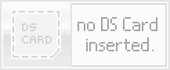
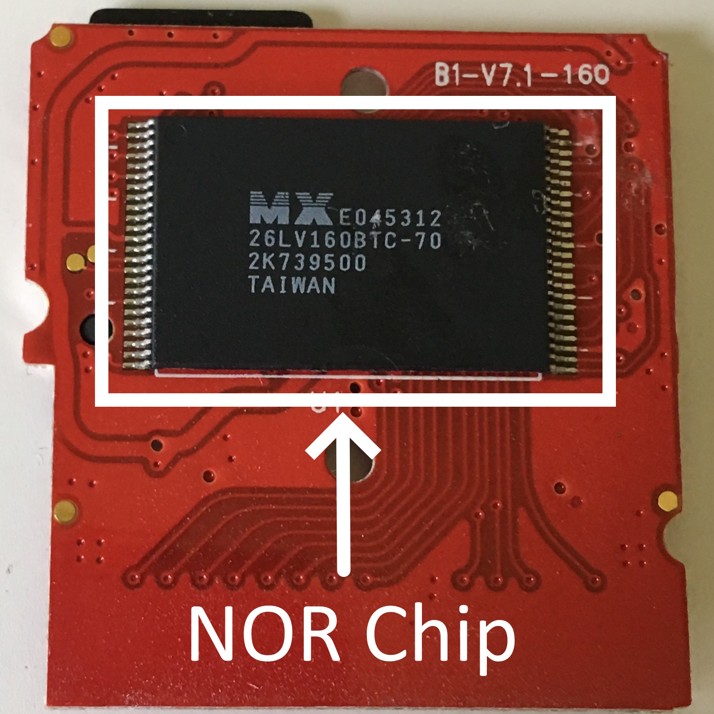
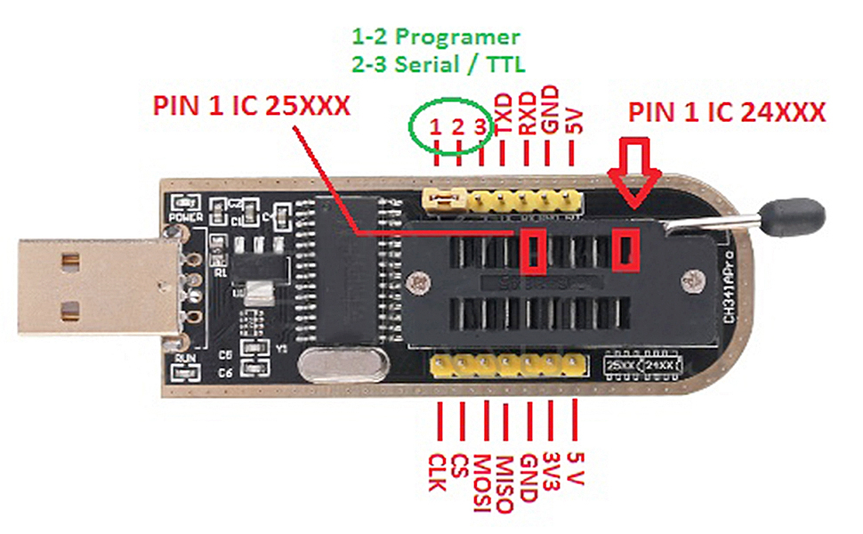
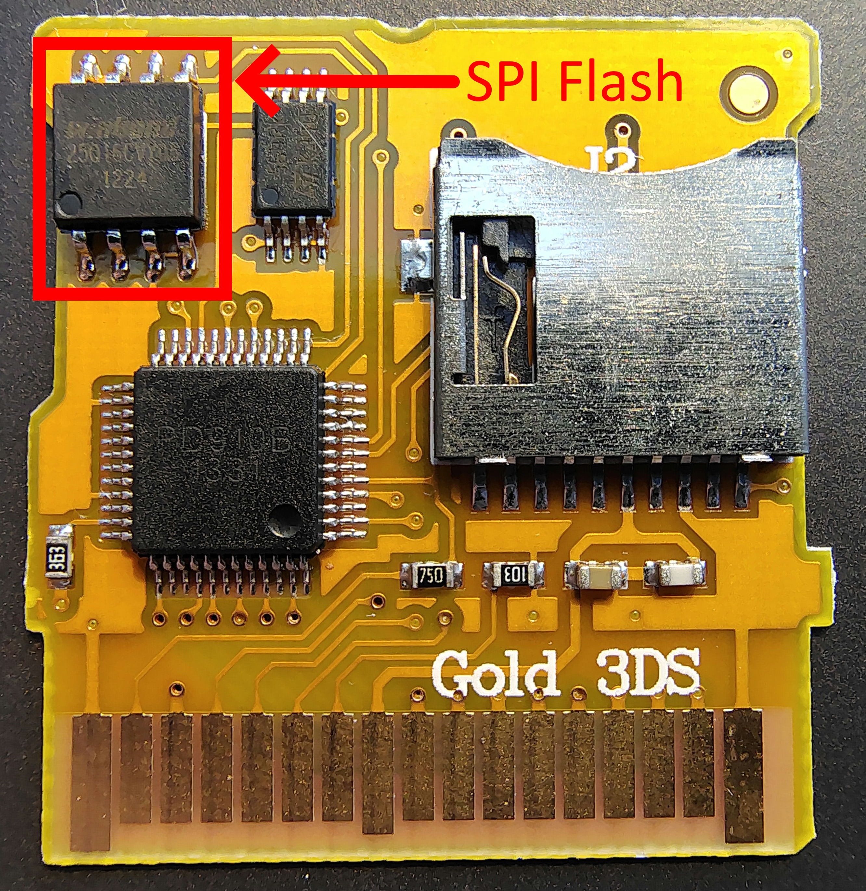
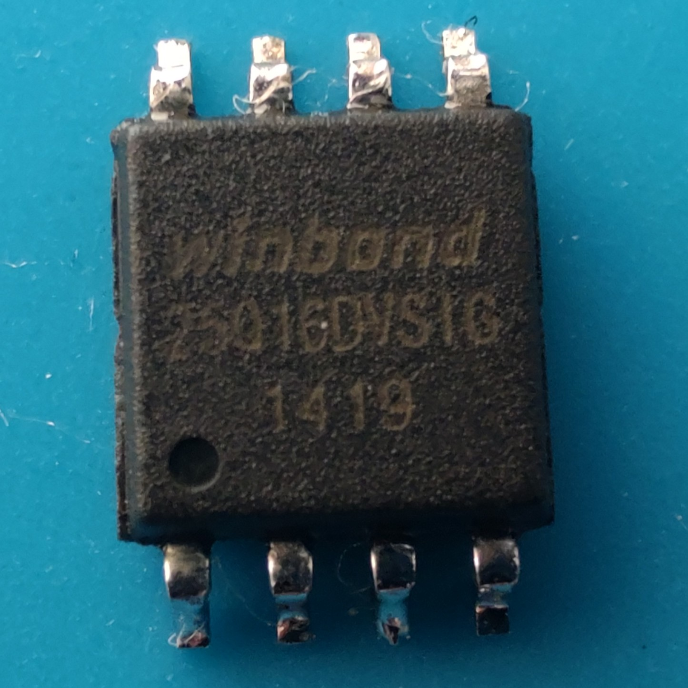
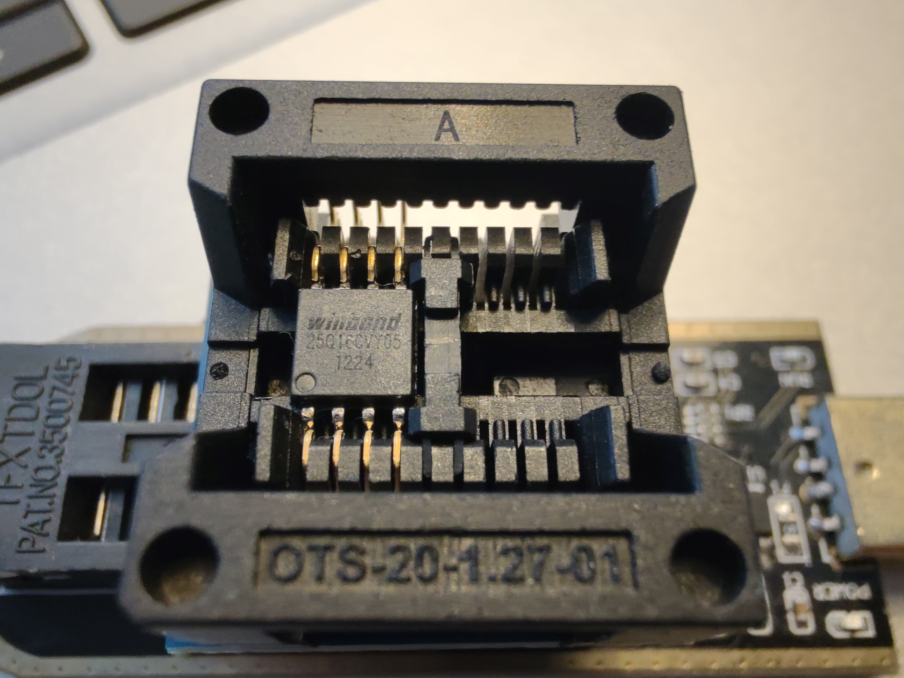
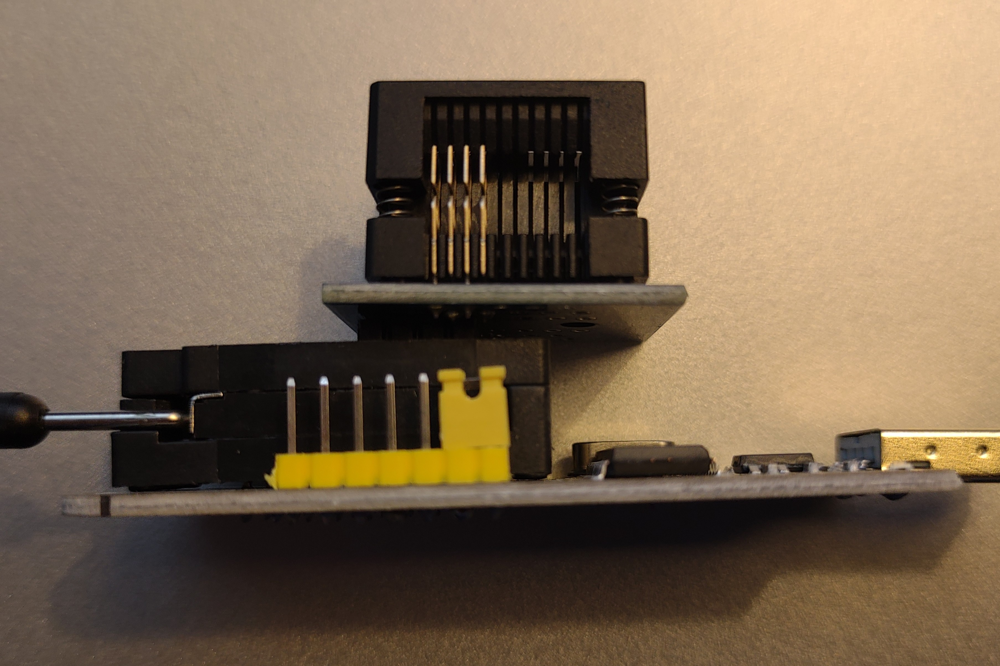
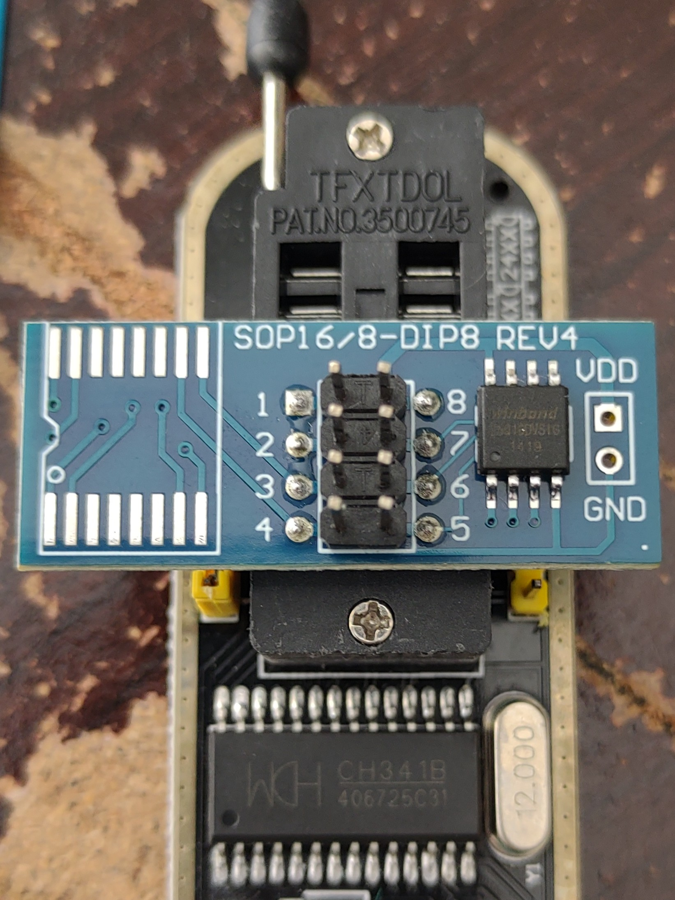
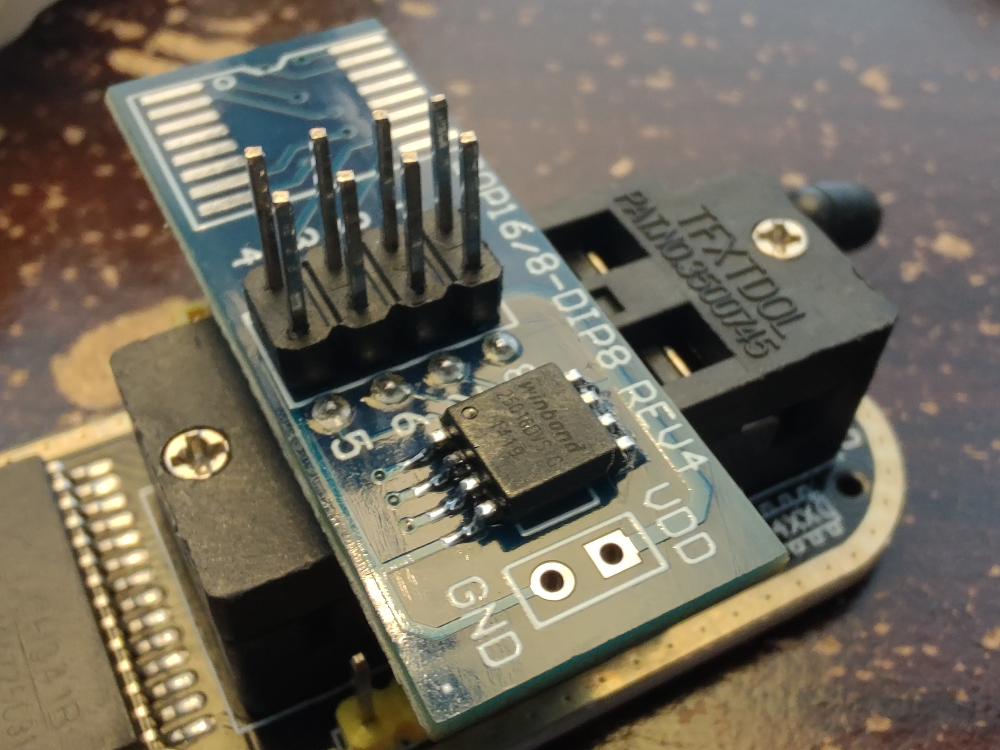

{ align=right width="200"}
# Unbricking Flashcarts
## All carts with SPI-type flash

!!! info "Why is This Necessary?"

    Many R4iTT based flashcarts are susceptible to flashrom corruption. In some cases, this can happen randomly during normal use, and in other cases, this can be caused by running incompatible kernels on this hardware, such as YSMenu. Unfortunately, DSTT cart commands correlate to R4iTT flashrom write commands. Executing YSMenu on an R4iTT ends up rewriting parts of the flashrom and bricks the cart, which requires a chip programmer to recover from.

!!! note "Bricked DEMON/DSTT Flashcarts"

    {align=right width="100"}

    If you're aiming to unbrick a DEMON or DSTT based flashcart, first make sure that it uses an SPI chip for the flashrom, not a NOR chip. NOR chip reflashing is not supported by this guide.

    Also note that if a flashcart with a NOR chip is bricked, it's more likely to have bad solder joints on the NOR chip rather than being corrupt. Reflowing the NOR chip with a soldering iron and flux is very likely to fix these carts if they are bricked.

!!! warning

    Soldering is required. Using clip-on attachments to connect to the SPI flash chip while it's still on the flashcart PCB *does not* work.

    This guide is a last resort if your cart is truly bricked. Make sure you've attempted easier fixes such as cleaning the cart's gold contacts with rubbing alcohol, or placing a piece of paper on the label side of the cart to improve contact with the cart reader.

### Requirements

1. **CH341A or Similar EEPROM/SPI Flash Programmer**
    - These programmers can be found easily by searching online marketplaces for `ch341a` in this guide.
    - We will use the [CH341A Mini Programmer](../images/CH341A_Mini.jpg "") variant of the CH341A.

1. **[AsProgrammer](https://github.com/nofeletru/UsbAsp-flash/releases/latest)** - A program used to read/write chips using the CH341A and other compatible programmers.

1. **Windows CH341A Serial & Parallel Drivers**
    - [Parallel Drivers](https://github.com/boseji/CH341-Store/raw/master/CH341-Windows-SPI-I2C-Driver%2BSDK-library/CH341PAR.ZIP)
    - [Serial Drivers](https://github.com/boseji/CH341-Store/raw/master/CH341-Windows-Serial-Driver%2BSDK-library/CH341SER.ZIP)
    - For other operating systems (not covered in this guide), see the [main driver repository](https://github.com/boseji/CH341-Store).

1. **Flashrom Backup** - Obtaining this will be covered below.

### Unbrick Guide

#### Identifying Hardware

!!! info

    The flashrom backup you will need to use depends on the capacity of your SPI flash chip on the board. Usually these carts will have either a 2MB or a 4MB flash chip.

1. To check the chip type and capacity, you will need to find the SPI chip on your cart.
    - [Here's an example PCB from an r4igold.cc 2013 cart.](../images/r4igold.cc_pcb.jpg "")

1. In the example above, we see a WinBond `25Q16CVY05` chip on the PCB. The `25` at the front means this is a `25XX` chip, therefore we will use the `25XX` port on the CH341A.

1. The next part is `Q16`. This means the chip is 16 Mbit in capacity, which is equal to 2MB. If your chip says `Q32`, that's 32Mbit = 4MB.

1. The last part of the number is `CVY05`. This will be useful to select the correct chip in AsProgrammer, keep it in mind. For this example, we would select `Winbond` -> `W25Q16CV`.

1. You will also notice that there is a circular dot present on the chip near one the legs. This indicates pin 1 of the chip for orientation. The CH341A also has these dot markings to help you orient the chip correctly on the adapter board.

#### Obtaining a Flashrom

1. Next, you will need to visit the [flashrom archive.](https://drive.google.com/drive/folders/10poT7I4Z2BPAnFp3QKKvsvM6toBQ5crm)

1. Choose the correct `.bin` flashrom backup for your cart in the archive. You can reference the photos to find a matching or similar PCB, and check the file size to make sure it's the correct size for your flashrom.
    - For the example, `R4iGold.cc Flash Backups` -> `R4iGold.cc_3DS_2013_imagedump.bin` would be a good fit.
    - If you can't find an exact match for your cart, try to find a PCB with the same flashrom size, and the same ASIC chip, then use that backup.

#### Preparing the Chip for Flashing

1. Now we will need to get the SPI flash chip off the flashcart PCB and mounted onto the CH341A flasher.
    - A hot air gun will be the easiest way to remove the chip if you have one. Put some flux on the pins, then rotate the air around the chip until the solder liquefies, and then take the chip off with tweezers.
    - If a hot air gun isn't available, you can also use a soldering iron as these chips have a fairly small number of mount points.
        1. Add some leaded solder to the pins with your iron.
        1. Wedge your tweezers underneath the pins of the cart and gently pull upward while running the iron across all four pins. This will allow you to lift one side of the chip upward and away from the pads on the PCB.
        1. Once one side is lifted, repeat the step above for the second row of four pins to remove the chip from the board.

1. Clean up the chip with your iron if any pins are bridged or if there's excess solder on the pins. [You should be left with a clean chip that looks like this.](../images/SPI_Chip.jpg "")

1. Next, it needs to be mounted to the CH341A for flashing. You have a couple options for doing so, depending on which accessories/clips you were sent with your CH341A.

1. The easiest and most time-effective method is to use a solder-less mount with clips, shown below. Simply place the adapter into the CH341A, and then push down the lock. Then press down on the adapter to open it, place the chip inside with tweezers, and let go to lock the chip into the adapter.

    &nbsp; {width="200"}
    &nbsp; {width="225"}
    &nbsp; {width="242"}

    - Remember to orient the chip so that the dot on the chip matches pin 1 on the CH341A.

1. The second method for connecting the chip to the flasher is to solder the chip onto an adapter board, like so:

    &nbsp; {width="150"}
    &nbsp; {width="265"}

    - Notice the numbers next to the pins that slot into the CH341A. Use these numbers to orient the adapter board correctly.

#### Flashing the Chip

1. Connect the CH341A with the chip attached to your PC.

2. Download and run the installer for both serial and parallel CH341A drivers. After installation, confirm that the flasher shows up properly in Device Manager - (`⊞ Win`+ `R` -> `devmgmt.msc`)
    - [CH341A with properly installed drivers.](../images/devmgmt.png){target="_blank"}
    - You may need to unplug and re-plug the CH341A into your system if it isn't properly recognized after installing drivers.

3. Download AsProgrammer, extract it, then run the program.

4. In AsProgrammer, select `Hardware` -> `CH341a`

5. Next, set the model of the chip you're flashing. Select `IC` -> `SPI` -> `<Manufacturer Here>` -> `<Model Number Here>`
    - For the example, we would select `WINBOND` for manufacturer, and `W25Q16CV` for model number.

6. AsProgrammer is now setup to read/write the chip. First, attempt a read on the chip to make sure everything is working properly. In AsProgrammer, click the `Read IC` button to read the data off the chip.

7. If you'd like, you can save the read data to a `.bin` file on your PC by clicking the Save icon.

8. If the read operation was successful, you can proceed to flashing the chip with the downloaded backup. Click on `Erase IC` to wipe all data on the chip.

9. Next, open the downloaded backup `.bin` file in AsProgrammer.

10. Click `Program IC` to write the opened `.bin` backup onto the chip.

11. Once the process completes, click `Verify IC` to check that the chip's data matches the `.bin` you flashed.
    - If you run into issues when flashing, try reseating the chip in the adapter, or in the case of a soldered mount, check your solder points and reflow them.

12. Close AsProgrammer if no issues were found.

#### Finishing Up

1. The chip is now ready to go back on the flashcart PCB.

1. Remove the chip from the CH341A adapter, and then solder it back onto the PCB.
    - You may find it helpful to wick up leftover solder on the PCB pads with a solder wick, so that you can set the chip down flat on the board's pads before soldering.

1. Reassemble the cart and test it in your DS. If it shows up properly, you're done!

### Troubleshooting

1. If the cart does not work after flashing, try cleaning the gold contacts on the PCB with rubbing alcohol. The DS will fail to read the cart if the contacts are dirty.

1. If cleaning the cart did not help, check pins on your SPI flash chip and make sure they're solidly connected to the board. You can use tweezers to gently press on each pin and make sure that it does not move. Reflow any bad joints.

1. Lastly, if nothing helps, you may want to try reflashing the chip, or using a different flashrom backup in case you flashed a wrong or incompatible backup.